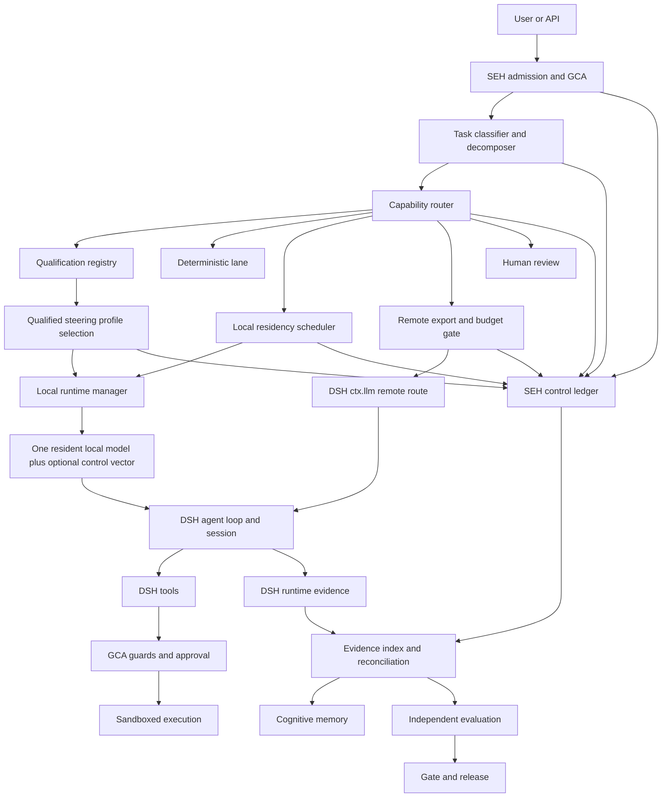
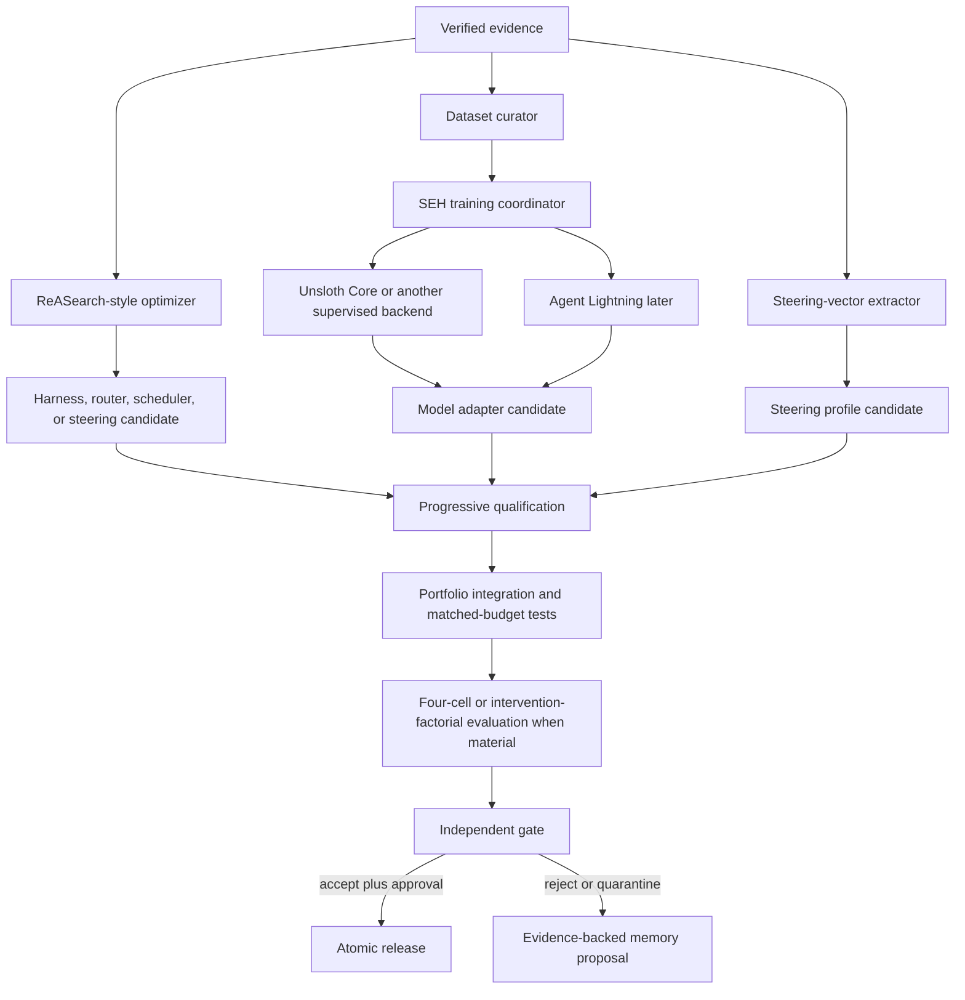
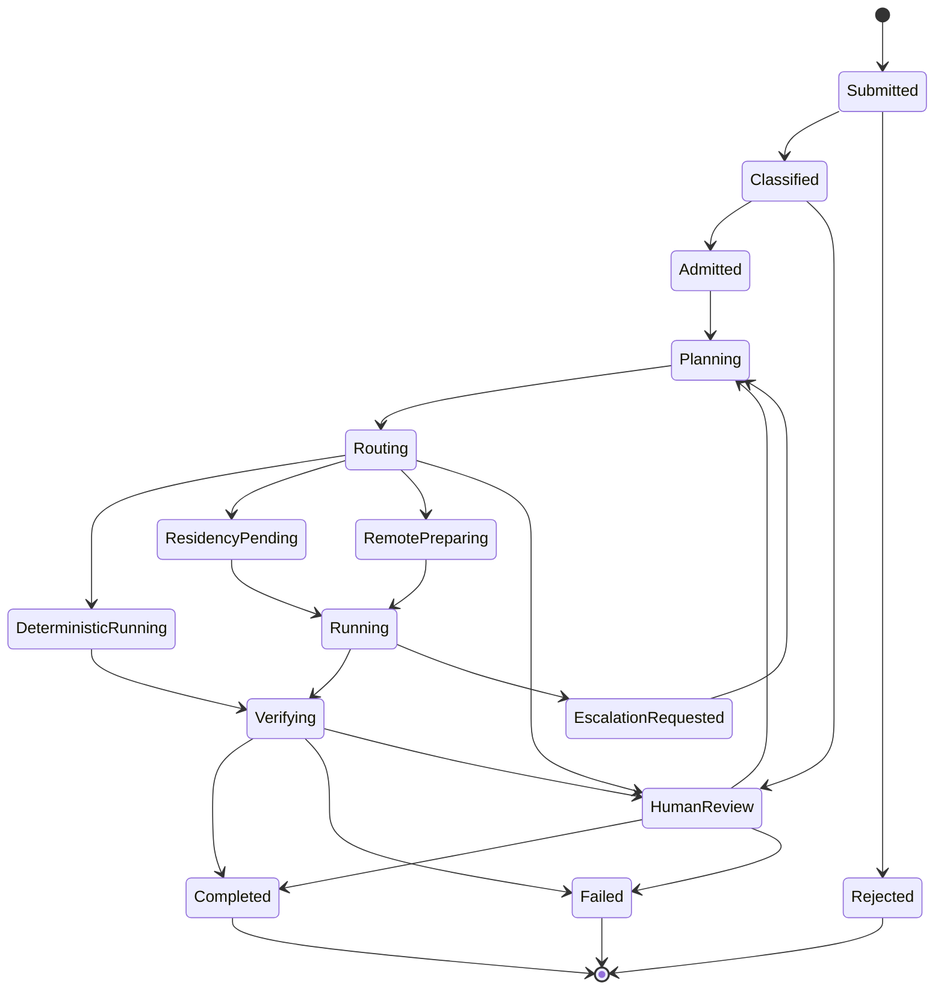
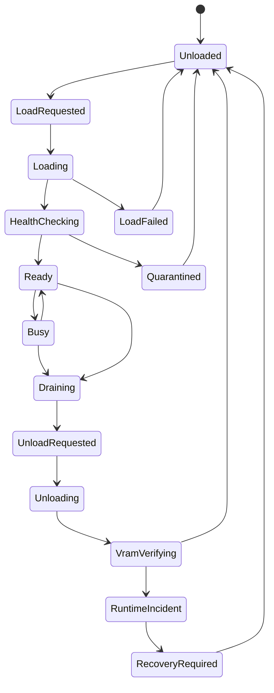
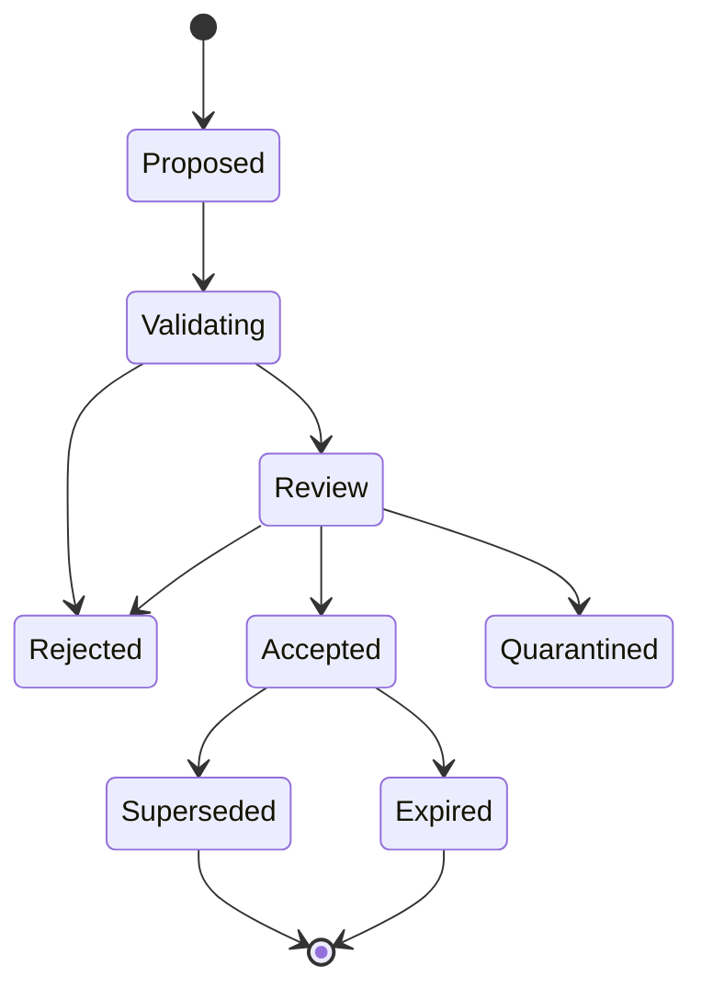
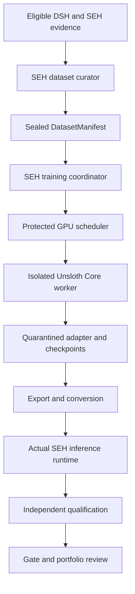
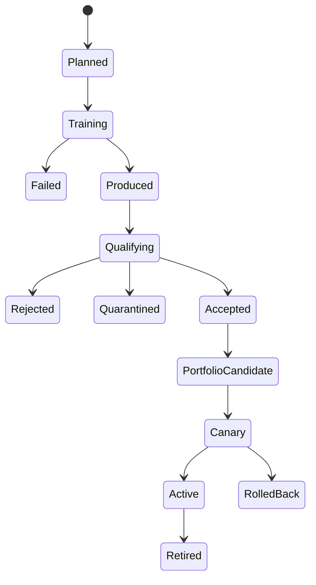
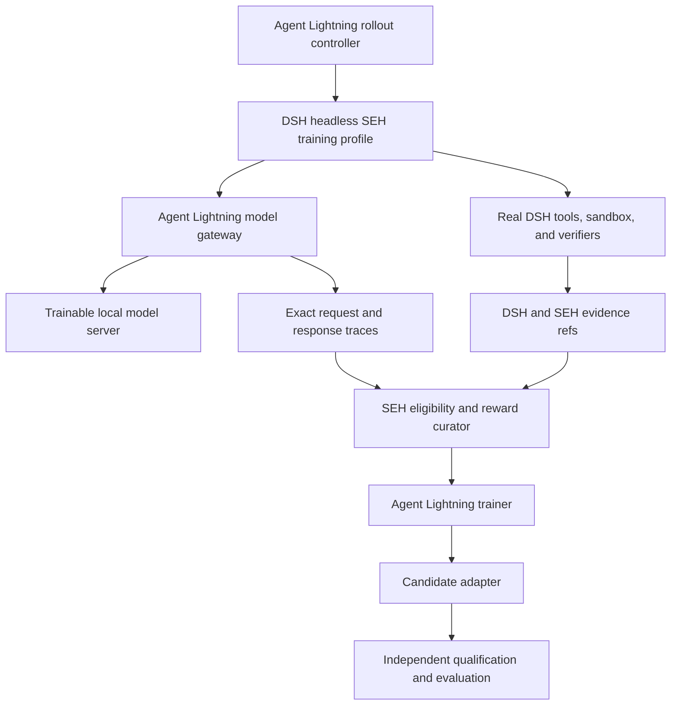
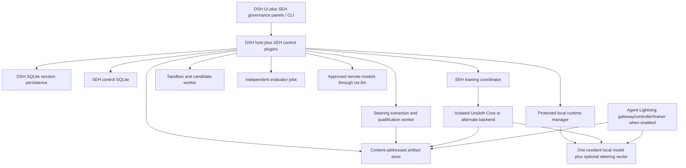

# Self-Evolving Harness (SEH) Architecture v3.1

**Architecture version:** 3.1  
**Status:** Proposed implementation contract - tool-calibration and training-backend revision  
**Date:** 2026-08-29  
**Runtime foundation:** DeepSeek Harness / Cordis, implementation baseline pinned to `b150a551b8d465e31e418e1b2eaf5e79bbb7d28e` (`dsh@0.1.1-rc.2`)  
**Observed upstream candidate:** `cd5ef8148158c3a752a658978873241fdf8e2bbc` (`dsh@0.1.2-alpha.1`), unreviewed and not adopted  
**Local model strategy:** capability-qualified specialist portfolio with at most one generative model resident on the reference GPU at a time  
**Reference workstation:** HP OMEN 16-ap0183AX, AMD Ryzen AI 7 350, 24 GB system RAM, NVIDIA GeForce RTX 5060 Laptop GPU with 8 GB VRAM, Windows 11  
**External model execution:** DeepSeek Harness `ctx.llm` plus `@deepseek-ai/dsh-llm-pi-ai`; Kimi K3 may be an initially preferred remote reasoning route but is not an architectural dependency  
**Inference-time behavioral control:** optional, qualification-gated representation steering for local open-weight runtime profiles  
**Training subsystem:** implementation-neutral training service; Unsloth Core is the initial preferred local LoRA/QLoRA provider, with Agent Lightning v1.0 retained for later harnessed agentic reinforcement learning  
**Deployment model:** Web2, local-first, single-operator initially  
**VAMS relationship:** cognitive-layer inspiration only; no VAMS runtime, Service Block, token, blockchain, or decentralized execution dependency

---

## 0. Executive decision

SEH is a governed self-evolving distribution of DeepSeek Harness. It is not a second agent harness built beside DeepSeek Harness, and it is not a model-specific agent product.

DeepSeek Harness remains the execution substrate. It owns model requests, the agent loop, tools, session history, prompt assembly, provider adapters, approvals, credentials, settings, sandbox interfaces, and user-facing execution surfaces.

SEH owns the capabilities that require independent governance or evidence:

1. task classification and capability requirements;
2. empirical model and tool qualification;
3. route eligibility and explanation;
4. one-GPU local model residency scheduling;
5. remote export and spend authorization;
6. cross-session control evidence and reconciliation;
7. reviewed cognitive memory;
8. bounded harness evolution;
9. local model evolution;
10. independent evaluation, gate, release, and rollback.

The defining local-first decision retained by v3.1 is:

> SEH classifies the work before it selects a model. It then selects from a qualified portfolio of local specialists, loads only the required model into the single GPU slot, and creates a separately pinned episode for that specialist. Remote execution is considered only when no permitted local or deterministic route can satisfy the task.

A single model does not need to perform every SEH function. The initial local system may contain separate candidates for fast bounded transformations, agentic tool use, coding, deep reasoning, multimodal work, and trainability. These candidates do not need to run side by side. They are time-multiplexed through a protected local runtime manager.

The local model portfolio is therefore a harness-level mixture of specialists, not a simultaneous inference ensemble. SEH assigns bounded subtasks to qualified specialists and preserves explicit evidence for every handoff and model switch.

The optimizer may propose a change. It may never control the evaluator, acceptance gate, GCA enforcement, hidden evaluation data, canonical evidence, release credentials, or promotion authority.

### 0.1 Material evolution from earlier architecture revisions

Architecture v1.0 centered local execution on VibeThinker-3B and remote execution on Kimi K3.

Architecture v2.0 corrected the provider boundary:

- DeepSeek Harness `ctx.llm` became the provider-neutral model plane;
- Kimi became an optional configured route rather than an SEH subsystem;
- VibeThinker became provisional and qualification-gated;
- DSH session events became canonical runtime evidence;
- SEH retained only a separate control ledger for governance facts;
- remote dispatch gained a final deny-only authorization guard and hierarchical spend controls;
- evaluation gained progressive qualification and matched-budget baselines.

Architecture v3.0 retained those decisions and added:

- task-family discovery before model selection;
- a deterministic no-model execution lane;
- capability vectors for subtasks;
- a local specialist portfolio rather than one universal local model;
- an explicit separation between capability routing and GPU residency scheduling;
- one generative model resident on the reference 8 GB GPU at a time;
- protected load, health-check, drain, unload, and VRAM-release behavior;
- model-switch cost and anti-thrashing policy;
- structured specialist handoffs instead of transparent conversation migration;
- per-runtime-profile qualification, including quantization, context, template, parser, and inference-engine identity;
- portfolio-level release manifests and component-at-a-time evolution;
- local model discovery as an evidence-producing research lane rather than a one-time model choice.

Architecture v3.1 preserves every v3.0 authority, evidence, routing, residency, and release invariant and adds two bounded model-evolution capabilities:

- **representation steering for tool-use propensity** - an optional, local-only, runtime-profile-bound intervention that can tune whether an already tool-capable model tends to request its granted tools, without granting tools or bypassing DSH/GCA execution controls;
- **pluggable supervised training backends** - an implementation-neutral SEH training service whose initial preferred local LoRA/QLoRA provider is Unsloth Core, operating in an isolated worker under the same protected GPU lease used by inference and qualification.

These additions introduce an explicit intervention ladder: use deterministic code first, then prompt/configuration calibration, then qualified representation steering, then supervised adapter training, then preference optimization, and only later harnessed RL when simpler methods do not produce sufficient verified improvement.

### 0.2 Local-first definition

For SEH, local-first means:

1. execute deterministic work without a generative model when possible;
2. search the qualified local specialist portfolio;
3. schedule the most suitable permitted model into the single GPU slot;
4. execute through normal DSH tools, sessions, approvals, and evidence;
5. escalate to another local specialist through a new episode when justified;
6. use a qualified remote model only when policy permits and no local route meets the required capability, confidence, context, modality, or latency objective;
7. require a human when neither local nor remote automation is permitted or sufficiently qualified.

Local-first never means that GPU congestion automatically permits remote export.

### 0.3 Behavioral intervention ladder [V1 CONTRACT]

SEH chooses the least invasive intervention that satisfies the task-family objective under matched evidence and resource budgets:

```text
0. deterministic implementation or verifier
1. prompt, tool-schema, or inference-configuration correction
2. representation-steering profile for tool-call propensity
3. supervised LoRA/QLoRA adapter through an approved training backend
4. preference or rejection-sampling optimization
5. Agent Lightning harnessed reinforcement learning
```

Moving to a later stage requires evidence that earlier, cheaper, more reversible interventions are insufficient or materially worse. A higher-numbered intervention is not presumed more capable merely because it changes more model state.

Representation steering controls a measured behavioral tendency. It does not create missing tool syntax, fix argument construction, confer authorization, or prove long-horizon competence. Supervised training may improve those capabilities, but the resulting adapter remains an unqualified candidate until it passes the exact runtime-profile and portfolio evaluation process.

---

## 1. Purpose, source of truth, and terminology

### 1.1 Purpose

This document is the implementation architecture for SEH. It defines:

- non-negotiable authority and evidence properties;
- the DeepSeek Harness versus SEH ownership boundary;
- task taxonomy and decomposition;
- provider-neutral local and remote model execution;
- specialist model qualification;
- single-GPU model residency scheduling;
- remote export, cost, and egress controls;
- runtime and control evidence;
- VAMS-inspired Web2 cognitive memory;
- ReASearch-style harness optimization;
- representation-steered local inference profiles;
- pluggable supervised training backends, initially Unsloth Core;
- supervised and Agent Lightning model evolution;
- independent evaluation and causal attribution;
- release, canary, rollback, and upstream compatibility;
- operator product behavior;
- staged implementation and verification.

This document is an architecture contract. It is not evidence that every described component is already implemented.

### 1.2 Architecture maturity labels

| Label | Meaning |
|---|---|
| **[INVARIANT]** | Security, authority, privacy, evidence, or release property that implementation must not weaken without explicit architecture and security review. |
| **[V1 CONTRACT]** | Interface or behavior intended to remain compatible after implementation begins. Change requires an ADR and migration analysis. |
| **[PROPOSED]** | Current engineering direction. Implementation evidence may change it without violating invariants. |
| **[ILLUSTRATIVE]** | Example, candidate, threshold, package name, formula, or default. Not normative. |
| **[DEFERRED]** | Intentionally postponed until measurements or scale justify it. |

Authority boundaries and evidence semantics are frozen before package names, thresholds, storage details, or model choices.

### 1.3 Source-of-truth order [INVARIANT]

When implementation artifacts conflict, use this order:

1. security, authority, privacy, evidence, and release invariants in this document;
2. accepted SEH ADRs;
3. versioned SEH policy, contracts, and schemas;
4. DeepSeek Harness `AGENTS.md` and `docs/architecture.md` at the adopted upstream pin;
5. DSH generated capability, Cordis, and configuration catalogs at that pin;
6. package-level documentation and tests;
7. generated SEH configuration documentation;
8. examples and comments.

A newer upstream DSH commit does not silently override an SEH invariant. It enters through the compatibility process in Section 34.

### 1.4 Core terms

| Term | Meaning |
|---|---|
| **DeepSeek Harness / DSH** | Cordis-based execution substrate that owns sessions, model calls, tools, approvals, provider adapters, and execution composition. |
| **SEH** | Governance, qualification, scheduling, memory, evolution, evaluation, training, and release layer added around DSH. |
| **Task** | One immutable user objective plus data class, policy, budgets, allowed workspace, and verification requirements. |
| **Task family** | Versioned category of work with measurable capability and verifier requirements. |
| **Capability vector** | Structured description of modality, reasoning, tools, code scope, verifier, context, latency, risk, and locality requirements. |
| **Subtask** | Bounded node in a task plan or decomposition graph. |
| **Deterministic lane** | Model-free execution for operations such as schema validation, compilation, testing, hashing, formatting, policy checks, and exact transformations. |
| **Provider route** | Provider identifier registered in DSH `ctx.llm`. |
| **Model route** | Immutable `providerId + modelId + providerConfigDigest` identity for an episode. |
| **Catalog-supported** | DSH can describe or call the route. This is not evidence that SEH trusts it. |
| **Qualified** | SEH has empirical evidence that a route and runtime profile satisfy defined role, task-family, tool, safety, and operational criteria. |
| **Model role** | Capability category such as `LOCAL_FAST`, `LOCAL_AGENT`, `LOCAL_CODER`, `LOCAL_REASONING`, `LOCAL_MULTIMODAL`, or `LOCAL_TRAINABLE`. |
| **Runtime profile** | Exact local deployment identity: model digest, adapter, quantization, engine, engine version, context, template, parser, sampling, optional steering profile, and measured hardware behavior. |
| **Representation steering** | Inference-time addition of a qualified direction to selected hidden-state layers of a local open-weight model to tune a measured behavioral propensity. |
| **Tool-use steering profile** | Immutable artifact binding one steering vector, extraction provenance, layer range, qualified alpha range, tool bundle, and exact runtime profile. |
| **Steering alpha** | Signed intervention strength applied to a qualified steering vector. It is policy-bounded data, never model-selected authority. |
| **Training backend** | Replaceable worker implementation that executes an approved training run from a sealed dataset and immutable configuration. |
| **Unsloth Core worker** | Initial preferred local LoRA/QLoRA training-backend provider; it performs optimization but owns no eligibility, qualification, gate, portfolio, or release decision. |
| **Local portfolio** | Versioned set of qualified local runtime profiles and their permitted roles. |
| **Resident route** | Local runtime profile currently loaded and ready on the GPU. |
| **Residency lease** | Exclusive scheduler authorization for one local runtime profile to occupy the GPU slot for bounded work. |
| **Residency switch** | Protected transition that drains the current model, unloads it, validates VRAM release, loads another profile, and health-checks it. |
| **Specialist handoff** | Immutable evidence-linked transfer package used to create a child episode for another model. |
| **Episode** | One provider/model/runtime-profile-pinned attempt to progress a task. A model switch creates a new episode. |
| **DSH session** | Append-only DSH event log used by the agent loop. An SEH episode maps to one DSH session or an explicitly pinned session range. |
| **Rollout** | One training or evaluation trajectory with stable rollout and group identity. |
| **Candidate** | Proposed harness bundle, model adapter, portfolio component, scheduler policy, memory patch, blueprint, or release. |
| **Runtime evidence** | DSH session facts about what the model saw and what tools did. |
| **Control evidence** | SEH facts about classification, route selection, residency, budgets, qualification, candidates, evaluation, gate, memory review, training, and release. |
| **Canonical evidence** | Append-only facts from which relevant requests, decisions, and outputs can be reconstructed. |
| **GCA** | Governance and Control Authority that owns protected policy, authority floors, budgets, export rules, identities, and release permissions. |
| **Gate** | Independent component that accepts, rejects, or quarantines frozen subjects. |
| **Blueprint** | Bounded policy describing what an optimizer may search and how candidate experiments run. |
| **Release** | Tested compatible composition of DSH pin, SEH code, prompts, tools, portfolio, scheduler policy, qualifications, memory, sandbox, evaluators, and remote policy. |

### 1.5 Design goals

SEH optimizes for:

- upstream reuse over reinvention;
- model and provider replaceability;
- task-first capability selection;
- one-GPU practicality;
- deterministic execution where possible;
- evidence before autonomy;
- explicit authority separation;
- safe failure and rollback;
- bounded, measurable self-improvement;
- operator visibility and interruptibility.

---

## 2. Scope boundaries and success definition

### 2.1 Included [V1 CONTRACT]

- DSH/Cordis plugin composition and documented extension seams.
- Provider-neutral execution through DSH `ctx.llm`.
- Task-family registry and capability-vector derivation.
- Deterministic no-model execution lane.
- Qualified local specialist portfolio.
- Optional, qualification-gated representation steering for supported local open-weight runtime profiles.
- Pluggable supervised-training backend service, initially evaluating Unsloth Core for LoRA/QLoRA.
- Single-GPU sequential model residency.
- Local model runtime profiles for llama.cpp, Ollama, vLLM, SGLang, or another reviewed OpenAI-compatible server.
- Remote model routes configured through DSH, with Kimi K3 as one optional route.
- GCA admission, tool, network, export, budget, mutation, scheduling, and release rules.
- DSH sessions as canonical runtime evidence.
- SEH control ledger for cross-session governance facts.
- Content-addressed artifacts, projections, replay, and reconciliation.
- VAMS-inspired Web2 cognitive memory.
- ReASearch-style bounded harness optimization.
- Supervised adapter training and later Agent Lightning integration.
- Independent evaluation, progressive qualification, matched-budget baselines, and four-cell causal analysis.
- Human-reviewed release and deterministic rollback.
- Single-workstation deployment first; conventional server deployment later.
- Operator UI extensions over DSH.

### 2.2 Explicitly excluded [INVARIANT]

- VAMS Service Block registration or execution.
- VAMS Neuron, Gateway, Composer, contracts, validators, or token economics as runtime dependencies.
- Blockchain anchoring, staking, settlement, wallets, or decentralized consensus.
- A model rewriting its own active process.
- A model directly controlling GPU model load or unload.
- A model, worker, or optimizer choosing an unbounded steering vector, layer range, or alpha.
- Representation steering being treated as a tool grant, approval, security control, or evidence of competence.
- A training backend selecting its own dataset eligibility, evaluator, gate result, portfolio membership, or release.
- Unsloth Studio or another third-party UI becoming an authoritative SEH control plane.
- A training worker reading arbitrary raw DSH sessions rather than a sealed DatasetManifest.
- Concurrent multi-model GPU residency as an initial requirement.
- Transparent provider or model switching inside an episode.
- Untrusted candidate code loaded into the active control process.
- Optimizer access to hidden or sealed evaluation answers.
- Trainer authority over eligibility, gate, or production activation.
- Online mutation of active weights.
- Automatic activation merely because DSH can call a provider or model.
- Remote-provider outputs as training data by default.
- Model summaries, dashboards, or memory projections as canonical evidence.
- Automatic production promotion in the initial release.
- A second agent loop, provider registry, approval system, or runtime session log beside DSH.

### 2.3 Initial success definition

SEH v1 is successful when it can:

1. classify a task into explicit capability requirements;
2. execute model-free work through deterministic services where appropriate;
3. explain why a specific local, remote, deterministic, or human route was selected;
4. select only qualified local runtime profiles;
5. load and unload local specialist models safely on one 8 GB GPU;
6. create a child episode for every model switch;
7. prevent remote dispatch that fails export, route, qualification, egress, or budget policy;
8. replay model-visible context from DSH evidence;
9. replay classification, routing, residency, budget, candidate, evaluation, gate, and release decisions from SEH control evidence;
10. propose bounded harness changes without touching protected targets;
11. extract, qualify, and replay an optional local tool-use steering profile without changing tool authority;
12. train a new local adapter through a replaceable backend from eligible local evidence without replacing active weights;
13. export and requalify that adapter in the real inference runtime;
14. evaluate changes independently and require separate approval for release;
15. atomically activate or roll back a complete release;
16. remain usable when any individual model or provider is replaced.

---

## 3. Non-negotiable invariants

### 3.1 Authority invariants [INVARIANT]

1. The optimizer proposes; the gate decides.
2. Candidate authorship and acceptance use separate identities and credentials.
3. The worker cannot modify active harness source, GCA, evaluator, hidden sets, scheduler control, gate, or release state.
4. The task classifier and router cannot modify qualification evidence or training labels.
5. The residency scheduler cannot create qualification evidence or override GCA.
6. The local runtime manager cannot select the task route it serves.
7. The trainer cannot choose eligibility policy or promote a model.
8. The evaluator cannot modify the subject it evaluates.
9. The memory consolidator cannot approve its own persistent L2/L3 changes.
10. The gate cannot author candidates.
11. The release manager cannot manufacture an acceptance decision.
12. Production activation requires a terminal gate decision and required human approval.
13. At most one active release mutation may occur at a time.
14. A weighted score cannot compensate for a hard privacy, security, authorization, evidence, or correctness veto.

### 3.2 DSH extension invariants [INVARIANT]

1. Extend DSH through documented Cordis plugins, services, providers, events, profiles, bundles, and middleware.
2. Do not place SEH behavior inside `core/agent-loop` unless a documented seam is insufficient and a dedicated ADR approves the exception.
3. Do not duplicate a DSH capability merely to give it an SEH name.
4. DSH owns model-call serialization, tool lifecycle, model-facing history, and provider protocol adapters.
5. Active SEH releases pin DSH commit and dependency lock digests.
6. Upstream sync occurs in isolation and must pass compatibility tests before adoption.

### 3.3 Task and route invariants [INVARIANT]

1. Task requirements are derived before model selection.
2. A deterministic implementation is preferred when it satisfies the requirement with stronger evidence and lower risk.
3. `providerId`, `modelId`, task-family IDs, and role IDs are data, not vendor-name unions.
4. Catalog support does not imply qualification.
5. Qualification applies to an exact runtime profile, not only a model name.
6. Production routing selects only policy-enabled, unexpired qualifications.
7. Advertised context capacity is not treated as measured safe context.
8. A resident model receives no authority advantage merely because it is already loaded.
9. A learned routing score cannot override deterministic privacy, qualification, tool, budget, or risk gates.

### 3.4 Local residency invariants [INVARIANT]

1. The initial workstation supports at most one resident generative model on the GPU.
2. No model call may be interrupted by an unload operation.
3. A model switch occurs only after the current episode reaches a safe boundary and the scheduler drains in-flight work.
4. A model switch creates a new child episode and DSH session or pinned session segment.
5. The scheduler, not the model, owns load, unload, sleep, wake, and residency decisions.
6. Runtime control endpoints are not model-facing tools.
7. The scheduler verifies model identity, runtime profile, health, and VRAM state before granting a lease.
8. Unload is not considered successful until the runtime reports termination and VRAM falls within the approved residual threshold.
9. Failure to release VRAM is an incident and blocks another load until recovery.
10. Switch count, load time, unload time, and residency duration are budgeted and logged.
11. Anti-thrashing policy prevents unbounded specialist oscillation.
12. Training, qualification, and inference share the GPU only through the same protected resource scheduler.

### 3.5 Episode and handoff invariants [INVARIANT]

1. Each episode pins provider, model, runtime profile, provider configuration, prompt, tools, memory, policy, sandbox, and evaluator plan.
2. A provider, model, quantization, context setting, template, or tool parser does not change inside an episode.
3. Escalation is a request for a new route, not an implicit provider switch.
4. Specialist handoffs contain bounded objectives, artifacts, evidence, constraints, and verified state.
5. Hidden reasoning traces are not required for handoff and must not be fabricated.
6. A child receives no broader tool, workspace, data, export, or budget authority than policy permits.

### 3.6 Remote export invariants [INVARIANT]

1. Remote export preparation happens before the remote child session is seeded.
2. DSH logs the exact sanitized context the remote model may see.
3. Every remote call passes a non-bypassable final guard after request assembly and before network dispatch.
4. The final guard is deny-only for model-visible content; it does not silently rewrite a logged request.
5. The guard validates route pin, provider configuration, qualification, export envelope, data class, tool schemas, budget reservation, and kill switches.
6. Authorization evidence is recorded before network I/O.
7. The adapter never receives a denied request.
8. Remote egress is allowlisted where feasible.
9. Missing policy, pricing, configuration, or evidence disables remote dispatch.

### 3.7 Evidence invariants [INVARIANT]

1. Model-visible means DSH-logged.
2. DSH runtime evidence and SEH control evidence are separate canonical domains.
3. SEH does not mirror the complete DSH event stream.
4. Projections, dashboards, indexes, and generated summaries are disposable.
5. Every score links to exact subject, evaluator, split, and evidence identities.
6. Every memory lesson links to supporting and contradicting evidence.
7. Every candidate and release has an immutable manifest and content hash.
8. Missing required evidence fails closed.
9. Retries preserve original attempts and explicit supersession.
10. Residency decisions and switches are replayable from control evidence.

### 3.8 Training invariants [INVARIANT]

1. Base weights are immutable within an experiment lineage.
2. Every experiment produces a new adapter or checkpoint identity.
3. Exact token IDs are preserved when the training method requires them.
4. Multi-call samples merge only under exact token-prefix compatibility.
5. Rollout and group identity survive retry and adaptation.
6. Train, qualification, development, test, sealed release, and shadow roles remain separate.
7. Remote outputs are training-ineligible by default.
8. Hidden evaluation traces are never training data.
9. Secrets, restricted data, unlicensed data, and unverifiable traces never enter training.
10. A model may be qualified for inference but rejected for local training, or vice versa.

### 3.9 Representation-steering invariants [INVARIANT]

1. Representation steering is an optional local inference intervention, not an authorization mechanism.
2. Tool grants are calculated before steering; a steering profile cannot add, rename, widen, or reveal tools beyond the episode ToolGrantManifest.
3. Steering is used only for local model runtimes that expose the required hidden-state or control-vector mechanism. Remote closed APIs are not assumed to support it.
4. A steering qualification applies to an exact runtime profile, model and adapter digest, quantization, engine version, chat template, tool parser, prompt/tool bundle, extraction dataset, vector digest, layer range, and alpha range.
5. An episode pins the steering profile and alpha. An unrecorded or out-of-range change is denied and creates an incident.
6. The worker model cannot choose its own vector, layer range, or alpha. The router may select only a policy-enabled value from an active qualification.
7. The ReASearch optimizer may propose a steering candidate but cannot widen protected alpha limits, alter the evaluator, self-qualify the vector, or release it.
8. Positive steering does not imply tool competence. Tool-name validity, argument accuracy, task completion, recovery, and safety are evaluated independently.
9. Unknown tool names, malformed calls, and unparseable arguments fail closed through the normal DSH tool pipeline.
10. Excessive steering, cross-task externalities, direct-answer regressions, reasoning degradation, and tool-loop amplification are release vetoes or bounded regression checks.
11. An absent, stale, incompatible, or unqualified steering profile means neutral inference, not an improvised substitute.
12. A steering vector and its extraction artifacts are content-addressed model-behavior artifacts and are included in release, replay, rollback, and supply-chain checks.

### 3.10 Pluggable-training-backend invariants [INVARIANT]

1. SEH owns the training service contract; Unsloth, Transformers/PEFT, Agent Lightning, or another framework is a replaceable backend provider.
2. Unsloth Core is the initial preferred LoRA/QLoRA research and supervised-training provider, not an architectural dependency or authority plane.
3. The training backend receives only an approved TrainingRunSpec, sealed DatasetManifest, immutable base-model reference, approved output root, and bounded resource grant.
4. The backend cannot query arbitrary DSH sessions, change data eligibility, inspect hidden evaluation data, edit GCA policy, write qualification, invoke the gate, activate a portfolio, or update the active release.
5. Training runs execute in an isolated worker process or environment. The Node/Cordis DSH host does not import the Python training stack into its control-plane process.
6. Training, qualification, and inference acquire the same protected GPU lease. No backend-specific scheduler bypass exists.
7. Base weights are read-only. Outputs enter a quarantined candidate store and receive new immutable adapter/checkpoint identities.
8. Every run pins backend name and revision, Python, OS environment, CUDA, driver, PyTorch, Triton where used, Transformers, PEFT, TRL where used, quantization libraries, source commit, dependency lock, model/tokenizer/template, and exact training configuration.
9. A backend-generated adapter is not qualified by successful training. It must be exported, loaded through the actual SEH inference runtime, and re-evaluated with the exact tokenizer, template, parser, quantization, steering, and tool bundle.
10. Native Windows and WSL2/Linux results are separate environment qualifications until evidence proves portability.
11. Third-party desktop or Studio interfaces may assist manual research but do not become canonical job control, dataset curation, artifact storage, evaluation, or release surfaces.
12. Missing, failed, interrupted, or unreconciled training evidence prevents candidate acceptance.

### 3.11 Privacy and security invariants [INVARIANT]

1. Secrets never enter prompts, model-visible events, memory, datasets, candidates, or tool results.
2. Repository, web, MCP, model, memory, and tool content are untrusted.
3. Private files remain local unless explicit export policy permits a defined subset.
4. Candidate runners have no production credentials or active-release write access.
5. Hidden data is mounted only into evaluator-controlled environments.
6. Protected-path, credential, evidence, sandbox, or unexplained-network violations quarantine the subject.
7. Enforcement lives outside mutable prompts.
8. Third-party model license and terms are qualification gates, not documentation footnotes.

### 3.12 Release invariants [INVARIANT]

1. A release pins the complete local model portfolio and scheduler policy, not only one local model.
2. Runtime never assembles an untested mixture of independently active components.
3. Activation changes one versioned release pointer with compare-and-swap semantics.
4. Rollback restores the entire previous compatible release.
5. Failed release evidence is retained.
6. Memory produced by a failed release is quarantined where causally relevant.

---

## 4. Architectural style and ownership boundary

### 4.1 Style [V1 CONTRACT]

SEH begins as a modular monolith plus isolated workers. Cordis plugins provide logical composition; separate processes or containers are used where security, GPU lifecycle, dependency weight, or failure isolation requires them.

The architecture favors:

- narrow stable service seams;
- reversible implementation slices;
- provider-neutral and model-neutral identifiers;
- explicit state machines;
- append-only evidence;
- model-free deterministic services;
- protected scheduling and policy;
- measured qualification;
- operator-visible decisions.

### 4.2 DSH owns

| Concern | DSH owner or seam |
|---|---|
| Agent turn and step loop | `ctx.agentLoop`, `ctx.agents` |
| Model registry and calls | `ctx.llm` |
| Generic model adapters | `@deepseek-ai/dsh-llm-pi-ai` and other DSH adapters |
| Session history | `ctx.sessions` plus SessionPersistence |
| Request header and route provenance | DSH request/header/context events |
| System prompt assembly | `ctx.systemPrompt` |
| Model-facing tools | `ctx.tools` |
| Tool execution pipeline | `tools/*` middleware and guards |
| Human approval | `ctx.approval` |
| File sandbox policy | `ctx.sandboxPolicy` |
| Filesystem, process, shell, sandbox | DSH capability seams |
| Credentials and provider settings | `ctx.credentials`, `ctx.settings` |
| Jobs and workflows | `ctx.jobs`, `ctx.workflowEngine` |
| Web, skills, presets, subagents | DSH capability seams |
| Client and web composition | DSH client and web plugin mechanisms |

### 4.3 SEH owns

| Concern | SEH owner |
|---|---|
| Task admission and classification | GCA plus task service |
| Task-family registry | Task taxonomy service |
| Capability vector and decomposition | Task planner or deterministic classifier |
| Model, tool, and steering qualification | Qualification service plus evaluators |
| Representation-steering policy and artifacts | Steering service plus qualification registry |
| Route eligibility and explanation | Router |
| Local portfolio | Portfolio registry |
| GPU residency and switching | Residency scheduler plus local runtime manager |
| Remote export and spend authorization | Export service, final guard, budget service |
| Network egress beyond DSH file policy | Deployment security layer |
| Cross-session governance evidence | SEH control ledger |
| Evidence linking and reconciliation | Evidence service |
| Cognitive memory | Memory service plus reviewer |
| Harness optimization | Restricted optimizer plus candidate runner |
| Dataset eligibility and training service | Curator plus implementation-neutral training coordinator |
| Supervised optimizer execution | Isolated training backend worker, initially Unsloth Core |
| Independent evaluation and gate | Evaluator registry plus gate |
| Release, canary, and rollback | Release service |
| Operator governance surfaces | SEH client extensions and projections |

### 4.4 What SEH must not build

| Do not build | Use instead |
|---|---|
| Bespoke Kimi, Claude, Gemini, or vendor HTTP clients | DSH `ctx.llm` adapters |
| Second vendor/model registry | DSH model catalog plus SEH qualification overlay |
| Parallel agent tool loop | DSH agent loop and `ctx.tools` |
| Parallel runtime conversation log | DSH sessions |
| Second approval UI | DSH approval seam plus GCA decision |
| Model-facing load/unload tool | Protected residency scheduler API |
| Model-facing steering-strength tool | Policy-pinned ToolUseSteeringProfile selected before inference |
| Unsloth-specific training authority | SEH training service with Unsloth as one backend provider |
| Third-party training UI as canonical control plane | SEH operator, evidence, artifact, and gate services |
| One hardcoded local model | Qualified portfolio and role registry |
| Unversioned handoff summary | SpecialistHandoff artifact with evidence |
| Hidden model fallback | New route decision and child episode |
| Initial standalone SEH chat product | Extend DSH UI and commands |

### 4.5 Logical planes

| Plane | Purpose | Primary authority |
|---|---|---|
| DSH execution | Model turns, tools, sessions, approvals | Adopted DSH composition |
| GCA control | Admission, policy floors, protected targets, budgets | Human-owned policy |
| Task intelligence | Classification, decomposition, verification plan | Task service under GCA |
| Qualification | Measure model, runtime, tool, steering, and role capability | Evaluator plus qualification service |
| Behavioral calibration | Qualify and select optional representation-steering profiles | Steering policy under GCA |
| Routing | Select eligible deterministic, local, remote, or human route | Router under GCA |
| Residency | Manage exclusive GPU model lease and switching | Scheduler under GCA |
| Runtime evidence | Preserve model-visible execution facts | DSH session log |
| Control evidence | Preserve governance and evolution facts | SEH control ledger |
| Cognitive memory | Retrieve and consolidate reviewed experience | Memory policy plus reviewer |
| Harness evolution | Propose and test harness changes | Optimizer plus isolated runner |
| Model evolution | Curate and train local specialists | Curator plus training service |
| Training backend execution | Run sealed optimization jobs and produce candidate artifacts | Isolated backend worker with no promotion authority |
| Evaluation | Produce independent evidence and scores | Evaluator registry |
| Release | Gate, activate, canary, rollback | Gate plus release manager |
| Operations | Explain, observe, pause, recover | Human operator |

### 4.6 System context



### 4.7 Evolution context



---

## 5. Actors and trust boundaries

### 5.1 Authority matrix [INVARIANT]

| Actor | May read | May write | Must never control |
|---|---|---|---|
| Task classifier | Task input, policy-visible metadata | Capability requirements and classification evidence | Qualification, gate, release |
| Task decomposer | Admitted task, approved evidence, verifier catalog | Subtask graph and handoff proposals | Tool authority, route qualification, release |
| Router | Capability requirements, qualifications, budgets, health | Route decisions | Qualification evidence, evaluator results, training labels |
| Residency scheduler | Selected local route, runtime profiles, queues, GPU telemetry | Residency decisions and leases | Task objective, qualification, gate, release |
| Local runtime manager | Approved residency command, runtime profile | Load, health, unload, runtime telemetry | Route choice, policy, qualification |
| Worker agent | Task context, approved memory, granted tools | DSH session and permitted workspace changes | Harness source, GCA, scheduler, evaluator, gate, release |
| Remote-call guard | Final request, route pin, export and budget evidence | Dispatch authorization or denial | Route qualification, task objective, gate |
| Qualification runner | Candidate runtime profile, steering profile, qualification tasks | Qualification evidence | Production enablement, sealed answers |
| Steering extractor | Approved local model profile and extraction dataset | Candidate vector artifacts and extraction evidence | Tool grants, alpha policy, qualification, gate, release |
| Training coordinator | Sealed dataset, backend registry, approved run spec | Training job and reconciliation evidence | Eligibility policy, optimization internals, gate, release |
| Training backend worker | Immutable base, sealed dataset, bounded config and GPU lease | Checkpoints, adapters, exports, telemetry | Raw DSH sessions, eligibility, evaluation, qualification, portfolio, release |
| ReASearch optimizer | Search-visible evidence, mutable source | Candidate workspace and optimizer memory | Hidden sets, GCA, scheduler hard limits, gate, release |
| Candidate runner | Frozen candidate and allowed benchmarks | Ephemeral artifacts | Active tree, production credentials, release state |
| Evaluator | Frozen subject, evaluator-only data, evidence | Signed evaluation results | Candidate content, promotion |
| Dataset curator | Eligible local evidence and rights metadata | Dataset manifests | Gate, evaluator policy, active adapter |
| Trainer | Sealed dataset and training configuration | Candidate checkpoints and telemetry | Eligibility, qualification policy, release |
| Memory consolidator | Canonical evidence and reviewed memory | Memory proposals and projections | Raw evidence, GCA, self-approval |
| Gate | Frozen manifests and evaluations | One terminal decision | Candidate generation |
| Release manager | Accepted decision and compatible artifacts | Active release pointer and rollback events | Gate outcome |
| Human operator | Review package and audit evidence | Explicit approvals and policy/config changes | Historical evidence mutation |

Every actor has a distinct logical identity. A single Windows user account does not remove application-level authorization requirements.

### 5.2 Credential scopes [INVARIANT]

Use separate scopes for:

- provider invocation;
- local runtime control;
- candidate materialization;
- evaluator hidden-data access;
- gate decision writing;
- release activation;
- training-job control and candidate artifacts;
- steering-vector extraction and artifact publication;
- persistent memory approval.

The model, worker, optimizer, and candidate receive no local-runtime-control credential.

### 5.3 Candidate trust rule

Candidate code is untrusted until independent evaluation and gate acceptance. It is never dynamically loaded into the active DSH/SEH process to evaluate itself.

### 5.4 Runtime control boundary

Local runtime load/unload endpoints:

- bind to loopback or a protected local IPC channel;
- accept only scheduler identity;
- are not exposed in `ctx.tools`;
- are not reachable from candidate sandboxes;
- emit control evidence for every request and outcome;
- reject arbitrary model paths not present in the approved portfolio manifest.

---
## 6. Task ontology, decomposition, and deterministic execution

### 6.1 Task-family principle [INVARIANT]

SEH does not begin routing from model names. It begins from a versioned definition of the work.

A task family defines:

- semantic objective;
- allowed and required modalities;
- code or artifact scope;
- verifier class and minimum strength;
- tool capabilities;
- expected context band;
- latency class;
- risk class;
- locality and export rules;
- qualification metrics;
- completion and escalation conditions.

### 6.2 Task-family contract [V1 CONTRACT]

```ts
interface TaskFamilyDefinition {
  schemaVersion: 1
  taskFamilyId: string
  version: string
  title: string
  description: string
  capabilityTemplate: CapabilityRequirements
  permittedRouteClasses: string[]
  requiredVerifierClasses: string[]
  primaryMetrics: string[]
  hardVetoCodes: string[]
  qualificationSuiteRef: string
  handoffPolicyRef: string
  contentHash: string
}
```

### 6.3 Capability vector [V1 CONTRACT]

```ts
interface CapabilityRequirements {
  schemaVersion: 1
  taskFamilyId: string
  modalities: Array<'text' | 'image' | 'audio'>
  reasoningDepth: 'none' | 'minimal' | 'standard' | 'deep'
  actionMode:
    | 'deterministic'
    | 'generate-only'
    | 'structured-action'
    | 'multi-step-tools'
  codeScope:
    | 'none'
    | 'snippet'
    | 'single-file'
    | 'multi-file'
    | 'repository'
  verifierClasses: string[]
  requiredTools: string[]
  preferredTools: string[]
  minContextTokens?: number
  expectedOutputTokens?: number
  latencyClass: 'interactive' | 'normal' | 'batch'
  riskClass: 'low' | 'medium' | 'high'
  locality: 'local-only' | 'remote-eligible'
  trainabilityRelevance?: 'none' | 'collect-rollout' | 'training-evaluation'
}
```

### 6.4 Initial task-family registry [PROPOSED]

| Family | Description | Typical route |
|---|---|---|
| `DETERMINISTIC_TRANSFORM` | Schema conversion, formatting, exact extraction, hashing, validation | Deterministic lane |
| `TEXT_FAST_BOUNDED` | Classification, concise extraction, summarization, tagging | `LOCAL_FAST` |
| `MEMORY_FOLDING` | Evidence-bounded L1 projection and candidate lesson drafting | Deterministic plus `LOCAL_FAST` |
| `STRUCTURED_ACTION` | One or few JSON action intents under strong validation | `LOCAL_AGENT` |
| `TOOL_WORKFLOW_BOUNDED` | Short multi-step tool use with explicit verifier | `LOCAL_AGENT` |
| `CODE_GENERATE_SINGLE` | Bounded code generation with compiler or tests | `LOCAL_CODER` or `LOCAL_VERIFIED` |
| `CODE_DEBUG_SINGLE` | Diagnose and fix one file from failing checks | `LOCAL_CODER` |
| `CODE_DEBUG_MULTI` | Multi-file repository debugging with tests | `LOCAL_CODER`, remote, or human |
| `REPOSITORY_CHANGE_LONG` | Long-horizon repository work | Qualified strong local, remote, or human |
| `REASONING_VERIFIABLE` | Math, logic, constrained design with strong verifier | `LOCAL_REASONING` |
| `REASONING_OPEN` | Ambiguous architecture or research analysis | Remote or human unless locally qualified |
| `MULTIMODAL_REVIEW` | Screenshots, diagrams, UI, charts, documents | `LOCAL_MULTIMODAL` or remote |
| `ROUTING_CLASSIFICATION` | Derive requirements and estimate local success | Deterministic plus `LOCAL_FAST` shadow |
| `QUALIFICATION_RUN` | Measure a model/runtime profile | Dedicated qualification worker |
| `HARNESS_EVOLUTION` | Propose bounded prompt/tool/workflow changes | Restricted optimizer profile |
| `MODEL_TRAINING` | SFT, preference, or harnessed RL work | Training profile, never normal worker |

This registry is intentionally coarse at first. New families require evidence that finer separation improves qualification, routing, or evaluation.

### 6.5 Deterministic lane [INVARIANT]

The following operations should be model-free unless a reviewed requirement proves otherwise:

- schema validation;
- content hashing;
- dependency lock comparison;
- compilation and tests;
- lint and static analysis;
- exact formatting and canonical serialization;
- secret scanning;
- path allowlist checks;
- budget arithmetic;
- policy intersection;
- event replay and projection rebuild;
- qualification expiry checks;
- release manifest verification;
- simple task metadata extraction from structured input.

A model may propose values that deterministic services validate. The model never replaces the validator.

### 6.6 Task decomposition [PROPOSED]

Decomposition uses this order:

1. preserve the immutable user objective;
2. identify outputs and completion evidence;
3. identify deterministic work;
4. define bounded subtasks for generative work;
5. assign verifier requirements;
6. derive tool and data requirements;
7. mark dependencies between subtasks;
8. mark possible specialist handoff points;
9. validate the graph under GCA;
10. route the next ready subtask.

```ts
interface SubtaskNode {
  schemaVersion: 1
  subtaskId: string
  taskId: string
  parentSubtaskId?: string
  objective: string
  requirements: CapabilityRequirements
  dependencyIds: string[]
  inputEvidenceRefs: EvidenceRef[]
  inputArtifactRefs: ArtifactRef[]
  verificationPlan: VerificationPlan
  state:
    | 'planned'
    | 'ready'
    | 'running'
    | 'verifying'
    | 'completed'
    | 'failed'
    | 'blocked'
  contentHash: string
}
```

### 6.7 Decomposition authority

The decomposer may structure the task but cannot:

- widen the user objective;
- grant tools or export permission;
- remove required verification;
- hide a failed subtask;
- select an unqualified route;
- promote a result to release state.

### 6.8 Classification evidence

Every classification records:

- classifier version;
- input evidence references;
- deterministic rules applied;
- any model-assisted proposal and its route;
- selected task family;
- capability vector;
- uncertainty and reason codes;
- reviewer action if classification was overridden.

---

## 7. Provider-neutral model plane and qualification

### 7.1 DSH model plane [V1 CONTRACT]

DSH already provides the correct provider abstraction:

- `ctx.llm` is the provider-neutral call registry;
- adapters own provider protocols;
- `dsh-llm-pi-ai` supports configured catalog routes and custom OpenAI-compatible routes;
- provider settings and credentials are managed by DSH;
- DSH request/session evidence records provider and model identity.

SEH adds qualification, policy, roles, runtime profiles, and scheduling around those routes.

### 7.2 Route identity [V1 CONTRACT]

```ts
interface ModelRouteRef {
  schemaVersion: 1
  providerId: string
  modelId: string
  locality: 'local' | 'remote'
  providerConfigDigest: string
}
```

### 7.3 Local runtime profile [V1 CONTRACT]

```ts
interface LocalRuntimeProfile {
  schemaVersion: 1
  runtimeProfileId: string
  route: ModelRouteRef
  modelArtifactDigest: string
  modelSourceRef: string
  licenseRecordId: string
  quantization: string
  inferenceEngine: string
  inferenceEngineVersion: string
  engineConfigDigest: string
  chatTemplateDigest: string
  toolParserDigest?: string
  tokenizerDigest: string
  configuredContextTokens: number
  measuredSafeContextTokens: number
  configuredMaxOutputTokens: number
  gpuLayerPolicy?: string
  cachePolicyDigest: string
  samplingProfileDigest: string
  measuredPeakVramMiB: number
  measuredResidualVramMiB?: number
  coldLoadP50Ms?: number
  coldLoadP95Ms?: number
  unloadP50Ms?: number
  unloadP95Ms?: number
  firstTokenP50Ms?: number
  firstTokenP95Ms?: number
  outputTokensPerSecond?: number
  qualificationId?: string
  contentHash: string
}
```

A model name without a runtime profile is not a production route.

### 7.4 Qualification status model [INVARIANT]

The UI and code distinguish:

1. **discovered** - model artifact is visible to a runtime;
2. **configured** - DSH can address the route;
3. **reachable** - a health request succeeded;
4. **runtime-qualified** - exact engine/quantization/template profile passed operational tests;
5. **role-qualified** - profile passed capability tests for one or more roles;
6. **policy-enabled** - GCA permits production selection;
7. **resident** - profile currently occupies the GPU slot.

No single green badge collapses these states.

### 7.5 Model qualification contract [V1 CONTRACT]

```ts
interface ModelQualification {
  schemaVersion: 1
  qualificationId: string
  runtimeProfileId?: string
  steeringProfileId?: string
  route: ModelRouteRef
  harnessReleaseId: string
  promptBundleDigest: string
  toolBundleDigest: string
  evaluatorBundleDigest: string
  roleResults: Record<string, RoleQualificationResult>
  taskFamilyResults: Record<string, TaskFamilyQualification>
  allowedToolIds: string[]
  deniedToolIds: string[]
  modalities: Array<'text' | 'image' | 'audio'>
  measuredContextLimit?: number
  structuredActionValidity?: number
  toolSelectionAccuracy?: number
  requiredToolRecall?: number
  unnecessaryToolCallRate?: number
  malformedToolCallRate?: number
  unknownToolNameRate?: number
  callsPerTask?: number
  argumentAccuracy?: number
  escalationQuality?: number
  loopRate?: number
  safetyVetoRate?: number
  medianLatencyMs?: number
  p95LatencyMs?: number
  status:
    | 'unqualified'
    | 'shadow'
    | 'qualified'
    | 'restricted'
    | 'stale'
    | 'retired'
  evidenceRefs: EvidenceRef[]
  issuedAt: string
  expiresAt?: string
  contentHash: string
}
```

### 7.6 Qualification subject identity [INVARIANT]

A qualification is invalidated or marked stale by material changes to:

- model artifact;
- quantization;
- inference engine or engine version;
- context allocation;
- tokenizer or chat template;
- tool parser;
- steering-vector artifact, extraction method, layer range, or qualified alpha range;
- prompt bundle;
- tool bundle;
- sandbox environment;
- evaluator suite;
- provider configuration;
- relevant model license or use terms.

### 7.7 Local role taxonomy [V1 CONTRACT]

| Role | Meaning |
|---|---|
| `LOCAL_FAST` | Low-latency bounded transformation, extraction, classification, ranking, or summarization. |
| `LOCAL_VERIFIED` | Bounded generation with strong deterministic verifier. |
| `LOCAL_AGENT` | Structured actions and short multi-step tool workflows. |
| `LOCAL_CODER` | Code generation, debugging, patching, and test repair. |
| `LOCAL_REASONING` | Verifiable math, logic, diagnosis, or planning. |
| `LOCAL_MULTIMODAL` | Qualified image, chart, document, or UI understanding. |
| `LOCAL_TRAINABLE` | Suitable for the planned local adapter training method and hardware budget. |
| `LOCAL_RESEARCH` | Benchmark-only or experimental; not production-routable. |

A runtime profile may hold several roles.

### 7.8 Initial model discovery matrix [ILLUSTRATIVE]

The following are research candidates, not pre-qualified production choices.

| Candidate | Candidate roles | Initial posture |
|---|---|---|
| `mistralai/Ministral-3-3B-Instruct-2512` | `LOCAL_FAST`, `LOCAL_AGENT`, `LOCAL_MULTIMODAL` | Strong general edge candidate; verify tool schemas, vision path, quantization, and Windows runtime. |
| `Qwen/Qwen3-4B-Instruct-2507` | `LOCAL_AGENT`, `LOCAL_VERIFIED`, light `LOCAL_CODER` | Strong tool/instruction candidate; measure practical context and repetition behavior. |
| `microsoft/Phi-4-mini-instruct` | `LOCAL_REASONING`, `LOCAL_AGENT` | Reasoning and function-call candidate; explicitly measure hallucinated function names. |
| `Qwen/Qwen2.5-Coder-7B-Instruct` | `LOCAL_CODER` | Code specialist candidate; measure VRAM, context, tool loop, and switch cost. |
| `nvidia/Nemotron-Labs-Diffusion-3B` | `LOCAL_FAST`, `LOCAL_RESEARCH` | Decode-efficiency candidate for non-agentic bounded work; not assumed to support long-horizon reasoning or tool calling. |
| `WeiboAI/VibeThinker-3B` | `LOCAL_REASONING`, `LOCAL_TRAINABLE`, `LOCAL_RESEARCH` | Verifiable-reasoning and training research candidate; baseline tool calling is not assumed. |
| `nvidia/Nemotron-Flash-3B-Instruct` | `LOCAL_RESEARCH` | Benchmark-only unless license policy permits; non-commercial license prevents default production adoption. |
| `nvidia/NVIDIA-Nemotron-3-Nano-30B-A3B-*` | Future hardware research | Excluded from the 8 GB workstation portfolio because total weights are approximately 30B even though active parameters per token are much smaller. |

The initial production portfolio should be smaller than the discovery set. A likely first target is:

- one winning 3B to 4B general/agentic profile;
- one code-specialist profile if it provides meaningful measured gain;
- deterministic services;
- qualified remote routes;
- optional research-only fast or trainable profiles.

### 7.9 Retired single-model assumptions

- VibeThinker is not the universal local worker.
- Kimi is not the universal remote provider.
- A Qwen3.5 9B base checkpoint is not treated as a direct production instruction route without an independently verified instruction-tuned artifact.
- Nominal context length is not used as the workstation context limit.
- A model marketed as agentic is not granted tools before SEH qualification.

### 7.10 License and provenance gate [INVARIANT]

Every model artifact records:

- source organization and repository;
- immutable revision or digest;
- license and use terms;
- commercial-use status;
- redistribution constraints;
- training-data policy relevance where known;
- quantization producer and provenance;
- local modification history.

A third-party quantization is a separate artifact subject. Production should prefer official or reproducibly generated quantization when practical.

### 7.11 Representation-steering role [PROPOSED]

The paper *Tunable Tool-Call Rates in LLM Agents via Representation Steering* identifies a residual-stream direction associated with whether an agent emits the shared tool-call opener. A difference-of-means vector is extracted from high- and low-tool-propensity prompts and applied at selected layers with a signed scale:

\[
h'_\ell = h_\ell + \alpha v_\ell
\]

For SEH, this mechanism is interpreted narrowly:

- it may tune the probability that a qualified local model requests one of its already granted tools;
- it may create task-family-specific cost-versus-success operating points;
- it may provide a cheaper baseline before supervised training;
- it may allow one local model artifact to support neutral and tool-calibrated runtime profiles;
- it does not create tool syntax, correct arguments, long-horizon planning, safety, or authorization.

The method applies only where the local runtime exposes compatible internal or control-vector support. DSH continues to receive an ordinary local model route and continues to own the model/tool interaction loop.

### 7.12 Tool-use steering profile [V1 CONTRACT]

```ts
interface ToolUseSteeringProfile {
  schemaVersion: 1
  steeringProfileId: string
  baseRuntimeProfileId: string

  modelArtifactDigest: string
  adapterDigest?: string
  quantization: string
  inferenceEngine: string
  inferenceEngineVersion: string
  engineConfigDigest: string
  tokenizerDigest: string
  chatTemplateDigest: string
  toolParserDigest?: string
  promptBundleDigest: string
  toolBundleDigest: string

  extractionDatasetDigest: string
  extractionSplitDigest: string
  extractionMethod: 'difference-of-means' | string
  propensityReadout: {
    kind: 'tool-opener-token' | 'contrastive-route' | string
    tokenId?: number
    directRouteId?: string
    toolRouteId?: string
  }

  vectorArtifactDigest: string
  layerStart: number
  layerEnd: number
  createdBy: string
  evidenceRefs: EvidenceRef[]
  createdAt: string
  contentHash: string
}

interface SteeringQualification {
  schemaVersion: 1
  steeringQualificationId: string
  steeringProfileId: string
  baseRuntimeProfileId: string
  harnessReleaseId: string
  promptBundleDigest: string
  toolBundleDigest: string
  evaluatorBundleDigest: string
  qualifiedAlphaMin: number
  qualifiedAlphaMax: number
  defaultAlpha: number
  taskFamilyAlpha: Record<string, number>
  taskFamilyResults: Record<string, TaskFamilyQualification>
  requiredToolRecall?: number
  unnecessaryToolCallRate?: number
  malformedToolCallRate?: number
  unknownToolNameRate?: number
  nonToolRegressionSummaryRef: ArtifactRef
  status: 'shadow' | 'qualified' | 'restricted' | 'stale' | 'rejected' | 'retired'
  evidenceRefs: EvidenceRef[]
  issuedAt: string
  expiresAt?: string
  contentHash: string
}

interface LocalExecutionProfileRef {
  schemaVersion: 1
  runtimeProfileId: string
  steeringProfileId?: string
  steeringQualificationId?: string
  steeringAlpha?: number
  effectiveConfigDigest: string
}
```

The extraction dataset and qualification sets are distinct. Tool-required and direct-answer examples are balanced across task families, difficulty, tool families, and non-tool capability controls.

### 7.13 Steering profile status [V1 CONTRACT]

```text
discovered
  -> extracted
  -> extraction-validated
  -> qualification-running
  -> shadow-qualified
  -> policy-enabled
  -> active-runtime-profile
```

Failure, incompatibility, malformed-call amplification, direct-answer regression, or stale identity moves the profile to `rejected`, `quarantined`, `stale`, or `retired`.

### 7.14 Steering selection order [INVARIANT]

1. Classify the task and derive capability requirements.
2. Calculate the episode ToolGrantManifest.
3. Select an eligible model and exact runtime profile.
4. Determine whether a qualified steering profile exists for that runtime, tool bundle, and task family.
5. Apply GCA risk restrictions and the qualification-bounded alpha range.
6. Compare neutral versus steered predicted utility, including tool-call cost and malformed-call risk.
7. Pin the selected profile and alpha in the routing decision and episode.
8. Load or configure the runtime only through the protected runtime manager.
9. Execute tool calls through the unchanged DSH tool pipeline.

No steering decision occurs before tool-grant calculation, and steering never changes the grant.

### 7.15 Initial runtime implementation [PROPOSED]

llama.cpp exposes control-vector and scaled-control-vector startup parameters plus a layer-range parameter. The initial Omen implementation may use those reviewed runtime controls to materialize separate exact profiles such as:

```text
qwen3-agent-neutral
qwen3-agent-tool-light
qwen3-agent-tool-balanced
qwen3-agent-tool-heavy
```

The profiles may share one model artifact but have different content hashes and qualifications. The architecture does not assume that the scale can be changed safely per request. Until the adopted runtime proves authenticated hot adjustment, changing the steering profile or alpha is treated as a runtime-profile transition at an episode boundary.

### 7.16 Steering qualification suite [V1 CONTRACT]

Measure at minimum:

- required-tool precision and recall;
- direct-answer accuracy where a tool is unnecessary;
- unnecessary-tool-call rate;
- valid tool-name rate;
- malformed-call and parse-failure rate;
- argument accuracy;
- calls per task and repeated-call rate;
- verified task success;
- tool-failure correction;
- unknown or unavailable tool refusal;
- forbidden-tool refusal;
- prompt-injection and tool-schema injection resistance;
- first-token latency, throughput, VRAM, and context impact;
- non-tool reasoning, coding, and summarization regressions;
- behavior across held-out prompts and held-out tool schemas;
- stability across seeds and alpha perturbations.

The alpha chosen for production maximizes verified utility under hard safety and malformed-call limits, not raw tool-call rate.

### 7.17 Steering limitations [INVARIANT]

- A model that cannot emit valid tool calls is not repaired merely by increasing propensity.
- A reasoning-first model may make the tool decision only after a long reasoning span; suppressing or bypassing that reasoning requires separate qualification and is not a default SEH technique.
- A vector extracted from one model, adapter, quantization, template, parser, prompt bundle, or tool bundle does not transfer by assumption.
- Tool-call rate is not a competence score.
- Strong alpha values can produce malformed or unrecognized calls; out-of-range values are prohibited.
- Closed remote APIs are not considered steering-capable unless the provider exposes a verifiable equivalent mechanism under policy.

### 7.18 Intervention identity in qualification

A qualification subject is now:

```text
model + adapter + quantization + engine + context + template + parser
+ prompt/tool bundle + optional steering vector/layer/alpha policy
+ sandbox + evaluator suite + reference hardware
```

Neutral inference is represented explicitly by an absent steering profile, not by an undocumented alpha of zero.

---

## 8. Capability routing and episode semantics

### 8.1 Route classes [V1 CONTRACT]

| Route class | Meaning |
|---|---|
| `DETERMINISTIC` | No generative model required. |
| `LOCAL_FAST` | Qualified small local route for bounded low-latency work. |
| `LOCAL_VERIFIED` | Qualified local route under strong verifier. |
| `LOCAL_AGENT` | Qualified local structured-action or short tool workflow route. |
| `LOCAL_CODER` | Qualified local code specialist. |
| `LOCAL_REASONING` | Qualified local reasoning specialist. |
| `LOCAL_MULTIMODAL` | Qualified local multimodal specialist. |
| `REMOTE_STANDARD` | Qualified remote general route. |
| `REMOTE_REASONING` | Qualified remote deep-reasoning route. |
| `REMOTE_LONG_CONTEXT` | Qualified remote route for measured context requirements. |
| `REMOTE_MULTIMODAL` | Qualified remote route for required modalities. |
| `HUMAN_REQUIRED` | Policy, risk, ambiguity, or capability requires human action. |
| `REJECT` | Policy disallows execution. |

### 8.2 Task envelope [V1 CONTRACT]

```ts
interface TaskEnvelope {
  schemaVersion: 1
  taskId: string
  tenantId: string
  submittedAt: string
  objective: string
  inputRefs: ArtifactRef[]
  workspaceRef?: string
  dataClass: 'public' | 'internal' | 'confidential' | 'restricted'
  requirements: CapabilityRequirements
  allowedTools: string[]
  forbiddenTools: string[]
  networkPolicy: 'none' | 'allowlist' | 'remote-model-only'
  verificationPlan: VerificationPlan
  executionBudget: ExecutionBudget
  remoteBudget?: RemoteBudget
  switchBudget?: LocalSwitchBudget
  humanApprovalPolicy: string
  metadata: Record<string, string>
}
```

The objective is immutable. Clarifications append linked user input rather than rewriting historical intent.

### 8.3 Hard gates before utility scoring [INVARIANT]

The router evaluates:

1. task and data classification;
2. deterministic feasibility;
3. remote export eligibility;
4. required modality;
5. tool and network requirements;
6. destructive or high-impact action risk;
7. verifier availability and strength;
8. context feasibility;
9. local hardware feasibility;
10. DSH route availability;
11. runtime-profile qualification and expiry;
12. role and task-family qualification;
13. license and policy status;
14. provider/model allow or deny policy;
15. remote kill switch and budget;
16. local runtime health and switch budget;
17. route incident or restriction status;
18. steering-profile compatibility, qualification, alpha limits, and risk policy when steering is proposed.

Only surviving routes and steering configurations enter utility selection.

### 8.4 Utility model [PROPOSED]

An initial route utility may include:

```text
U(route, task) =
    verifiedSuccessProbability * taskValue
  + verifierStrengthWeight
  + localityPreference
  + residentCompatibilityBonus
  - expectedLatencyCost
  - expectedTokenOrMonetaryCost
  - expectedToolCallCost
  - requiredToolMissRisk
  - unnecessaryToolCallRisk
  - steeringMalformedCallRisk
  - steeringExternalityRisk
  - localSwitchCost
  - GPUOpportunityCost
  - escalationRisk
  - policyRisk
```

The resident bonus is bounded. It cannot make an unqualified or materially weaker route eligible.

### 8.5 Routing decision [V1 CONTRACT]

```ts
interface RoutingDecision {
  schemaVersion: 1
  decisionId: string
  taskId: string
  subtaskId?: string
  routerVersion: string
  taskFamilyId: string
  routeClass: string
  selectedRoute?: ModelRouteRef
  selectedExecutionProfile?: LocalExecutionProfileRef
  qualificationId?: string
  toolGrantId?: string
  residencyAction:
    | 'none'
    | 'reuse-resident'
    | 'load'
    | 'switch'
    | 'remote'
    | 'human'
    | 'reject'
  reasonCodes: string[]
  rejectedRoutes: Array<{
    route?: ModelRouteRef
    executionProfile?: LocalExecutionProfileRef
    reasonCodes: string[]
  }>
  predictedVerifiedSuccess?: number
  verifierStrength?: number
  estimatedSwitchCostMs?: number
  exportPolicyResult: 'not-applicable' | 'allowed' | 'denied'
  executionBudgetSnapshot: ExecutionBudget
  remoteBudgetReservationId?: string
  createdAt: string
  contentHash: string
}
```

### 8.6 Episode contract [V1 CONTRACT]

An episode pins:

- task and subtask identity;
- parent episode when applicable;
- DSH session identity;
- provider and model route;
- exact local execution profile for local routes, including the neutral or qualified steering configuration;
- model and steering qualification identities;
- optional steering vector digest, layer range, and alpha as committed by the execution profile;
- model, tokenizer, template, parser, and adapter digests where knowable;
- DSH pin and dependency lock;
- prompt, tool, route, memory, GCA, and scheduler policy versions;
- granted tools;
- sandbox, process, and network policy;
- residency lease for local execution;
- remote reservation and export envelope for remote execution;
- verifier plan;
- start, end, and terminal state.

### 8.7 Specialist handoff [V1 CONTRACT]

```ts
interface SpecialistHandoff {
  schemaVersion: 1
  handoffId: string
  taskId: string
  sourceEpisodeId: string
  targetSubtaskId: string
  objective: string
  completedSubgoals: string[]
  unresolvedQuestions: string[]
  verifiedFacts: Array<{
    statement: string
    evidenceRefs: EvidenceRef[]
  }>
  evidenceRefs: EvidenceRef[]
  artifactRefs: ArtifactRef[]
  verifierStateRef?: ArtifactRef
  constraints: string[]
  prohibitedActions: string[]
  permittedDataClass: string
  createdAt: string
  contentHash: string
}
```

The handoff is assembled from canonical evidence and explicit projections. It is not a demand for private chain-of-thought.

### 8.8 Escalation semantics [INVARIANT]

Escalation may be requested because of:

- repeated verifier failure;
- no measurable progress;
- tool-plan loop;
- context risk;
- unsupported modality or tool;
- local resource exhaustion;
- low calibrated success probability;
- policy uncertainty;
- provider failure;
- switch budget exhaustion;
- explicit operator instruction.

The task controller re-evaluates the immutable objective and current subtask. It does not automatically continue the same conversation on another model.

### 8.9 Task state machine [V1 CONTRACT]



---

## 9. Local specialist portfolio and single-GPU residency scheduler

### 9.1 Portfolio principle [INVARIANT]

The portfolio contains qualified runtime profiles, not abstract model names. Only one profile may hold the reference GPU residency lease at a time.

### 9.2 Portfolio manifest [V1 CONTRACT]

```ts
interface LocalModelPortfolioManifest {
  schemaVersion: 1
  portfolioId: string
  entries: Array<{
    entryId: string
    runtimeProfileId: string
    route: ModelRouteRef
    roleIds: string[]
    qualificationIds: string[]
    allowedSteeringProfileIds: string[]
    adapterDigest?: string
    enabled: boolean
    priorityClass: 'primary' | 'specialist' | 'fallback' | 'research'
  }>
  defaultResidentEntryId?: string
  maxConcurrentGpuModels: 1
  switchPolicyDigest: string
  taskFamilyRegistryDigest: string
  schedulerVersion: string
  contentHash: string
}
```

### 9.3 Scheduler responsibilities

The scheduler:

- owns the exclusive GPU lease;
- tracks resident, loading, draining, unloading, failed, and quarantined profiles;
- orders interactive inference, qualification, evaluation, and training work;
- estimates switch cost;
- batches compatible background work;
- enforces switch budgets and cooldowns;
- coordinates safe episode boundaries;
- calls the local runtime manager;
- validates health and VRAM release;
- records every decision and transition;
- never chooses an unqualified route on its own.

### 9.4 Switch budget [V1 CONTRACT]

```ts
interface LocalSwitchBudget {
  maxSwitchesPerTask: number
  maxSwitchesPerHour?: number
  minimumExpectedUtilityGain: number
  minimumResidencyMs: number
  switchCooldownMs: number
  maximumQueueDelayMs: number
  drainTimeoutMs: number
  loadHealthTimeoutMs: number
  unloadTimeoutMs: number
}
```

### 9.5 Residency decision [V1 CONTRACT]

```ts
interface ResidencyDecision {
  schemaVersion: 1
  residencyDecisionId: string
  taskId?: string
  episodeId?: string
  requestedExecutionProfile: LocalExecutionProfileRef
  currentExecutionProfile?: LocalExecutionProfileRef
  action: 'reuse' | 'load' | 'switch' | 'queue' | 'deny'
  reasonCodes: string[]
  estimatedSwitchMs?: number
  queuePriority: number
  switchBudgetSnapshot: LocalSwitchBudget
  createdAt: string
  contentHash: string
}
```

### 9.6 Residency lease [V1 CONTRACT]

```ts
interface ResidencyLease {
  schemaVersion: 1
  leaseId: string
  executionProfile: LocalExecutionProfileRef
  holderActorId: string
  taskId?: string
  episodeId?: string
  acquiredAt: string
  expiresAt?: string
  state: 'granted' | 'active' | 'draining' | 'released' | 'revoked'
  contentHash: string
}
```

### 9.7 Runtime state machine [V1 CONTRACT]



### 9.8 Safe switch sequence [INVARIANT]

1. router selects a qualified target profile;
2. scheduler checks switch budget and priority;
3. scheduler prevents new calls to the current resident profile;
4. active calls finish or reach an approved abort boundary;
5. current episode is suspended or closed;
6. specialist handoff is frozen if another episode continues the task;
7. scheduler releases the old lease;
8. runtime manager unloads or terminates the old model process;
9. scheduler verifies runtime termination and GPU memory release;
10. runtime manager loads or configures the target `LocalExecutionProfileRef`;
11. health checks verify model identity, template, context, parser, steering identity or neutral state, response, and resource limits;
12. scheduler grants a new lease;
13. task controller creates the target child episode;
14. DSH executes through the target local route.

### 9.9 Health-check contract

Before a profile becomes `Ready`, checks include:

- exact model and runtime-profile identity;
- server version and configuration digest;
- model endpoint readiness;
- configured and effective context;
- tokenizer/template hash where exposed;
- exact neutral or steering configuration, including vector digest, layer range, qualification, and alpha;
- tool schema round-trip when the role requires tools;
- known structured-output probe;
- cancellation probe;
- peak and idle VRAM;
- no unauthorized listening address;
- no unexpected external network access.

### 9.10 VRAM release verification [INVARIANT]

An unload succeeds only when:

- runtime reports unloaded or process termination;
- no active request remains;
- GPU memory falls below the profile-independent residual allowance;
- old model endpoint cannot accept a new request;
- scheduler state and runtime state agree.

If verification fails:

- mark `local-model/vram-release-failed`;
- block another load;
- attempt reviewed runtime restart;
- preserve logs and process telemetry;
- notify the operator;
- require reconciliation before resuming.

### 9.11 Anti-thrashing policy

The scheduler may:

- keep a qualified resident model when expected gain from switching is below threshold;
- batch compatible background subtasks;
- delay low-priority memory folding or evaluation until the matching specialist is resident;
- prefer deterministic completion over a low-value model switch;
- stop a task after switch-budget exhaustion and request human or remote review.

It may not:

- reuse a resident model outside its qualification;
- hide a quality downgrade;
- switch providers inside an episode;
- override privacy or export policy;
- unload an active call to meet a latency target.

### 9.12 Scheduling priority [PROPOSED]

Initial priority order:

1. operator emergency and system recovery;
2. interactive approved task inference;
3. canary or release-blocking verification;
4. task-critical specialist continuation;
5. qualification and evaluation;
6. background memory and indexing;
7. adapter training and harnessed RL.

Training runs only in approved windows and yields at a safe checkpoint when higher-priority inference requires the GPU.

### 9.13 Local runtime manager seam [V1 CONTRACT]

```ts
interface LocalRuntimeManager {
  listProfiles(): Promise<LocalRuntimeProfileStatus[]>
  currentExecutionProfile(signal: AbortSignal): Promise<LocalExecutionProfileRef | undefined>
  load(profile: LocalExecutionProfileRef, signal: AbortSignal): Promise<LoadResult>
  configure(profile: LocalExecutionProfileRef, signal: AbortSignal): Promise<ConfigureResult>
  health(profile: LocalExecutionProfileRef, signal: AbortSignal): Promise<HealthResult>
  drain(profile: LocalExecutionProfileRef, signal: AbortSignal): Promise<DrainResult>
  unload(profile: LocalExecutionProfileRef, signal: AbortSignal): Promise<UnloadResult>
  gpuSnapshot(signal: AbortSignal): Promise<GpuResourceSnapshot>
}
```

Implementations may wrap llama.cpp router mode, Ollama, vLLM, SGLang, a process supervisor, or a future runtime. Consumers do not import runtime-specific APIs.

### 9.14 Initial Windows runtime strategy [PROPOSED]

For Windows 11 and 8 GB VRAM:

- use a runtime that exposes an OpenAI-compatible model endpoint;
- prefer explicit scheduler-controlled load and unload;
- disable implicit model autoload where practical;
- bind runtime control to loopback;
- keep DSH tool execution outside the model server;
- treat llama.cpp router mode as a replaceable provider, not an architectural dependency;
- use Ollama as a simpler prototype when appropriate;
- use vLLM under WSL2 or Linux for training-oriented profiles when needed;
- qualify every runtime version because model management behavior is evolving.

Known router-mode issues and semantics must be included in compatibility tests. SEH does not rely on a model server's built-in filesystem or shell tools.

### 9.15 Steering-aware residency [INVARIANT]

A steering profile is part of the exact runtime identity. A neutral and a steered configuration may share model weights but are not evidence-equivalent.

A hot profile change is permitted only when the adopted runtime proves all of the following:

- scheduler-authenticated control;
- atomic application before the next request;
- no in-flight request observes mixed configuration;
- exact vector and alpha can be queried and health-checked;
- DSH/SEH evidence records the new configuration before inference;
- rollback to the previous configuration is deterministic.

Absent that proof, the scheduler drains the episode, creates a specialist handoff where needed, restarts or reconfigures the runtime, health-checks the new steering identity, grants a new lease, and creates a child episode. Steering changes count against switch and task budgets to prevent oscillation.

### 9.16 Local control events [V1 CONTRACT]

```text
local-model/portfolio-activated
local-model/switch-decided
local-model/load-requested
local-model/loading
local-model/loaded
local-model/health-passed
local-model/health-failed
local-model/lease-granted
local-model/lease-released
local-model/drain-started
local-model/unload-requested
local-model/unloaded
local-model/load-failed
local-model/vram-release-failed
local-model/runtime-restarted
local-model/profile-quarantined
steering/runtime-config-requested
steering/runtime-config-applied
steering/runtime-config-rejected
```

---

## 10. Remote execution, export control, spend policy, and tool grants

### 10.1 Remote execution principle [INVARIANT]

Remote execution is a separately authorized route, not an implicit fallback from local failure or GPU pressure. A remote provider may run the normal DSH agent loop and use approved DSH tools, but every remote episode is created from a sanitized export package, pinned to one provider/model configuration, constrained by a tool grant, and checked by a protected final dispatch guard.

The scheduler may report local capacity or residency delay. It may never convert that condition into remote permission. The router and GCA must make a new route decision from the immutable task objective and current evidence.

### 10.2 Remote preparation flow [INVARIANT]

Remote data minimization and redaction happen before the child DSH session is seeded:

```text
parent task and episode evidence
  -> select explicit source ranges and artifacts
  -> apply path, content, data-class, and secret rules
  -> create immutable sanitized artifacts
  -> record export envelope
  -> create remote child episode and DSH session
  -> let DSH assemble and log the exact request
  -> run deny-only final dispatch guard
  -> invoke configured DSH provider adapter
```

This ordering protects the DSH requirement that model-visible content is reconstructable from its session log.

### 10.3 Export envelope [V1 CONTRACT]

```ts
interface ExportEnvelope {
  schemaVersion: 1
  exportId: string
  taskId: string
  parentEpisodeId?: string
  childEpisodeId: string
  selectedRoute: ModelRouteRef
  dataClass: 'public' | 'internal' | 'confidential'
  sourceEvidenceRefs: EvidenceRef[]
  sanitizedArtifactRefs: ArtifactRef[]
  sanitizedMessageDigest: string
  includedPathPatterns: string[]
  excludedReasonCodes: string[]
  redactionPolicyVersion: string
  secretScanDigest: string
  createdBy: string
  createdAt: string
  contentHash: string
}
```

An export envelope records what was permitted and why. It does not persist removed secret bytes.

### 10.4 Final remote-call guard [INVARIANT]

The final remote-call guard receives the actual fully assembled DSH model request immediately before provider dispatch. It is an authorization layer, not a second provider implementation and not a prompt rewriting layer.

The guard verifies:

1. task and episode identity;
2. provider and model equal the episode route pin;
3. current resolved provider configuration digest equals the pin;
4. route qualification remains active and applicable;
5. the request derives from the approved export envelope;
6. data-class and path/content export policy;
7. absence of secret or restricted content;
8. attachment and modality policy;
9. system prompt, injected context, and tool schemas are expected;
10. the tool grant is exact;
11. global, provider, model, task, and episode remote switches;
12. active spend reservation;
13. retry and provider-switch rules;
14. current GCA and release policy versions.

If any check fails, the call is denied before external network I/O.

### 10.5 Deny-only request semantics [INVARIANT]

The final guard may:

- allow the unchanged model-visible request;
- deny it with stable reason codes;
- attach internal authorization metadata that is not model-visible;
- reserve or reconcile cost accounting.

It may not:

- redact or rewrite logged prompt text;
- silently remove messages, attachments, or tool schemas;
- substitute another provider or model;
- shorten context in a way not already represented in DSH evidence;
- continue without required price, policy, or export state.

A content failure requires a new sanitized child episode or explicit operator/policy action.

### 10.6 Remote dispatch authorization [V1 CONTRACT]

```ts
interface RemoteDispatchAuthorization {
  schemaVersion: 1
  authorizationId: string
  taskId: string
  episodeId: string
  dshSessionId: string
  route: ModelRouteRef
  qualificationId: string
  exportId: string
  toolGrantId: string
  reservationId: string
  requestHeaderEvidenceRef: EvidenceRef
  dispatchEnvelopeDigest: string
  policyVersion: string
  authorizedBy: string
  authorizedAt: string
  expiresAt: string
  contentHash: string
}
```

The authorization commits to the content-preserving dispatch envelope. An authorization may be consumed at most once unless the retry policy explicitly records a new provider attempt under the same logical DSH request.

### 10.7 Required extension proof

Before real remote traffic is enabled, implementation evidence must prove that:

- untrusted plugins cannot mount after or bypass the protected final guard;
- worker, optimizer, trainer, and candidate identities cannot disable or reorder it;
- a provider rewrite before the guard is inspected as the final route;
- a provider rewrite after the guard is impossible in the approved composition;
- direct unguarded access to model-provider hosts is blocked where the platform permits;
- removing or failing the guard disables remote execution rather than falling back unguarded;
- the actual dispatched request can be reconciled to DSH request evidence and the authorization digest.

If Cordis waterfall ordering at the adopted DSH pin cannot prove this position, SEH must add the smallest protected dispatch wrapper or propose an upstream seam. Patching `core/agent-loop` is not the default response.

### 10.8 Remote budget hierarchy [INVARIANT]

```ts
interface RemoteBudget {
  maxPerCallUsd?: number
  maxPerEpisodeUsd?: number
  maxPerTaskUsd?: number
  maxPerRollingDayUsd?: number
  maxPerRollingMonthUsd?: number
  maxRemoteCallsPerEpisode?: number
  maxRemoteChildEpisodesPerTask?: number
  maxInputTokensPerCall?: number
  maxOutputTokensPerCall?: number
  maxReasoningTokensPerCall?: number
}
```

Applicable scopes are intersected. The most restrictive limit wins.

### 10.9 Reservation and settlement [V1 CONTRACT]

```ts
interface RemoteSpendReservation {
  schemaVersion: 1
  reservationId: string
  taskId: string
  episodeId: string
  route: ModelRouteRef
  priceRecordId: string
  estimatedInputTokens: number
  reservedOutputTokens: number
  reservedUsd: number
  status: 'reserved' | 'settled' | 'released' | 'expired' | 'disputed'
  createdAt: string
  expiresAt: string
  settledUsageRef?: EvidenceRef
  actualUsd?: number
  contentHash: string
}
```

The budget service performs:

1. conservative preflight estimation;
2. atomic reservation before authorization;
3. dispatch only after reservation success;
4. settlement from provider usage where available;
5. conservative settlement when exact usage is missing;
6. release or expiry of abandoned reservations;
7. idempotent reconciliation by provider request or episode call identity;
8. incident reporting for unresolved discrepancies.

Provider prices are versioned data, not architecture constants.

### 10.10 Kill switches [INVARIANT]

At minimum:

- global remote enabled;
- per-provider enabled;
- per-model enabled;
- per-tenant enabled;
- per-task enabled;
- emergency system pause.

A disabled higher scope cannot be overridden by a lower scope. Unknown switch state fails closed.

### 10.11 Tool grant calculation [V1 CONTRACT]

```text
DSH registered tools
  intersect task allowlist
  minus task denylist
  intersect GCA policy
  intersect model/runtime qualification
  intersect data-class and export policy
  intersect sandbox and environment capability
  = ToolGrantManifest
```

```ts
interface ToolGrantManifest {
  schemaVersion: 1
  toolGrantId: string
  taskId: string
  subtaskId?: string
  episodeId: string
  route: ModelRouteRef
  runtimeProfileId?: string
  qualificationId: string
  allowedTools: Array<{
    toolId: string
    capabilityDigest: string
    approvalPolicy: string
  }>
  deniedTools: Array<{ toolId: string; reasonCodes: string[] }>
  createdAt: string
  contentHash: string
}
```

The model sees only the granted tool schemas. A deployment-installed tool does not become available merely because it exists. Steering selection occurs only after this manifest is frozen, may reference its digest during qualification, and cannot add, remove, rename, or broaden a tool grant.

### 10.12 Remote failure posture

- Export preparation unavailable: no remote child session.
- Qualification unavailable or stale: remote denied.
- Price or budget authority unavailable: remote denied.
- Final guard unavailable: remote disabled.
- Provider failure: no implicit alternate provider.
- Context overflow: close or suspend the episode and re-route through a new decision.
- Approval channel unavailable for a required approval: deny.
- Usage missing: settle conservatively and flag reconciliation.

---

## 11. DeepSeek Harness and Cordis integration

### 11.1 Extension principle [INVARIANT]

SEH extends DSH through documented Cordis services, providers, consumers, profiles, bundles, events, guards, and middleware. It does not fork or duplicate the core execution loop for ordinary SEH capabilities.

Every new capability identifies:

1. the Service Definition;
2. one or more Service Providers;
3. the Consumers;
4. durable facts and lifecycle events;
5. configuration ownership;
6. unload and rollback behavior;
7. browser/runtime dependency boundaries;
8. verification at the assembled application level.

### 11.2 DSH seams reused [V1 CONTRACT]

| SEH need | DSH seam or mechanism |
|---|---|
| Model execution | `ctx.llm`, provider adapters, `llm/stream` |
| Model catalog and configuration | `dsh-llm-pi-ai`, `ctx.settings`, `ctx.credentials` |
| Agent lifecycle | `ctx.agents`, `ctx.agentLoop`, `agent/*` events |
| Runtime evidence | `ctx.sessions`, SessionPersistence |
| Prompt and context | `ctx.systemPrompt`, scoped context, `agent/pre-step` |
| Tools | `ctx.tools` and `tools/*` pipeline |
| Human approval | `ctx.approval` |
| Filesystem | `ctx.fs` and filesystem intent events |
| Shell and subprocess | `ctx.shell`, `ctx.subprocess` |
| Process sandbox | `ctx.sandbox`, `ctx.sandboxPolicy` |
| Non-session state | `ctx.storage`, `ctx.storageDomain` where semantics fit |
| Background work | `ctx.jobs`, `ctx.workflowEngine` |
| Subagents | `ctx.subagents` after qualification |
| Session recall | `ctx.sessionReferenceResolver` |
| Operator UI | DSH client modules, Remote methods, projections, commands |

### 11.3 Request reconstruction [INVARIANT]

Anything visible to a model must be reconstructable from DSH session evidence. SEH model-visible memory, policy notices, handoffs, and runtime snapshots therefore enter through DSH-supported context and event mechanisms.

A new model-visible input requires:

- a documented producer;
- durable event representation;
- replay rendering;
- compaction behavior;
- UI behavior when relevant;
- snapshot or integration coverage.

### 11.4 Prompt assembly

SEH contributes bounded prompt/context sections for:

- task objective and immutable constraints;
- current episode and route identity;
- granted tools and approval posture;
- approved memory;
- specialist handoff;
- verifier requirements;
- current sandbox and network policy;
- budget and escalation guidance where appropriate.

Security enforcement remains outside prompt text. Prompt instructions explain controls but cannot replace them.

### 11.5 Settings and credentials [INVARIANT]

Provider settings remain DSH-owned. SEH stores only policy metadata and references.

Production credentials use:

- DSH credential records;
- `apiKeyEnv` or another secret-aware provider mechanism;
- OS-protected or reviewed secret storage;
- per-actor least-privilege access.

Do not place API keys, bearer tokens, private headers, or passwords in ordinary tracked settings, plain `llm-pi-ai.headers`, session events, artifacts, model context, or logs.

A provider configuration change produces a new digest. An active episode whose provider configuration no longer matches is ineligible for another model call and must close or restart under a new pin.

### 11.6 Sandbox and network extension

DSH file policy is reused for file effects. SEH adds deployment-level controls where DSH does not supply complete process or network egress enforcement.

Required policies include:

- candidate runners default to no network;
- optimizers receive only explicitly approved endpoints;
- training workers receive only required model, data, and artifact endpoints;
- active remote model egress is allowlisted;
- local runtime control ports are loopback-only and scheduler-only;
- shell availability does not imply arbitrary network authority;
- unexpected egress is denied and logged.

### 11.7 Profiles and compositions

At minimum, define distinct DSH compositions or presets for:

- production/local worker;
- deterministic worker;
- remote child worker;
- task decomposition/classification;
- model and steering qualification;
- steering-vector extraction;
- harness optimizer;
- candidate execution;
- independent evaluator;
- memory consolidation;
- supervised model training coordinator;
- isolated Unsloth or alternative training backend worker;
- Agent Lightning rollout collection;
- operator/admin.

The profiles may share process infrastructure initially, but their logical identities, tools, settings, credentials, data access, and protected targets remain distinct.

### 11.8 Representation-steering integration

Representation steering remains below the DSH provider-neutral model seam:

```text
SEH route and tool grant
  -> steering-policy selection
  -> protected local runtime manager
  -> exact local runtime profile with optional control vector
  -> DSH ctx.llm request
  -> DSH session evidence
  -> DSH tool calls, guards, approval, execution, and results
```

SEH does not patch `core/agent-loop` to add a steering decision. The runtime profile and steering identity are pinned before a model request begins. Model-visible prompts and tool schemas remain DSH-logged; hidden-state intervention metadata is SEH control evidence linked to the DSH step.

The local inference server is not trusted to authorize tools. It can only emit model output that the normal DSH pipeline parses and evaluates.

### 11.9 No custom provider without a proven gap

A local model served through a compatible OpenAI-style endpoint is configured through DSH `dsh-llm-pi-ai` whenever its protocol, streaming, tool calls, modalities, and usage accounting are supported.

A custom adapter is justified only by a documented gap such as:

- incompatible wire protocol;
- required exact token IDs unavailable through the generic path;
- unsupported structured tool stream;
- required replay metadata;
- unique authentication flow;
- runtime control that cannot safely remain outside the adapter.

The gap, alternative options, compatibility consequences, and tests require an ADR.

---

## 12. Evidence, persistence, replay, and reconciliation

### 12.1 Two canonical evidence domains [INVARIANT]

SEH uses two complementary append-only domains:

**DSH runtime evidence** records what occurred inside agent execution and what the model saw.

**SEH control evidence** records cross-session governance, qualification, scheduling, evolution, evaluation, training, memory review, gate, and release facts.

SEH does not mirror the full DSH event stream into a second ledger.

### 12.2 DSH runtime evidence

DSH remains canonical for:

- turn and step boundaries;
- user, assistant, and tool-result messages;
- raw stream chunks when persisted;
- tool calls and results;
- request header snapshots;
- system prompt and tool schema snapshots;
- provider/model request context;
- model provenance and usage;
- session-local approval and policy events supplied by DSH packages;
- plugin-added events that affect model-visible or execution-local semantics.

### 12.3 SEH control event families [V1 CONTRACT]

```text
task/submitted
task/classified
task/admitted
task/rejected
task/decomposition-created
subtask/created
subtask/dependency-resolved
routing/requirements-derived
routing/decided
episode/created
episode/suspended
episode/escalation-requested
episode/ended
handoff/created

local-model/portfolio-activated
local-model/switch-decided
local-model/load-requested
local-model/loaded
local-model/health-passed
local-model/health-failed
local-model/lease-granted
local-model/lease-released
local-model/drain-started
local-model/unload-requested
local-model/unloaded
local-model/vram-release-failed
local-model/profile-quarantined

budget/reserved
budget/settled
budget/exhausted
export/prepared
remote/dispatch-authorized
remote/dispatch-denied

qualification/run-started
qualification/completed
qualification/status-changed
qualification/expired

steering/extraction-started
steering/vector-produced
steering/extraction-validated
steering/qualification-started
steering/qualification-completed
steering/profile-selected
steering/profile-applied
steering/profile-rejected
steering/malformed-call-detected

evolution/run-started
evolution/candidate-proposed
evolution/policy-validated
evolution/candidate-frozen
evolution/candidate-rejected
evolution/candidate-quarantined

evaluation/started
evaluation/completed
gate/decision-recorded
release/activation-started
release/activated
release/rolled-back

model/dataset-sealed
training/backend-validated
training/resource-estimated
training/job-approved
training/gpu-lease-acquired
model/training-started
model/checkpoint-produced
training/run-paused
training/run-resumed
training/run-failed
training/run-completed
training/adapter-produced
training/export-produced
training/gpu-lease-released
training/candidate-quarantined
model/candidate-evaluated

memory/patch-proposed
memory/patch-reviewed
system/paused
system/resumed
```

Do not create a control event when a DSH event is already the canonical fact and an evidence reference is sufficient.

### 12.4 Control event envelope [V1 CONTRACT]

```ts
interface SEHControlEvent<T> {
  schemaVersion: 1
  eventId: string
  eventType: string
  occurredAt: string
  recordedAt: string
  actorId: string
  actorRole: string
  taskId?: string
  subtaskId?: string
  episodeId?: string
  candidateId?: string
  rolloutId?: string
  groupId?: string
  causationId?: string
  correlationId: string
  sequence: number
  payload: T
  evidenceRefs: EvidenceRef[]
  artifactRefs: ArtifactRef[]
  policyVersion: string
  contentHash: string
}
```

### 12.5 Evidence references [V1 CONTRACT]

```ts
interface EvidenceRef {
  kind: 'dsh-event' | 'dsh-range' | 'seh-control-event' | 'artifact'
  sessionId?: string
  seq?: number
  startSeq?: number
  endSeq?: number
  controlEventId?: string
  artifactHash?: string
  contentHash: string
}
```

A `dsh-range` identifies a closed ordered event range and its digest. Consumers must not substitute a current mutable projection.

### 12.6 Artifact store [V1 CONTRACT]

Artifacts become immutable once referenced by a frozen candidate, qualification, dataset, evaluation, gate decision, or release.

Artifacts include:

- sanitized export packages;
- specialist handoffs;
- source snapshots and patches;
- test and verifier output;
- benchmark manifests;
- model files and quantization metadata;
- adapters and checkpoints;
- representation-steering vectors, extraction datasets, layer/alpha policies, and qualification reports;
- training-backend environment locks, resource estimates, manifests, checkpoints, and logs;
- runtime profiles;
- redaction reports;
- review packages;
- rollback bundles.

Initial storage is a local content-addressed filesystem. A scaled implementation may use an S3-compatible object store without changing evidence semantics.

### 12.7 Initial persistence layout [PROPOSED]

| Domain | Initial store |
|---|---|
| DSH sessions | DSH SQLite SessionPersistence |
| SEH control ledger | Separate SQLite database or SEH-owned tables |
| Artifacts | Local content-addressed filesystem |
| Projections and indexes | SQLite and `ctx.storageDomain` where suitable |
| Qualification and steering registry | Control ledger plus reproducible projection |
| Training backend registry and job projection | Control ledger plus immutable environment/job artifacts |
| Portfolio and release state | Versioned manifests plus compare-and-swap active pointer |
| Secrets | DSH credential seam and OS-protected source |

SEH never couples to the physical internal schema of DSH SQLite. It reads DSH history through supported session and persistence interfaces.

### 12.8 Replay levels [V1 CONTRACT]

| Level | Guarantee |
|---|---|
| Request replay | Reconstruct the model-visible request, route, tools, system prompt, memory, and runtime policy from DSH evidence. |
| Projection replay | Rebuild task, subtask, episode, portfolio, qualification, candidate, and release views from canonical events. |
| Decision replay | Recompute deterministic classification, routing, residency, budget, export, and gate decisions from pinned inputs. |
| Evaluation replay | Recompute deterministic evaluator outputs from frozen artifacts and datasets. |
| Execution replay | Re-run in a pinned environment; external nondeterminism and hardware variance are reported. |
| Dataset replay | Recreate dataset inclusion and split assignment from eligibility policy and evidence refs. |
| Training replay | Recreate dataset, backend environment, configuration, code, and dependency state; exact kernels may not be bit-identical. |
| Steering replay | Reconstruct vector, extraction provenance, layer range, alpha policy, runtime identity, and DSH steps to which the intervention applied. |
| Residency replay | Reconstruct model load, lease, switch, and unload decisions; hardware timing may vary. |

### 12.9 Idempotency and retries

- Every external SEH mutation accepts an idempotency key.
- DSH owns model/tool retry events.
- A route or runtime-profile change creates a new episode.
- Retries preserve attempt and supersession identity.
- Budget settlement is idempotent per call identity.
- A candidate receives at most one terminal gate decision.
- Active release mutation uses compare-and-swap.
- Model load/unload requests are idempotent for the same runtime transition identity.

### 12.10 Reconciliation [INVARIANT]

The reconciler verifies:

- every episode references an existing DSH session or range;
- route and runtime-profile pins agree with DSH request context;
- every local lease has a valid scheduler transition and terminal release;
- the reported resident profile matches runtime health and GPU evidence;
- each authorized remote dispatch corresponds to an attempted call, cancellation, or expiry;
- all budget reservations settle or expire;
- frozen artifact hashes resolve;
- qualification records reference reproducible evidence;
- every steered DSH call references a compatible active steering profile and in-range alpha;
- training jobs consume the sealed dataset and immutable backend environment they claim;
- gate decisions reference immutable subjects;
- active releases reference complete compatible manifests;
- projections equal replay.

A material mismatch creates an incident and may pause routing, evolution, training, or release paths.

---

## 13. Web2 cognitive memory inspired by VAMS

### 13.1 Boundary [INVARIANT]

The cognitive layer borrows selected VAMS concepts but remains an independent Web2 subsystem. It does not invoke VAMS, register Service Blocks, use a blockchain, or depend on VAMS contracts, validators, token economics, or decentralized storage.

### 13.2 Concept mapping

| VAMS-inspired concept | SEH interpretation |
|---|---|
| SIRA | Original-query retrieval plus bounded expected-answer expansion used only as search scaffolding. |
| HORMA | Hierarchical memory levels with bounded retrieval and pageable storage. |
| HIPIF | Evidence folding at verified subgoal, episode, or run boundaries. |
| EvoMem | Append-only proposal and review lifecycle for persistent memory changes. |
| V(m) | Transparent multi-factor utility and risk score. |
| ProPlay | Evidence-backed procedural graph that provides soft guidance. |

CHC node scoring and Service Block matchmaking remain out of scope.

### 13.3 Memory hierarchy [V1 CONTRACT]

| Level | Name | Contents | Authority |
|---|---|---|---|
| L0 | Canonical evidence | DSH runtime evidence, SEH control evidence, immutable artifacts | Append-only canonical |
| L1 | Episode/run projection | Reproducible task, subtask, evaluation, training, and evolution summaries | Derived |
| L2 | Semantic lesson | Generalized claim, counterexamples, scope, confidence, expiry | Persistent only after review |
| L3 | Procedure | Versioned workflow or procedural graph | Persistent only after review |

The memory consolidator never edits L0. L1-L3 can be invalidated and regenerated without changing history.

### 13.4 Memory item contract [V1 CONTRACT]

```ts
interface MemoryItem {
  schemaVersion: 1
  memoryId: string
  level: 'L1_EPISODE' | 'L2_LESSON' | 'L3_PROCEDURE'
  namespace: string
  title: string
  content: string
  claims: MemoryClaim[]
  supportingEvidence: EvidenceRef[]
  contradictingEvidence: EvidenceRef[]
  taskFamilies: string[]
  modelRoleApplicability: string[]
  runtimeProfileApplicability: string[]
  applicability: string[]
  exclusions: string[]
  confidence: number
  epistemicValue: number
  expectedUtility: number
  risk: number
  createdBy: string
  reviewedBy?: string
  reviewStatus: 'proposed' | 'accepted' | 'rejected' | 'quarantined' | 'superseded'
  validFrom: string
  expiresAt?: string
  supersedes?: string[]
  contentHash: string
}
```

### 13.5 Retrieval pipeline [V1 CONTRACT]

1. Parse immutable objective, current subtask, task family, capability vector, repository/workspace identity, data class, active route, and model role.
2. Apply tenant, namespace, sensitivity, expiry, and qualification filters.
3. Retrieve lexical matches from the original query.
4. Generate bounded expected-answer terms and label them query-only.
5. Retrieve semantic candidates when embeddings are enabled.
6. Retrieve relevant failures, contradictions, and rejected candidates deliberately.
7. Score relevance, confidence, applicability, utility, epistemic value, diversity, recency, and risk.
8. Deduplicate and cluster near-identical lessons.
9. Enforce token, diversity, and risk budgets.
10. Record exact selected memory IDs and versions through DSH model-visible context.
11. Render evidence links for workers and reviewers.

Generated query expansion never becomes stored truth.

### 13.6 Memory valuation [PROPOSED]

An initial transparent score may be:

```text
V(m) = 0.25R + 0.20C + 0.20U + 0.15E + 0.10D + 0.10N - 0.25K
```

Where:

- `R`: task and subtask relevance;
- `C`: evidence-supported confidence;
- `U`: expected future utility;
- `E`: epistemic value, including informative failure;
- `D`: diversity or novelty;
- `N`: domain-appropriate recency;
- `K`: poisoning, privacy, staleness, or overgeneralization risk.

Weights are visible configuration. Protected review and security floors remain outside optimizer control.

### 13.7 HIPIF-style folding

Folding occurs only at a verified boundary:

1. select a closed evidence range;
2. capture objective, task family, route, runtime profile, actions, verifier evidence, result, and uncertainty;
3. produce an L1 projection;
4. preserve exact evidence references;
5. run unsupported-claim and contradiction checks;
6. optionally propose an L2 lesson;
7. leave canonical evidence unchanged.

Compression is a view, never evidence replacement.

### 13.8 Persistent patch lifecycle [INVARIANT]



Persistent L2/L3 changes require evidence, contradictions, scope, exclusions, provenance, content hash, policy validation, and a reviewer distinct from the proposer.

### 13.9 Procedural graph

Procedure nodes may include:

```text
inspect -> classify -> decompose -> plan -> select-role -> acquire-residency
-> execute -> verify -> diagnose -> retry -> handoff -> escalate -> review -> finish
```

Edges record:

- task-family applicability;
- supporting and contradicting evidence;
- compatible model roles and runtime profiles;
- success and failure counts;
- result distribution and uncertainty;
- switch and execution cost;
- last validation time;
- release compatibility range.

The graph provides soft context guidance only. It cannot force a tool call, select an unqualified model, acquire a GPU lease, bypass GCA, or approve a release.

### 13.10 Memory modes

- `STATELESS`
- `SESSION_ICL`
- `EXTERNAL_READONLY`
- `PERSISTENT_MUTATING_REQUIRES_REVIEW`

Default worker mode is `EXTERNAL_READONLY`. Default consolidator mode is `PERSISTENT_MUTATING_REQUIRES_REVIEW`.

---

## 14. Harness evolution plane

### 14.1 Purpose

Harness evolution improves SEH and DSH composition without changing model weights. It may improve prompts, tool descriptions, workflows, task taxonomy, memory retrieval, routing, portfolio composition, scheduler policy, and selected non-security plugins.

ReASearch-style behavior gives the optimizer substantial autonomy over how it searches inside a bounded candidate environment. It does not give the optimizer authority over acceptance, protected policy, hidden data, runtime credentials, or production activation.

### 14.2 Optimizer profile [PROPOSED]

The optimizer should run as a restricted DSH agent profile where practical so it can reuse:

- qualified DSH model routes;
- approved repository and analysis tools;
- DSH session evidence;
- candidate workspace isolation;
- web and research capability when explicitly allowed;
- subagents and workflows only after qualification;
- persistent optimizer search memory;
- deterministic verifiers.

The optimizer profile is separate from production, evaluator, gate, release, and training profiles.

### 14.3 Mutable components [V1 CONTRACT]

The initial mutation surface may include:

- selected system-prompt sections and ordering;
- tool names, descriptions, schemas, and non-security implementations;
- task-family definitions and examples;
- deterministic decomposition heuristics;
- capability extraction prompts and classifiers;
- workflow and orchestration graphs;
- worker presets and scoped contexts;
- memory retrieval, ranking, folding, and consolidation configuration;
- context compaction parameters;
- representation-steering extraction datasets, candidate vectors, layer ranges, and alpha proposals within protected outer limits;
- training-backend configuration candidates that do not change eligibility or authority;
- route utility thresholds within protected limits;
- qualification thresholds above protected floors;
- portfolio role assignments for already qualified runtime profiles;
- default resident model choice;
- scheduler batching, cooldown, and switch-utility parameters within protected limits;
- retry and escalation parameters within protected limits;
- experiment scheduling and internal budget allocation;
- selected private Cordis plugins listed by policy.

### 14.4 Protected targets [INVARIANT]

The optimizer cannot modify:

- GCA policy or enforcement;
- actor identities, authorization logic, or credential scopes;
- protected-target definitions;
- remote-call guard and export policy;
- remote provider allowlists and kill switches;
- remote hard cost ceilings;
- local GPU lease authority;
- runtime control endpoint credentials;
- maximum concurrent GPU residency on the reference deployment;
- minimum drain, health, and VRAM-release safety checks;
- evaluator implementation or registry;
- qualification/evaluation hidden answers;
- test and sealed release datasets;
- canonical DSH session rules;
- SEH control-ledger integrity and hashing;
- sandbox or network enforcement;
- dataset eligibility floors;
- reviewer identities or approval requirements;
- release credentials and active release pointer;
- base-model weights;
- protected steering alpha ceilings, prohibited-tool policies, and active steering qualifications;
- training eligibility, hidden data, backend credentials, and active candidate store;
- CI security and authority workflows;
- source-of-truth precedence;
- optimizer/gate/trainer/release separation.

A candidate touching a protected target is rejected before materialization.

### 14.5 Evolution blueprint [V1 CONTRACT]

```ts
interface EvolutionBlueprint {
  schemaVersion: 1
  blueprintId: string
  objectiveClasses: string[]
  allowedComponents: MutableComponentPolicy[]
  protectedTargets: ProtectedTargetPolicy[]
  mutationOperators: MutationOperator[]
  evidenceRetrievalPolicy: string
  priorFailurePolicy: string
  taskFamilyScope: string[]
  qualificationPlan: ExperimentPlan
  trainSplitRef: string
  qualificationSplitRef: string
  developmentSplitRef: string
  matchedBudgetBaselinePolicy: string
  gatePolicyRef: string
  budgets: EvolutionBudget
  humanApprovalPolicy: string
  contentHash: string
}
```

### 14.6 Candidate types

Harness evolution may produce:

- prompt candidate;
- tool-schema candidate;
- workflow candidate;
- memory-policy candidate;
- task-taxonomy candidate;
- routing-policy candidate;
- portfolio-role candidate;
- scheduler-policy candidate;
- representation-steering-profile candidate;
- supervised-training-backend recipe candidate;
- DSH plugin candidate;
- composite harness candidate;
- evolution-blueprint candidate.

Early work prefers one component at a time. Composite candidates require stronger attribution evidence.

### 14.7 Harness candidate manifest [V1 CONTRACT]

```ts
interface HarnessCandidate {
  schemaVersion: 1
  candidateId: string
  subjectClass: string
  parentHarnessVersion: string
  parentReleaseId: string
  blueprintId: string
  optimizerVersion: string
  optimizerSessionRef: EvidenceRef
  hypothesis: string
  expectedImpact: string[]
  taskFamilyScope: string[]
  risks: string[]
  mutableComponents: string[]
  protectedTargetCheckDigest: string
  evidenceRefs: EvidenceRef[]
  patchArtifact: ArtifactRef
  upstreamCommit: string
  dependencyLockDigest: string
  sandboxImageDigest: string
  authorIdentity: string
  createdAt: string
  frozenAt?: string
  contentHash: string
}
```

### 14.8 Search lifecycle [V1 CONTRACT]

1. Select a failure cluster, product objective, capability gap, cost issue, or operational problem from search-visible evidence.
2. Attribute the likely mutable component before proposing edits.
3. Retrieve related successes, failures, counterexamples, and rejected candidates.
4. Choose one bounded hypothesis.
5. Validate mutation scope before workspace creation.
6. Materialize in an isolated candidate worktree or workspace.
7. Run syntax, type, static, dependency, policy, and security checks.
8. Run tiny deterministic smoke tests.
9. Run qualification tasks visible to the optimizer.
10. Compare against a no-mutation or matched-budget baseline where applicable.
11. Continue, restart, or freeze within the run budget.
12. Freeze candidate contents and identity.
13. Evaluator identity runs independent development evaluation.
14. Produce a signed review package.
15. Gate accepts, rejects, or quarantines.
16. Release manager acts only on an accepted decision and required approval.
17. Consolidate outcomes into evidence-backed memory proposals.

### 14.9 Candidate isolation [INVARIANT]

Candidate execution receives:

- disposable workspace or worktree;
- frozen source and candidate patch;
- read-only allowed benchmark inputs;
- no hidden answers;
- no production credentials;
- no active source or release writes;
- default-deny network;
- explicit endpoint allowlist only when required;
- bounded CPU, memory, disk, processes, wall time, tokens, tools, API cost, and model switches;
- complete stdout, stderr, process, file, network, and policy telemetry;
- content-addressed result artifacts.

Terminate and quarantine on:

- protected-path access;
- sandbox escape attempt;
- hidden-data access;
- credential discovery attempt;
- unapproved egress;
- evidence tampering;
- runtime-control access;
- gate or release API access;
- attempts to modify active model files or scheduler state.

### 14.10 ReASearch authority boundary [INVARIANT]

The optimizer may decide:

- what candidate to test next;
- which allowed component to mutate;
- neutral-versus-steered runtime comparisons and bounded alpha candidates;
- escalation from steering to supervised training when steering fails on syntax, arguments, recovery, or long-horizon behavior;
- which search-visible evidence to retrieve;
- when to diagnose, retry, restart, or stop;
- how to allocate its internal bounded budget;
- which eligible optimizer model route to use when policy permits.

It may not decide:

- which evidence is hidden;
- which protected targets become mutable;
- whether a hard veto is ignored;
- whether a route becomes qualified;
- whether a candidate passes development evaluation;
- whether a release is activated;
- whether forbidden remote export becomes allowed;
- whether the optimizer gains production credentials.

This is autonomous optimization, not autonomous authority.

### 14.11 Evolution of routing and scheduling

Routing and scheduler candidates require special controls because they influence every future task.

A routing candidate must be evaluated for:

- verified-success calibration;
- false-local and unnecessary-remote rates;
- unqualified-route selection attempts;
- tool-grant correctness;
- task-family confusion;
- privacy and export effects;
- cost and latency;
- escalation quality.

A scheduler candidate must be evaluated for:

- switch count and switch latency;
- queue delay;
- anti-thrashing behavior;
- drain correctness;
- lease exclusivity;
- unload and VRAM release;
- health-check accuracy;
- task quality under residency reuse;
- starvation and priority inversion;
- training preemption safety.

Both begin in shadow mode and cannot affect production until independently accepted.

---

## 15. Local model evolution and portfolio development

### 15.1 Purpose

Model evolution improves one trainable local runtime-profile lineage for defined task families or roles. It does not assume that one model should eventually replace every portfolio specialist.

A local model candidate may be optimized for:

- structured action generation;
- bounded tool selection;
- coding and repair;
- reasoning;
- summarization and memory folding;
- multimodal understanding;
- escalation calibration;
- efficient inference;
- trainability on available hardware.

### 15.2 Role-specific model stages [PROPOSED]

| Stage | Meaning | Promotion evidence |
|---|---|---|
| `M0-U` | Untuned and unqualified base/runtime profile | Baseline characterization only |
| `M0-Q` | Untuned but qualified for selected roles and task families | Independent qualification |
| `M0-S` | Untuned model plus qualified representation-steering profile | Verified task-family gain, bounded tool-call cost, no prohibited externality |
| `M1` | Supervised adapter | Structured actions, role/task gains, regression control |
| `M2` | Preference or rejection-sampling adapter | Verified pairwise gain without safety loss |
| `M3` | Agent Lightning harnessed-RL adapter | Stable on-policy gain across seeds and independent evaluation |
| `M-R` | Research-only model/profile | Not selectable for production |
| `M-X` | Retired or quarantined lineage | Historical evidence only |

Do not begin M1 merely to increase raw tool-call rate before testing prompt/configuration calibration and representation steering. Do not begin M3 until the model reliably satisfies the action and tool protocol required by its training environment.

### 15.3 Model candidate independence [INVARIANT]

VibeThinker, Nemotron, Qwen, Ministral, Phi, or any other model is a candidate, not an architectural dependency.

A negative result may lead to:

- reasoning-only qualification;
- fast non-agentic qualification;
- research-only status;
- replacement by another model;
- removal from the portfolio.

The router, scheduler, evidence, memory, gate, and release architecture remain unchanged.

### 15.4 Narrow action protocol [PROPOSED]

Models should learn intent rather than direct authority:

```ts
interface ActionIntent {
  schemaVersion: 1
  action: string
  arguments: Record<string, unknown>
  confidence: number
  disposition: 'execute' | 'clarify' | 'handoff' | 'escalate' | 'stop'
}
```

DSH and SEH validate, authorize, execute, and verify. A model-generated action is never authorization.

### 15.5 Training-data eligibility [INVARIANT]

| Source | Default | Conditions |
|---|---|---|
| Verified qualified local rollout | Eligible | Complete provenance, permitted data, required tokens, independent verifier |
| Failed local rollout | Conditional | Useful correction signal, safe and legal, provenance complete |
| Human-authored example | Eligible | Rights, provenance, and review recorded |
| Permitted open dataset | Eligible | License and lineage recorded |
| Synthetic local/open-model trace | Conditional | Generator, license, data, and quality policy permit |
| Any remote-provider output | Ineligible | Requires written exception and rights review; never implicit |
| Hidden, test, or sealed trace | Ineligible | Evaluation only |
| Secret, restricted, or unredacted trace | Ineligible | Never enters training |
| Unverifiable reconstruction | Ineligible | Required evidence absent |

### 15.6 Training-call record [V1 CONTRACT]

```ts
interface TrainingCallRecord {
  schemaVersion: 1
  requestId: string
  taskId: string
  subtaskId?: string
  episodeId: string
  dshSessionId: string
  dshStepRef: EvidenceRef
  rolloutId: string
  groupId: string
  route: ModelRouteRef
  runtimeProfileId: string
  modelRole: string
  taskFamilyId: string
  baseModelDigest: string
  adapterDigest?: string
  steeringProfileId?: string
  steeringAlpha?: number
  tokenizerDigest: string
  templateDigest: string
  promptTokenIdsRef?: ArtifactRef
  responseTokenIdsRef?: ArtifactRef
  toolBundleDigest: string
  toolGrantId: string
  memorySnapshotDigest: string
  samplingConfigDigest: string
  verifierEvidenceRefs: EvidenceRef[]
  trainingEligible: boolean
  eligibilityReasonCodes: string[]
}
```

### 15.7 Dataset manifest [V1 CONTRACT]

```ts
interface DatasetManifest {
  schemaVersion: 1
  datasetId: string
  targetRole: string
  targetTaskFamilies: string[]
  purpose: 'agentic-sft' | 'tool-repair-sft' | 'preference' | 'harnessed-rl'
  sourcePolicyVersion: string
  includedRollouts: string[]
  excludedRollouts: Array<{ rolloutId: string; reasonCodes: string[] }>
  splitAssignmentDigest: string
  tokenizerDigest: string
  deduplicationDigest: string
  redactionDigest: string
  licenseSummaryRef: ArtifactRef
  curatorIdentity: string
  sealedAt: string
  contentHash: string
}
```

### 15.8 Exact sample-adapter rules [INVARIANT]

1. Capture prompt and response token IDs from the actual inference path when required.
2. Preserve task, episode, request, rollout, group, and step identity.
3. Merge calls only when exact token-prefix compatibility is proven.
4. Never concatenate text and retokenize to fabricate a continuous trajectory.
5. Mark non-mergeable samples and reasons explicitly.
6. Preserve retries and supersession.
7. Keep one rollout assigned consistently to its update group.
8. Compute group baselines and advantages at rollout level by default.
9. Use rollout-level token-mean loss by default unless a reviewed method changes it.
10. Version and hash sample-adapter code.
11. Keep runtime-profile and tool-parser identity with every sample.
12. Prevent cross-role dataset leakage when it would invalidate evaluation.

### 15.9 Training run manifest [V1 CONTRACT]

A training run pins:

- target role and task families;
- base model, tokenizer, and chat-template digests;
- runtime profile and quantization used for rollout collection;
- dataset manifest;
- adapter method and rank;
- optimizer, scheduler, batch, seed, and precision;
- training backend ID, version, source revision, environment digest, and framework versions;
- Python, OS environment, CUDA/runtime, driver, PyTorch, Triton where used, Transformers, PEFT, TRL where used, and quantization-library versions;
- Agent Lightning and inference-gateway versions when applicable;
- sample adapter, aggregation, advantage, and loss policy;
- DSH training profile and release digest;
- tools, sandbox, verifier, and policy digests;
- GPU type, topology, and resource window;
- source commit and dependency lock;
- checkpoints, logs, and terminal reason.

### 15.10 Training backend service [V1 CONTRACT]

```ts
interface TrainingBackendRef {
  schemaVersion: 1
  backendId: string
  backendVersion: string
  sourceRevision: string
  environmentDigest: string
  capabilityIds: string[]
  licenseRecordId: string
  contentHash: string
}

interface TrainingRunSpec {
  schemaVersion: 1
  trainingRunId: string
  backend: TrainingBackendRef
  datasetManifestId: string
  baseModelArtifactRef: ArtifactRef
  tokenizerDigest: string
  chatTemplateDigest: string
  targetRole: string
  targetTaskFamilies: string[]
  method: 'lora' | 'qlora' | 'dpo' | 'other-reviewed'
  trainingConfigRef: ArtifactRef
  resourceBudgetRef: string
  checkpointPolicyRef: string
  outputCandidateRootRef: string
  policyVersion: string
  contentHash: string
}

interface TrainingBackend {
  validate(spec: TrainingRunSpec): Promise<TrainingValidation>
  estimate(spec: TrainingRunSpec): Promise<ResourceEstimate>
  start(spec: TrainingRunSpec): Promise<TrainingRunHandle>
  checkpoint(runId: string): Promise<ArtifactRef>
  pause(runId: string): Promise<void>
  resume(runId: string): Promise<void>
  cancel(runId: string): Promise<void>
  inspect(runId: string): Promise<TrainingStatus>
  export(runId: string, format: string): Promise<ArtifactRef[]>
}
```

The coordinator validates policy and resources, acquires the GPU lease, and reconciles evidence. The backend performs numerical optimization. These are separate authorities and may run in separate processes.

### 15.11 Unsloth Core provider [PROPOSED]

Unsloth Core is the initial preferred supervised LoRA/QLoRA backend candidate because it targets lower-memory adapter training and supports common open model families and export workflows. It enters SEH as a provider of the `TrainingBackend` service, not as a model runtime, scheduler, dataset curator, evaluator, or release manager.

Initial posture:

- use the headless Core Python API rather than making Studio the authoritative interface;
- pin an exact release or commit only after Phase 0-M/U compatibility review;
- preserve a standard Transformers/PEFT reference path for portability and correctness comparison;
- prefer QLoRA for 3B to 4B Omen experiments; treat 7B or 8B training as measured research, not a promise;
- run in an isolated native-Windows or WSL2/Linux environment; choose the canonical environment from evidence;
- store all outputs in the candidate/quarantine artifact namespace;
- requalify the exported adapter in the actual llama.cpp, Ollama, vLLM, SGLang, or other adopted inference runtime.

The observed upstream Unsloth release at the architecture review date is recorded only as an unadopted candidate. Active training manifests never use a floating `main`, package wildcard, or mutable model tag.

### 15.12 Unsloth environment manifest [V1 CONTRACT]

```ts
interface UnslothTrainingEnvironment {
  schemaVersion: 1
  backendId: 'unsloth-core' | string
  unslothVersion: string
  unslothSourceRevision: string
  unslothZooVersion?: string

  pythonVersion: string
  operatingEnvironment: 'windows' | 'wsl2' | 'linux' | 'container'
  torchVersion: string
  cudaRuntimeVersion: string
  gpuDriverVersion: string
  tritonVersion?: string
  bitsAndBytesVersion?: string
  transformersVersion: string
  peftVersion: string
  trlVersion?: string

  baseModelDigest: string
  tokenizerDigest: string
  chatTemplateDigest: string
  loadPrecision: '4bit' | '8bit' | '16bit'
  gradientCheckpointingMode: string
  environmentLockDigest: string
  contentHash: string
}
```

Native Windows and WSL2 environments have separate manifests and benchmark evidence even when package versions match.

### 15.13 Adapter training specification [V1 CONTRACT]

```ts
interface AdapterTrainingSpec {
  schemaVersion: 1
  targetRole: string
  targetTaskFamilies: string[]
  method: 'lora' | 'qlora'
  rank: number
  alpha: number
  dropout: number
  targetModules: string[]
  maxSequenceLength: number
  microBatchSize: number
  gradientAccumulationSteps: number
  epochs: number
  learningRate: number
  warmupRatio: number
  seed: number
  trainOnResponsesOnly: boolean
  checkpointPolicyId: string
  resourceBudgetId: string
  contentHash: string
}
```

The `alpha` in this contract is LoRA scaling and is semantically distinct from representation-steering alpha. Implementations and UIs must label them separately.

### 15.14 Isolated training topology [INVARIANT]



The worker has no provider credentials, hidden evaluation data, active model-store write access, gate credential, release credential, or arbitrary DSH session-query permission.

### 15.15 Export and inference round trip [INVARIANT]

A successful training loss or evaluation inside the training process is insufficient. The candidate path is:

```text
Unsloth checkpoint or LoRA adapter
  -> immutable candidate artifact
  -> optional merge
  -> optional GGUF or runtime conversion
  -> hash tokenizer, template, parser, and converted model
  -> load through the actual protected local runtime manager
  -> health checks
  -> role and task-family qualification
  -> portfolio integration and gate
```

Template or tokenizer divergence, conversion regression, missing adapter tensors, output corruption, or tool-parser mismatch rejects or quarantines the candidate.

### 15.16 Intervention comparison [V1 CONTRACT]

For tool-use failures, SEH evaluates progressively:

```text
neutral base
prompt/tool-schema correction
representation steering
Unsloth QLoRA/SFT adapter
adapter plus steering, only if independently qualified
preference optimization
Agent Lightning RL
```

A supervised adapter claim includes matched comparisons against the strongest simpler intervention. An adapter whose only measurable benefit is increased tool-call frequency must outperform or justify itself against representation steering and prompt-only calibration.

### 15.17 Unsloth and Agent Lightning boundary

Unsloth optimizes model parameters from an approved dataset or preference corpus. Agent Lightning later collects and trains from real-harness trajectories through a gateway/controller/trainer topology. They may eventually interoperate through a reviewed bridge, but this architecture assumes no first-class official integration.

SEH keeps the common authority plane around both:

- dataset eligibility;
- rollout and token identity;
- GPU scheduling;
- reward hard vetoes;
- independent evaluation;
- qualification;
- gate;
- portfolio release and rollback.

### 15.18 Adapter lifecycle [V1 CONTRACT]



An accepted adapter is not active until the complete portfolio/release composition passes integration and release gates.

### 15.19 Portfolio development strategy

The first portfolio should be smaller than the candidate set. Add a specialist only when it improves measured utility after including:

- model file and storage cost;
- cold load and unload time;
- switch frequency;
- qualification and maintenance burden;
- context and VRAM constraints;
- task-quality improvement;
- operational reliability;
- license and distribution constraints.

A fast specialist is not justified merely because it has fewer parameters. Its end-to-end value must exceed the cost of switching from the resident model.

---

## 16. Agent Lightning harnessed agentic RL integration

### 16.1 Role

Agent Lightning is a training subsystem. It observes and trains model behavior while the real DSH/SEH harness continues to own prompts, tools, context, control flow, sandboxing, evidence, and verification.

It is not the SEH optimizer, GCA, evaluator, qualification authority, memory authority, gate, scheduler, or release manager.

### 16.2 Relationship to supervised backends

Unsloth and equivalent supervised backends are Phase 7 providers. Agent Lightning is the Phase 8 harnessed-RL subsystem. The distinction is:

| Concern | Unsloth-style supervised backend | Agent Lightning |
|---|---|---|
| Primary input | Sealed supervised or preference dataset | Real-harness rollout requests, responses, tools, and rewards |
| Primary output | LoRA/QLoRA or preference-tuned candidate | On-policy or harnessed-RL candidate |
| Harness in training loop | Not necessarily | Yes, through the real DSH profile |
| SEH dataset eligibility | Required | Required |
| SEH independent qualification | Required | Required |
| Promotion authority | None | None |

A future Agent Lightning trainer may use Unsloth components only after an explicit compatibility experiment proves token identity, rollout grouping, objective correctness, checkpoint semantics, and resource behavior. This architecture does not infer that compatibility from both projects supporting RL terminology.

### 16.3 Topology [PROPOSED]



### 16.4 Agent Lightning supplies

- model endpoint proxy;
- rollout controller;
- request and response capture;
- worker and trainer reconciliation;
- vLLM/verl or supported training integration;
- asynchronous and collocated scheduling patterns;
- sample adaptation support;
- training telemetry and checkpoint management.

### 16.5 SEH retains authority [INVARIANT]

SEH retains:

- task admission and task families;
- training profile and tool grants;
- GCA, sandbox, network, and export policy;
- DSH runtime evidence;
- dataset eligibility and rights;
- reward vector and hard vetoes;
- hidden evaluation data;
- independent evaluator;
- qualification status;
- gate decision;
- portfolio membership;
- active release and rollback.

### 16.6 Reward construction [PROPOSED]

Rewards remain a vector before scalar optimization:

| Dimension | Examples |
|---|---|
| Correctness | Tests, compilation, schema validity, exact answers |
| Safety | No forbidden action, policy compliance |
| Evidence quality | Complete provenance and reproducibility |
| Efficiency | Tokens, tools, time, GPU, switch, and API cost |
| Robustness | Seeds, perturbations, adversarial cases |
| Escalation quality | Timely completion, handoff, or escalation |
| Maintainability | Static quality, complexity, duplication, documentation |

Security, privacy, secret, hidden-set, or authority violations make a rollout ineligible. They are not merely negative scalar rewards.

### 16.7 Single-GPU training schedule [INVARIANT]

On the reference workstation:

- interactive approved inference has priority;
- training starts only in approved exclusive or collocated windows;
- a training process may not own release credentials;
- pause and drain occur at safe checkpoints;
- model and optimizer checkpoints are written before planned preemption;
- GPU memory pressure stops training before destabilizing serving;
- remote execution is not authorized merely because training occupies the GPU;
- resource contention is recorded in evaluation evidence.

---

## 17. Qualification, evaluation, and causal attribution

### 17.1 Evaluation goals

SEH must distinguish:

1. whether a model or harness candidate improves task outcomes;
2. whether improvement exceeds equivalent extra retry, inference, or search budget;
3. whether gains generalize beyond the tasks used during search;
4. whether portfolio and scheduler changes preserve overall system behavior;
5. whether a release remains safe, auditable, and recoverable.

### 17.2 Evaluator classes

| Evaluator | Examples | Authority |
|---|---|---|
| Deterministic | Tests, compiler, schemas, exact answers, policy checks | Preferred hard evidence |
| Static | Type, lint, dependency, secret, license, complexity | Hard or scored per rule |
| Behavioral | Tool trajectory, repair, handoff, escalation, replay | Scored and inspected |
| Security | Injection, exfiltration, sandbox escape, protected paths | Hard veto |
| Performance | Latency, throughput, VRAM, switch time, token/API/GPU cost | Budgeted |
| Qualification | Model, role, task-family, runtime-profile competence | Route and portfolio evidence |
| Model judge | Rubric quality where deterministic checks are unavailable | Advisory unless calibrated |
| Human | Architecture, product, risk, ambiguous quality | Required for protected releases initially |

### 17.3 Progressive qualification ladder [V1 CONTRACT]

```text
candidate
  -> 0. identity, provenance, schema, and protected-target checks
  -> 1. static and security checks
  -> 2. tiny deterministic smoke set
  -> 3. qualification set with low seed count
  -> 4. expanded qualification plus matched-budget baseline
  -> 5. independent development evaluation with required seeds
  -> 6. portfolio and scheduler integration evaluation
  -> 7. four-cell interaction test when harness and model both change materially
  -> 8. sealed release evaluation when policy schedules it
  -> gate
```

Weak candidates stop early to protect GPU time and development-set integrity.

### 17.4 Split discipline [INVARIANT]

- **Train/search:** visible to optimizer or trainer.
- **Qualification:** repeated low-cost filtering with explicit overfit controls.
- **Development:** independent candidate-acceptance signal; answers hidden from candidates.
- **Test:** periodic comparison, not daily feedback.
- **Sealed release:** opened only for planned release decisions.
- **Shadow production:** privacy-controlled observation without user-facing behavior change.

Membership and answers for evaluator-only splits are inaccessible to candidate and optimizer environments.

### 17.5 Model and runtime-profile qualification

Qualification is issued for the exact runtime profile, not the abstract model name.

Measure at minimum:

- task-family verifier pass rate;
- structured output and tool-call validity;
- tool/action selection and argument accuracy;
- forbidden/unavailable action refusal;
- correction after verifier or tool failure;
- handoff and escalation quality;
- loop and stall rate;
- prompt-injection and exfiltration behavior;
- nominal versus measured safe context;
- first-token latency and throughput;
- peak VRAM and system RAM;
- cold load, health, drain, unload, and VRAM release times;
- runtime crashes and recovery;
- quantization regression;
- baseline capability retention;
- license and provenance status.

### 17.6 Task-family qualification record

Each task-family result includes:

- suite identity and version;
- runtime profile and release;
- task count and seed policy;
- verifier class;
- allowed tools;
- pass, partial, and failure rates;
- confidence intervals;
- failure taxonomy;
- safety and privacy outcomes;
- measured cost and resource use;
- applicability and exclusions;
- expiry or revalidation trigger.

### 17.7 Representation-steering evaluation [V1 CONTRACT]

Steering evaluation produces a cost-success frontier rather than one global best alpha. For each exact runtime profile and task family, compare:

- neutral alpha or no steering profile;
- negative alpha values intended to suppress unnecessary calls;
- bounded positive alpha values intended to increase required calls;
- prompt/tool-schema calibration;
- equal-budget retries;
- supervised adapter when available.

Primary metrics include:

- verified task success;
- required-tool precision and recall;
- direct-answer accuracy;
- unnecessary tool calls;
- malformed calls and unknown tool names;
- argument validity;
- calls, tokens, latency, and GPU time per task;
- tool failure recovery;
- non-tool capability regression;
- prompt-injection and prohibited-tool outcomes.

The extraction set, steering-qualification set, development set, and sealed release set are separate. Alpha is selected from qualification or development policy without exposing sealed answers.

### 17.8 Supervised-backend evaluation [V1 CONTRACT]

A training-backend qualification establishes that the backend can:

- validate the exact run spec;
- estimate resources conservatively;
- train without writing outside approved mounts;
- checkpoint, pause, resume, cancel, and fail safely;
- preserve base-model immutability;
- emit complete manifests and content-addressed outputs;
- release GPU resources;
- export an adapter that reproduces in the real inference runtime;
- remain isolated from eligibility, hidden data, gate, and release authority.

For Unsloth, Phase 0-M/U compares native Windows and WSL2/Linux where practical and includes a focused Transformers/PEFT baseline. Performance claims are reported as measured Omen results rather than adopting upstream marketing percentages.

### 17.9 Matched-budget baseline [V1 CONTRACT]

Material harness-evolution claims compare against simple alternatives under comparable:

- model, runtime profile, and steering profile where applicable;
- training backend and environment when a trained candidate is evaluated;
- task identities;
- tool environment;
- verifier and feedback visibility;
- model calls and tokens;
- wall time, GPU time, and remote cost;
- switch budget;
- seed policy.

Examples include:

- retry best-of-N without mutation;
- independent restarts;
- additional verifier-guided attempts;
- current harness with equal compute;
- current scheduler with equal switching budget;
- neutral model versus prompt calibration versus representation steering;
- representation steering versus supervised adapter under comparable evaluation and engineering budgets;
- Unsloth-produced adapter versus a standard PEFT reference when backend correctness or portability is claimed.

### 17.10 Four-cell co-evolution [V1 CONTRACT]

When a harness component and a model adapter change materially:

| Cell | Harness | Model | Purpose |
|---|---|---|---|
| A | H0 | M0 | Current compatible baseline |
| B | H1 | M0 | Harness effect |
| C | H0 | M1 | Model effect |
| D | H1 | M1 | Interaction and final pair |

Use matched tasks, seeds, budgets, tool environment, runtime profile, steering state, training provenance, and evaluator versions where methodologically possible. When steering and an adapter both change, use a bounded factorial comparison only if interaction is plausible; do not attribute the combined result to either intervention alone.

### 17.11 Portfolio evaluation without combinatorial explosion [INVARIANT]

A portfolio release does not vary every specialist after every small change.

Use component-at-a-time evaluation:

```text
P0 = General G0 + Coder C0 + Fast F0 + Router R0 + Scheduler S0
candidate = Coder C1
focused comparison = G0 + C1 + F0 + R0 + S0
```

Then run:

1. changed-specialist qualification;
2. affected task-family evaluation;
3. routing and handoff integration;
4. scheduler and residency integration;
5. regression tests on unaffected families;
6. full release evaluation only if material.

When interactions are suspected, expand the factorial design deliberately and record why.

### 17.12 Scheduler evaluation

Evaluate:

- lease exclusivity;
- cold and warm switch latency;
- queue latency by priority;
- switch rate and avoided switches;
- utility-gain calibration;
- cooldown and minimum-residency behavior;
- load/health/unload failure recovery;
- VRAM release correctness;
- starvation and priority inversion;
- episode boundary correctness;
- handoff completeness;
- inference versus training preemption;
- quality impact from resident-model reuse;
- end-to-end utility including switch cost.

### 17.13 Statistical policy [V1 CONTRACT]

- Predeclare primary metrics and practical thresholds.
- Use paired comparisons for shared task identities.
- Set minimum sample sizes before evaluation.
- Report confidence intervals and failure counts.
- Use multiple seeds for stochastic release candidates.
- Limit repeated peeking at development data.
- Rotate compromised sets with lineage.
- Include held-out task families.
- Prefer practical effect sizes over tiny point gains.
- Record negative and inconclusive outcomes.

### 17.14 Evaluation result [V1 CONTRACT]

```ts
interface EvaluationResult {
  schemaVersion: 1
  evaluationId: string
  subjectType:
    | 'harness'
    | 'model'
    | 'runtime-profile'
    | 'portfolio'
    | 'routing-policy'
    | 'scheduler-policy'
    | 'release'
    | 'blueprint'
  subjectId: string
  baselineSubjectId?: string
  evaluatorBundleDigest: string
  datasetSplitRef: string
  seeds: number[]
  scores: Record<string, number>
  confidenceIntervals: Record<string, [number, number]>
  hardVetoes: Array<{ code: string; evidence: EvidenceRef[] }>
  regressions: Array<{ metric: string; baseline: number; candidate: number }>
  cost: CostSummary
  matchedBudgetBaselineId?: string
  evidenceRefs: EvidenceRef[]
  evaluatorIdentity: string
  completedAt: string
  contentHash: string
}
```

---

## 18. Meta-evolution

### 18.1 Purpose

Meta-evolution improves the evolution blueprint rather than a production worker or one model. It begins only after ordinary harness and model evolution produce enough reliable history to evaluate search strategies.

### 18.2 Mutable blueprint elements [V1 CONTRACT]

Within protected ranges:

- optimizer instructions and reasoning protocol;
- evidence-retrieval parameters;
- candidate-component selection;
- mutation-operator mix;
- task-family sampling;
- experiment scheduling;
- token, compute, switch, and remote budget allocation;
- seed count above protected minimums;
- diagnostic aggregation;
- exploration versus exploitation;
- non-security score aggregation;
- search-memory policy;
- restart and stop policy.

### 18.3 Permanently protected meta-elements [INVARIANT]

- hidden and sealed data;
- GCA enforcement;
- actor and credential separation;
- protected-target policy;
- remote-call guard;
- local GPU lease authority;
- ledger and session integrity;
- minimum safety, privacy, security, and evidence thresholds;
- remote hard ceilings;
- training-data eligibility floors;
- reviewer identities;
- gate and promotion authority;
- production credentials;
- max one resident generative model on the reference GPU.

Meta-evolution cannot weaken its own acceptance authority.

### 18.4 Meta evaluation

A blueprint candidate is evaluated across complete Level-1 evolution runs and multiple task families. Metrics include:

- final task quality;
- convergence area under the curve;
- held-out family generalization;
- useful candidates per budget;
- repeated-failure avoidance;
- robustness;
- tokens, GPU time, switches, wall time, and API cost;
- regressions and interventions;
- contamination and overfit indicators.

Meta-train, meta-development, and sealed meta-release sets remain separated.

### 18.5 Deferred learnable harness-state policies [DEFERRED]

SEH may later test learned policies over memory access, routing state, progress, or experience only after:

- deterministic and heuristic baselines exist;
- state is outside protected GCA authority;
- replay and evaluation are mature;
- the learned policy is wrapped by deterministic hard gates;
- rollback and shadow evaluation are proven.

---

## 19. Independent gate and review architecture

### 19.1 Gate role [INVARIANT]

The gate decides whether a frozen candidate is accepted, rejected, or quarantined. It does not generate candidates and cannot alter them.

A candidate author, optimizer, trainer, router, scheduler, memory consolidator, or evaluator cannot issue its terminal gate decision.

### 19.2 Gate input

The gate reads:

- immutable subject manifest and content hash;
- parent and baseline identity;
- mutation surface and protected-target result;
- evaluation results and evidence;
- model, runtime-profile, and steering-profile qualification status;
- training-backend and exported-adapter provenance;
- split-integrity and statistical evidence;
- matched-budget baseline where required;
- regressions and hard vetoes;
- license and data-lineage findings;
- cost and resource effects;
- release compatibility;
- required human approvals;
- rollback target.

### 19.3 Gate decision order [INVARIANT]

1. Verify identity, content hash, and provenance.
2. Verify DSH pin, dependencies, model, and runtime compatibility.
3. Verify mutation scope and protected targets.
4. Apply hard privacy, safety, security, correctness, authority, and evidence vetoes.
5. Verify evaluator completeness and split integrity.
6. Check statistical sufficiency.
7. Compare primary metrics and regression budgets.
8. Check matched-budget baseline where required.
9. Check latency, GPU, switch, token, and API-cost budgets.
10. Verify portfolio and release compatibility.
11. Require human approval where policy specifies.
12. Record exactly one terminal decision.

A weighted aggregate cannot override a hard veto.

### 19.4 Gate decision [V1 CONTRACT]

```ts
interface GateDecision {
  schemaVersion: 1
  gateDecisionId: string
  subjectType: string
  subjectId: string
  subjectContentHash: string
  baselineId?: string
  outcome: 'accepted' | 'rejected' | 'quarantined'
  hardVetoes: string[]
  reasonCodes: string[]
  requiredEvaluationIds: string[]
  approvalIds: string[]
  rollbackTarget?: string
  gatePolicyDigest: string
  decidedBy: string
  decidedAt: string
  contentHash: string
}
```

### 19.5 Review package order [INVARIANT]

Operator review shows:

1. subject identity, parent, and content hash;
2. hard veto table;
3. exact mutation surface;
4. hypothesis and expected effect;
5. evidence and verification completeness;
6. primary metrics and uncertainty;
7. matched-budget comparison;
8. regressions and cost changes;
9. portfolio/scheduler interaction;
10. four-cell result where applicable;
11. security, privacy, license, and data-lineage findings;
12. required approvals;
13. rollback target;
14. decision control.

A positive score never visually suppresses a veto.

---

## 20. Release, canary, activation, and rollback

### 20.1 Release composition [INVARIANT]

A release is a complete tested composition. Runtime must not assemble untested independent latest versions of prompts, tools, models, scheduler, policy, memory, or evaluators.

### 20.2 Release manifest [V1 CONTRACT]

```ts
interface ReleaseManifest {
  schemaVersion: 1
  releaseId: string
  dshUpstreamCommit: string
  dshPackageVersion: string
  dependencyLockDigest: string
  sehHarnessVersion: string
  promptBundleDigest: string
  toolBundleDigest: string
  taskFamilyRegistryDigest: string
  decompositionPolicyDigest: string
  routerPolicyDigest: string
  localPortfolioDigest: string
  localSchedulerPolicyDigest: string
  localRuntimeManagerDigest: string
  qualificationSnapshotDigest: string
  gcaPolicyDigest: string
  remoteGuardDigest: string
  remotePriceRegistryDigest: string
  memorySchemaVersion: string
  memoryPolicyDigest: string
  sandboxPolicyDigest: string
  networkPolicyDigest: string
  evaluatorBundleDigest: string
  representationSteeringBundleDigest?: string
  toolUseCalibrationPolicyDigest?: string
  trainingBackendRegistryDigest: string
  trainingProvenanceRefs: EvidenceRef[]
  requiredEvaluationIds: string[]
  gateDecisionId: string
  approvalIds: string[]
  rollbackTarget: string
  createdAt: string
  contentHash: string
}
```

Secret credential values are never part of the release manifest.

### 20.3 Atomic activation [INVARIANT]

Activation:

1. resolves and verifies every manifest reference;
2. verifies signatures or trusted content hashes;
3. verifies model files, adapters, runtime profiles, and licenses;
4. verifies active policy and scheduler compatibility;
5. prepares rollback assets;
6. compares and swaps one active release pointer;
7. emits activation evidence;
8. starts runtime under the complete new manifest.

An interrupted activation yields either the complete old release or the complete new release, never a mixed composition.

### 20.4 Portfolio activation

Portfolio activation does not immediately load every model. It activates the allowed runtime-profile set, role mappings, qualification snapshot, and scheduler policy.

The scheduler then loads profiles on demand under the active manifest. Each portfolio entry also limits which steering profiles may compose with that runtime. A model file or steering vector not referenced by the active portfolio cannot acquire a production residency lease.

### 20.5 Canary stages [V1 CONTRACT]

1. static manifest and artifact verification;
2. offline request and decision replay;
3. isolated model/runtime/steering health and benchmark tests;
4. shadow neutral-versus-steered selection and task classification;
5. shadow task route selection;
6. shadow residency decisions without model switching;
7. operator-only local portfolio canary;
8. limited low-risk deterministic and local tasks;
9. broader qualified local tasks;
10. remote policy changes, if any, under separate canary;
11. wider production use only after measured evidence.

Each stage declares sample size, duration, success, abort, and rollback criteria before starting.

### 20.6 Automatic abort signals

- critical security or privacy event;
- unexplained remote export;
- route, runtime-profile, or provider-config pin violation;
- remote budget bypass or overspend;
- unqualified route selection;
- GPU lease overlap;
- failed drain or unsafe unload;
- VRAM release failure;
- model health failure or output corruption;
- verifier regression beyond threshold;
- tool-loop or failure spike;
- switch thrashing or queue starvation;
- evidence or reconciliation gap;
- tokenizer, template, or tool-parser mismatch;
- steering vector, layer, alpha-policy, or tool-bundle mismatch;
- malformed-call, unknown-tool, unnecessary-call, or tool-loop spike attributable to steering;
- training/export provenance mismatch in an activated adapter;
- rollback-incompatible artifact composition.

### 20.7 Rollback [INVARIANT]

Rollback restores the complete previous release:

- DSH pin and dependency lock;
- SEH code and profiles;
- prompts and tools;
- task taxonomy and decomposition policy;
- router and qualification snapshot;
- local portfolio and scheduler policy;
- model files and adapters;
- steering vectors, steering qualifications, and calibration policy;
- training backend registry and accepted adapter provenance;
- runtime manager configuration;
- remote guard, price, export, and budget policy;
- memory schema compatibility;
- sandbox and network policy;
- evaluator references.

Rollback never deletes evidence from the failed release. Memory produced by the failed release is quarantined when causally relevant until reviewed.

### 20.8 Startup verification

At startup, the active release verifies:

- expected DSH commit and package version;
- dependency lock;
- all protected plugin identities;
- final remote guard presence;
- scheduler and runtime-control authorization;
- active portfolio and model/runtime/steering qualification references;
- steering vector, layer, alpha-policy, and tool-bundle compatibility;
- training backend registry and accepted adapter provenance;
- artifact hashes;
- database/store identities;
- policy and evaluator digests;
- rollback target availability.

Failure prevents affected autonomy from starting. Security or evidence failures fail closed.

---

## 21. Security architecture

### 21.1 Security assumptions

SEH assumes:

- model output can be incorrect, adversarially influenced, or malformed;
- repository, web, MCP, tool, memory, and handoff content can contain prompt injection;
- optimizer-generated code may be malicious or accidentally unsafe;
- local model files, quantizations, templates, and parsers are supply-chain inputs;
- runtime control endpoints are high-authority surfaces;
- a classification or routing mistake can expose tools, data, or cost;
- remote providers and catalogs can drift;
- local runtimes can fail to unload or release resources correctly;
- memory can be poisoned;
- representation steering can over-call tools, emit malformed names, or regress unrelated capabilities;
- steering artifacts or alpha policy can be substituted or escalated;
- training backends can be compromised, escape mounts, contaminate datasets, or emit non-reproducible artifacts;
- training can optimize proxies or leak evaluation data;
- human operators can make configuration mistakes.

Controls therefore live outside mutable model prompts whenever enforcement is required.

### 21.2 Principal threats and controls

| Threat | Control |
|---|---|
| Optimizer self-approval | Separate identity, evaluator, gate, and release credentials |
| Trainer activation | Trainer cannot write qualification, gate, portfolio, or release state |
| Hidden-set leakage | Evaluator-only mounts and no candidate-visible paths |
| Benchmark overfit | Split discipline, held-out families, matched-budget baselines |
| Prompt or goal hijack | Treat all content as untrusted; GCA and guards outside prompts |
| Tool misuse | Per-episode tool grant, monotonic guards, approval, sandbox |
| Candidate sandbox escape | OS/container isolation, protected mounts, egress denial, quarantine |
| Remote secret exfiltration | Pre-session sanitization, final deny-only guard, endpoint allowlist |
| Provider or model substitution | Episode route pin plus final request verification |
| Mid-episode provider drift | Provider-config digest pin and new-episode requirement |
| Remote overspend | Atomic reservation, settlement, hierarchy, kill switches |
| Local model substitution | Portfolio/runtime-profile digest and residency lease verification |
| Unauthorized model loading | Scheduler-only loopback control interface and runtime allowlist |
| GPU lease overlap | Single protected lease authority and negative concurrency tests |
| Residual VRAM or failed unload | GPU snapshot verification, runtime restart, quarantine |
| Switch thrashing | Switch budget, cooldown, minimum residency, utility threshold |
| Malicious model artifact | Content hash, source/license record, secret scan, isolated health test |
| Tool parser mismatch | Parser digest in runtime profile and model qualification |
| Steering over-call or malformed-call amplification | Qualified alpha range, task-family metrics, hard malformed-call ceiling, neutral rollback |
| Steering artifact substitution | Vector digest, extraction provenance, runtime-profile binding, startup verification |
| Model or optimizer escalates steering | Alpha selected by protected policy; no model-facing control tool |
| Training backend compromise | Isolated worker, read-only base, sealed dataset, no credentials, bounded mounts/egress, quarantined outputs |
| Training UI becomes shadow authority | Core/headless provider behind SEH service; Studio optional and non-authoritative |
| Exported adapter differs from trained behavior | Actual-runtime round-trip qualification with tokenizer/template/parser hashes |
| Handoff poisoning | Structured schema, evidence refs, content hash, untrusted-context label |
| Memory poisoning | Provenance, contradiction retrieval, review-gated L2/L3, expiry |
| Dataset contamination | Rights, lineage, split checks, remote-output exclusion |
| Reward hacking | Independent verifiers, trajectory inspection, hard eligibility vetoes |
| Evidence tampering | Append-only stores, hashes, restricted writers, reconciliation |
| Infinite evolution | Nested budgets, candidate ceilings, operator pause |
| Supply-chain compromise | Pinned upstream, dependencies, model files, and isolated sync review |
| Plain secret in settings | Secret-aware credential references; reject plaintext secret fields |
| Unsafe automatic fallback | New route decision and child episode required |

### 21.3 Security zones [V1 CONTRACT]

- **Trusted control zone:** GCA, task taxonomy, router, qualification registry, scheduler authority, control ledger, evaluator, gate, and release.
- **DSH execution zone:** active DSH runtime, session persistence, approved provider adapters, and approved tools.
- **Local runtime zone:** local model servers and GPU control, reachable only through approved interfaces.
- **Sandbox zone:** task and candidate workers with explicit mounts, processes, and egress.
- **Training zone:** sealed datasets, model files, checkpoints, and GPU workers without release credentials.
- **Remote-provider zone:** external model endpoints reachable only through approved DSH routes and final guard.
- **Operator zone:** authenticated UI/CLI with explicit high-impact controls.

### 21.4 Data classes [V1 CONTRACT]

| Class | Remote model | Local model | Training | Persistent memory |
|---|---|---|---|---|
| Public | Allowed by route/task policy | Allowed | Allowed with rights and lineage | Allowed |
| Internal | Redacted/allowlisted only | Allowed under workspace policy | Reviewed local use | Reviewed namespace |
| Confidential | Denied by default | Local only under restrictive policy | Explicit approval and local-only | Restricted namespace |
| Restricted/secrets | Denied | Do not enter model context | Denied | Denied |

Local execution is not permission to expose secrets to a model. Secret-bearing data is minimized or kept in deterministic/credential-aware tools.

### 21.5 Model artifact intake [INVARIANT]

Before a model or adapter enters the candidate store:

- record exact source, revision, and download identity;
- record license and intended-use restrictions;
- hash original and converted artifacts;
- record conversion and quantization tool versions;
- scan metadata and packaging for unexpected files;
- store outside active runtime directories until reviewed;
- run isolated load and health checks;
- benchmark parser/template behavior;
- mark the artifact unqualified by default.

Non-commercial, research-only, or incompatible licenses cannot silently enter a distributable production release.

### 21.6 Runtime control security [INVARIANT]

Local runtime control endpoints:

- bind to loopback or an isolated control network;
- authenticate the scheduler identity;
- are absent from model tool schemas;
- are inaccessible to workers, optimizers, candidates, and trainers unless a dedicated test profile grants a mock;
- accept only active-portfolio runtime profile IDs;
- log load, drain, unload, and restart actions;
- reject path traversal and arbitrary model paths;
- use explicit model-store roots;
- fail closed when scheduler or release identity is missing.

### 21.7 Security authority tests [INVARIANT]

Continuously test that:

- optimizer cannot gate or release;
- trainer cannot activate an adapter or portfolio;
- candidate cannot access hidden sets or credentials;
- worker cannot change policy, scheduler, or active release;
- unqualified routes cannot run production tasks;
- remote dispatch without authorization is impossible;
- provider/config mismatch is denied;
- remote kill switch blocks all remote calls;
- a second local model cannot acquire the GPU lease;
- runtime control cannot load an unreferenced model;
- failed unload does not permit another load;
- protected-target edits fail before execution;
- evidence corruption fails replay and reconciliation closed;
- remote outputs remain excluded from training by default;
- steering cannot reveal or invoke a tool absent from the ToolGrantManifest;
- out-of-range or incompatible alpha is denied;
- malformed or unknown tool calls cannot dispatch;
- training worker cannot read arbitrary sessions, hidden sets, provider credentials, gate, portfolio, or release state;
- training outputs enter only the candidate/quarantine store;
- an exported adapter cannot activate before actual-runtime requalification.

### 21.8 Failure posture

- GCA unavailable: stop task admission.
- Required DSH persistence unavailable: stop model and tool execution.
- Qualification unavailable: production model routing stops.
- Scheduler unavailable: local model changes stop; current safe episode may finish only if lease state is verifiable.
- GPU state ambiguous: stop new local inference and restart/quarantine runtime.
- Remote guard or budget unavailable: remote execution disabled.
- Evaluator unavailable: preserve candidate, no decision.
- Gate unavailable: no promotion.
- Release service unavailable: no activation.
- Memory unavailable: stateless/read-only only when task policy permits.
- Steering service unavailable or evidence stale: neutral inference only when the neutral runtime profile is independently qualified; otherwise local route selection stops.
- Training backend unavailable: execution continues; that training provider pauses.
- Trainer unavailable: execution continues; model evolution pauses.

---

## 22. Deployment architecture

### 22.1 Reference workstation profile [ILLUSTRATIVE]

The initial deployment is designed around the user-selected HP OMEN 16-ap0183AX profile:

- Windows 11;
- AMD Ryzen AI 7 350;
- 24 GB system RAM;
- NVIDIA GeForce RTX 5060 Laptop GPU;
- 8 GB VRAM;
- local NVMe storage.

This hardware profile informs the one-GPU residency design. It is not a permanent protocol constraint. Other machines provide their own measured hardware profile.

### 22.2 Single-workstation topology [PROPOSED]



### 22.3 Initial processes

- DSH/SEH host application;
- DSH SQLite session persistence;
- SEH control-ledger service;
- local model runtime manager;
- one local inference server or router;
- sandbox/container or process-enclosure worker;
- candidate/evaluator worker;
- optional steering-vector extraction/qualification worker;
- SEH training coordinator;
- isolated Unsloth Core or alternative supervised-training worker only in approved training phases;
- Agent Lightning gateway/controller/trainer only in later training phases;
- DSH web UI or CLI with SEH extensions;
- telemetry and GPU monitoring.

### 22.4 Local model store

The model store separates:

- downloaded source artifacts;
- converted artifacts;
- quantized artifacts;
- adapters;
- representation-steering vectors and extraction manifests;
- training-backend environments, checkpoints, and export artifacts;
- active-release references;
- quarantined artifacts;
- temporary runtime cache.

Only content-addressed reviewed artifacts may be referenced by an active portfolio. Runtime control receives logical profile IDs, not arbitrary filesystem paths.

### 22.5 Resource scheduling [INVARIANT]

Priority order:

1. emergency pause, rollback, and recovery;
2. interactive approved inference;
3. release-blocking verification;
4. task-critical specialist continuation;
5. qualification and evaluation;
6. background memory and indexing;
7. model training and harnessed RL.

System RAM may buffer model loading or runtime offload, but must not be treated as equivalent to VRAM performance. Every runtime profile records measured behavior.

### 22.6 Windows runtime options [PROPOSED]

- **llama.cpp router or server:** preferred for explicit GGUF model management when its adopted version passes load/unload and tool-format qualification.
- **Ollama:** useful for early prototyping and explicit unload behavior.
- **vLLM:** training and high-throughput option under Linux or WSL2; not assumed native Windows infrastructure.
- **SGLang:** optional reviewed runtime when model/protocol support and Windows/Linux deployment fit.

SEH depends on `LocalRuntimeManager`, not on one runtime product.

### 22.7 Training environment strategy [PROPOSED]

Phase 0-M/U evaluates both native Windows and WSL2/Linux Unsloth Core environments on the Omen where support permits. The canonical environment is selected by measured:

- installation reproducibility;
- RTX 5060/CUDA compatibility;
- peak VRAM and system RAM;
- examples or tokens per second;
- checkpoint and resume reliability;
- filesystem and artifact interoperability;
- pause, cancellation, process-tree cleanup, and VRAM release;
- export correctness in the actual inference runtime;
- compatibility with later Agent Lightning, vLLM, and verl plans.

The likely long-term default is a WSL2/Linux isolated worker because later RL and server portability are Linux-oriented, but the architecture does not pre-decide the result. Native Windows remains a separate supported profile if it qualifies.

### 22.8 Conventional server deployment [DEFERRED]

When measured requirements justify scaling:

- PostgreSQL for SEH control data and projections;
- supported relational DSH persistence when available and reviewed;
- S3-compatible immutable artifact storage;
- durable queued jobs;
- separate DSH host, runtime scheduler, candidate runner, evaluator, trainer, gate/release, and UI processes;
- OIDC, RBAC, TLS, backups, and monitoring;
- private GPU network;
- explicit service-to-service identity;
- one or more GPU slots represented as schedulable resources.

The authority and evidence semantics remain unchanged.

### 22.9 Storage scaling rule

Do not replace SQLite merely because a larger database appears more production-like. Scale only when measured concurrency, durability, recovery, query, or multi-process requirements exceed the adopted stores.

### 22.10 Backup and recovery

Back up:

- DSH session persistence;
- SEH control ledger;
- active and rollback release manifests;
- qualification records;
- memory records;
- artifact index and irreplaceable artifacts;
- policy and configuration without plaintext secrets.

Recovery drills must prove:

- DSH sessions reopen and replay;
- control projections rebuild;
- active release resolves;
- rollback target resolves;
- model and adapter hashes match;
- residency state starts from a safe unloaded condition;
- remote execution remains disabled until policy and budget state restore.

---

## 23. Operator product architecture

### 23.1 Product principles [V1 CONTRACT]

1. **Supported is not qualified.** DSH availability and SEH qualification are separate.
2. **Model name is not runtime identity.** Quantization, engine, template, parser, context, and steering configuration are visible.
3. **Calibrated is not authorized.** Representation steering may alter whether a model proposes a tool call; only the frozen tool grant, GCA, approval, and sandbox authorize effects.
4. **Training complete is not qualified.** An Unsloth checkpoint or exported adapter remains quarantined until actual-runtime qualification, gate review, and release acceptance.
5. **Observed is not inferred.** Measurements, provider claims, and predictions are distinguished.
6. **Task classification precedes route selection.** Operators can inspect the derived capability vector.
7. **One route per episode.** Model identity stays prominent and immutable.
8. **One GPU lease is visible.** Resident, queued, loading, draining, and failed states are explicit.
9. **Explain before export.** Remote data, model, reason, tools, and budget are shown.
10. **Hard veto first.** Blockers appear before aggregate scores.
11. **No hidden fallback.** A blocked route shows the real reason.
12. **Autonomy is interruptible.** Pause, remote-disable, training-stop, and rollback controls are discoverable.
13. **Evidence is one action away.** Claims link to source events and artifacts.
14. **Safer defaults win.** Remote calls, training, candidate execution, persistent memory changes, and automatic activation begin disabled.

### 23.2 Primary views

| View | Required information |
|---|---|
| System overview | Active release, DSH pin, pause state, remote state, rolling spend, GPU state, resident model, incidents |
| Tasks | Objective, data class, decomposition, route lineage, verifier, budgets, evidence completeness |
| Task classification | Task family, capability vector, confidence, deterministic opportunities, evidence |
| Route explanation | Eligible and rejected routes, qualification, expected success, cost, switch effect, export decision |
| Episodes | Immutable route/runtime pin, DSH session, tools, memory, handoffs, usage, parent/child lineage |
| Local portfolio | Entries, roles, runtime profiles, qualifications, enabled state, license, active release |
| GPU residency | Current lease, queue, load/drain/unload timeline, VRAM, switch budget, failures |
| Models | DSH configured metadata plus independent SEH qualification, steering, and runtime-profile state |
| Remote policy | Enablement, data classes, providers, reservations, spend, kill switches |
| Candidates | Hypothesis, mutation surface, diff, stage, baselines, regressions, risks |
| Evaluation | Scores, uncertainty, failures, hard vetoes, task families, evidence |
| Tool-use calibration | Neutral/steered profile, vector provenance, layer range, alpha bounds, task-family frontier, malformed-call and externality metrics |
| Training | Dataset lineage, backend/environment, eligibility, role target, configuration, checkpoints, reward/loss, GPU schedule, export/requalification |
| Four-cell | H0/M0, H1/M0, H0/M1, H1/M1, interaction and budget controls |
| Memory review | Claims, evidence, contradictions, scope, expiry, proposer and reviewer |
| Gate review | Hard vetoes, hashes, mutation, metrics, cost, approvals, rollback |
| Releases | Active/previous composition, portfolio, canary, aborts, rollback readiness |
| Evidence/replay | DSH ranges, SEH events, artifacts, reconciliation and replay status |
| Upstream compatibility | Current pin, candidate, seam diffs, tests, decision |

### 23.3 Route explanation card [V1 CONTRACT]

```text
Task: Fix failing parser tests
Family: CODE_DEBUG_MULTI_FILE
Data: INTERNAL
Selected role: LOCAL_CODER
Selected runtime: local-qwen-coder-q4
Steering: neutral or qualified profile / alpha / reason
Qualification: QUALIFIED for repo-debug-v1 under the exact execution profile
Resident runtime: local-general-3b
Switch decision: SWITCH - expected verified-success gain exceeds switch cost
Estimated switch: measured p50/p95
Tools: read, search, patch, test
Verifier: repository tests
Remote export: NOT APPLICABLE
Evidence: classification, route, qualification, residency-decision IDs
```

### 23.4 Model and runtime card

Show independent fields:

```text
Configured in DSH: yes/no
Provider route and model ID
Source and license
Runtime profile: engine / quantization / context / template / parser
Steering: neutral or profile / vector / layer range / qualified alpha / selected alpha
Training lineage: backend / environment / dataset / adapter / export chain where applicable
Reachability and health
SEH status: unqualified / shadow / qualified / restricted / stale / retired
Qualified roles and task families
Allowed tools and data classes
Measured safe context
Peak VRAM and system RAM
Load, unload, latency, throughput
Current portfolio and residency state
Policy enabled: yes/no
```

Do not collapse these dimensions into one green health badge.

### 23.5 GPU residency panel

The panel shows:

- current profile and lease owner;
- active episode;
- queue by priority;
- current VRAM and system RAM;
- load, health, drain, and unload timestamps;
- switch count and remaining switch budget;
- cooldown and minimum-residency timers;
- runtime incidents and quarantine;
- operator controls allowed by role.

### 23.6 High-impact controls

- system pause/resume;
- force neutral steering or disable a steering profile;
- remote disable/enable through reviewed policy;
- training stop/pause/cancel;
- cancel queued model load;
- quarantine runtime profile;
- release rollback;
- emergency local runtime restart.

Every mutation requires authenticated identity, authorization, durable evidence, and confirmation or approval when policy requires it.

### 23.7 UI implementation rule

Extend DSH client/web plugin and Remote-method mechanisms first. Do not create a parallel execution UI or backend merely to brand SEH. A separate application is justified only by a documented extension or security boundary gap.

---

## 24. Cordis package and service architecture

### 24.1 Package strategy

Start with a small number of clear ownership packages. Split when:

- a distinct security identity is required;
- multiple providers implement one service;
- browser-safe contracts must exclude runtime code;
- lifecycle or dependency weight differs;
- upstream conventions clearly require separation.

### 24.2 Proposed initial package topology [PROPOSED]

```text
packages/
  seh/
    contracts/              browser-safe IDs, schemas, manifests, evidence refs
    control/                GCA, actors, protected targets, task admission, budgets
    task-taxonomy/          task families, capability extraction, decomposition contracts
    qualification/          model, tool, runtime, steering, and task-family qualification
    steering/               vector extraction contracts, profile policy, runtime integration
    routing/                eligibility, utility, explanation, episode policy
    portfolio/              local portfolio and role mapping
    residency/              GPU lease, switch policy, runtime-manager definition
    evidence/               control ledger, evidence index, projections, reconciliation
    memory/                 retrieval, folding, valuation, patch review, procedure graph
    evolution/              blueprints, optimizer contracts, candidate interfaces
    evaluation/             evaluators, progressive qualification, matched baselines
    gate/                   terminal candidate decisions
    training/               dataset eligibility, backend service, SFT and Agent Lightning contracts
    training-unsloth/       optional isolated Unsloth Core provider, split when dependency weight justifies it
    release/                manifests, canary, activation, rollback
    operator/               commands, Remote methods, UI projections
  bundle/
    seh-headless/
    seh-web/
    seh-training/
```

This is a starting ownership map, not a requirement to create every directory in the first PR.

### 24.3 Deliberately absent packages

Do not initially add:

```text
llm/kimi-k3
llm/vibethinker-local
llm/qwen-coder
seh/provider-registry
seh/tool-loop
seh/session-runtime
seh/chat-backend
seh/steering-authorization
seh/unsloth-control-plane
```

Models served through supported protocols are DSH routes plus SEH qualification records.

### 24.4 SEH service keys [PROPOSED]

```text
ctx.sehPolicy
ctx.sehTasks
ctx.sehTaskTaxonomy
ctx.sehDecomposition
ctx.sehQualification
ctx.sehSteering
ctx.sehRouter
ctx.sehPortfolio
ctx.sehResidency
ctx.sehLocalRuntime
ctx.sehBudget
ctx.sehControlEvidence
ctx.sehMemory
ctx.sehEvolution
ctx.sehEvaluation
ctx.sehGate
ctx.sehDataset
ctx.sehTraining
ctx.sehTrainingBackends
ctx.sehRelease
```

Service definitions remain implementation-neutral.

### 24.5 Package dependency direction [INVARIANT]

- `contracts` depends on no runtime package.
- policy, qualification, steering, routing, portfolio, residency, and training coordination depend on contracts and stable DSH service definitions, not concrete providers.
- provider implementations depend on their service definitions. The Unsloth provider may depend on Python worker protocols but the core contracts do not.
- gate depends on immutable evaluation and policy interfaces, not optimizer code.
- release depends on gate decisions and manifests, not candidate authors.
- operator projections consume services; they do not become alternate authority paths.
- browser packages do not import filesystem, process, credential, or secret-bearing runtime modules.

### 24.6 Repository strategy [V1 CONTRACT]

```text
upstream: deepseek-ai/deepseek-harness
origin:   SEH fork under the selected organization
```

Recommended branches:

```text
main or master                     approved fork state
upstream-sync/YYYY-MM-DD           isolated upstream candidate
feat/seh-foundation                contracts and authority
feat/seh-<capability>              one reviewed implementation slice
research/local-model-<candidate>   model/runtime qualification work
evo/candidate/<run>/<candidate>    ephemeral candidate refs/worktrees
```

Do not rename upstream packages during foundation work. Keep upstream synchronization auditable.

---

## 25. Commands and external interfaces

### 25.1 Initial interface rule

Prefer:

- Cordis services;
- DSH commands;
- DSH Remote methods for the web UI;
- CLI commands;
- jobs and workflows.

Do not invent a broad public HTTP API before real external consumers and authorization semantics are exercised.

### 25.2 Operator commands [PROPOSED]

```text
seh status
seh system pause
seh system resume
seh remote disable
seh remote enable --policy <ref>

seh task submit
seh task inspect <task-id>
seh task classify <task-id>
seh task decomposition <task-id>
seh route explain <task-or-subtask-id>
seh episode inspect <episode-id>
seh episode replay <episode-id>

seh model list
seh model profile <runtime-profile-id>
seh model qualify <runtime-profile-id> --suite <suite-id>
seh qualification inspect <qualification-id>
seh steering extract <runtime-profile-id> --dataset <dataset-id>
seh steering qualify <steering-profile-id> --suite <suite-id>
seh steering inspect <steering-profile-id>
seh steering disable <steering-profile-id>

seh portfolio inspect <portfolio-id>
seh portfolio propose
seh residency status
seh residency queue
seh residency load <runtime-profile-id>
seh residency quarantine <runtime-profile-id>

seh budget status
seh export inspect <export-id>

seh memory query
seh memory review <patch-id>

seh evolve harness --dry-run
seh evolution inspect <run-id>
seh candidate inspect <candidate-id>
seh evaluate <candidate-id>
seh gate decide <candidate-id>

seh dataset inspect <dataset-id>
seh training backend list
seh training estimate --backend <id> --spec <spec-id>
seh training start --backend <id> --spec <spec-id>
seh training pause <run-id>
seh training resume <run-id>
seh training cancel <run-id>
seh training inspect <run-id>
seh evolve model --dataset <dataset-id> --role <role-id>

seh release inspect <release-id>
seh release canary <release-id>
seh release activate <release-id>
seh release rollback <release-id>

seh upstream inspect
seh upstream compare <commit>
```

Direct residency mutations are operator/admin operations, never model-facing tools.

### 25.3 Future HTTP facade [DEFERRED]

Potential resources:

```text
/tasks
/subtasks
/episodes
/task-families
/model-routes
/runtime-profiles
/qualifications
/portfolios
/residency
/budgets
/exports
/evolution-runs
/candidates
/evaluations
/memory-patches
/gate-decisions
/releases
```

The facade maps to the same services and authorization, not a second control path.

### 25.4 Mutation requirements [INVARIANT]

Every external mutation requires:

- authenticated actor identity;
- authorization decision;
- idempotency key;
- expected-version or compare-and-swap where races matter;
- durable control event;
- stable error code;
- no secret echo;
- evidence and approval references where required.

---

## 26. Observability, metrics, and SLO policy

### 26.1 Required identifiers

Record task, subtask, episode, DSH session, route, runtime profile, steering profile, steering qualification, portfolio, residency decision, lease, export, budget reservation, candidate, evaluation, dataset, training backend, training run, export artifact, gate decision, and release IDs.

### 26.2 Routing and qualification telemetry

- task family and capability vector;
- classifier version and confidence;
- deterministic-lane decisions;
- eligible and rejected routes with reason codes;
- predicted verified success;
- selected role and runtime profile;
- steering profile, vector, layer range, alpha, and policy identity;
- required-tool recall, unnecessary-call, malformed-call, unknown-tool, and calls-per-task metrics;
- qualification ID, age, and expiry;
- false-local, unnecessary-remote, wrong-specialist, and handoff rates.

### 26.3 Residency telemetry

- current profile and lease;
- queue depth and wait by priority;
- load, health, drain, unload, and restart duration;
- switch reason and estimated versus actual cost;
- switches per task and time window;
- avoided switches from batching or resident reuse;
- peak and residual VRAM;
- system RAM and offload;
- first-token latency and throughput after load;
- runtime crashes and quarantines;
- training backend, run, preemption, checkpoint, and cleanup state;
- steering runtime configuration and last verified identity;
- starvation and priority inversion.

### 26.4 Remote telemetry

- export classification and redaction result;
- provider/model/config digest;
- authorization and denial reason;
- token estimate, reservation, actual use, and cost;
- retries, timeouts, and provider errors;
- kill-switch state;
- reconciliation status.

### 26.5 Evolution and training telemetry

- candidate funnel and failure stage;
- protected-target denials;
- matched-budget baseline results;
- task-family and held-out generalization;
- dataset inclusion/exclusion counts and reasons;
- training backend/environment identity, resource estimate, loss, reward, KL, entropy, checkpoints, pause/resume, export, and instability;
- adapter qualification and portfolio integration;
- human intervention frequency.

### 26.6 Memory telemetry

- retrieval hit and utility rates;
- token budget;
- contradiction rate;
- stale/expired items;
- patch acceptance and quarantine;
- evidence-link failures;
- procedural-edge performance.

### 26.7 Initial dashboards

1. System safety, active release, remote state, and incidents.
2. GPU residency and local model queue.
3. Local portfolio and qualification matrix.
4. Task-family routing quality.
5. Tool-use calibration frontier and steering-profile health.
6. Remote export and spend.
7. Runtime/control evidence and reconciliation.
8. Harness candidate funnel.
9. Model dataset, training backend, export, and round-trip qualification health.
10. Progressive, matched-budget, and four-cell evaluation.
11. Memory quality and poisoning signals.
12. Security and authority events.
13. Upstream compatibility drift.

### 26.8 Hard correctness SLOs [V1 CONTRACT]

Until performance baselines exist:

- required evidence completeness for admitted tasks: 100 percent;
- unrecorded remote dispatch authorization: zero;
- remote dispatch while global remote is disabled: impossible;
- production use of required-but-unqualified route: zero;
- simultaneous local GPU leases on reference workstation: zero;
- accepted protected-target writes: zero;
- unapproved remote training samples: zero;
- dispatch of a tool absent from the ToolGrantManifest under steering: impossible by construction;
- use of an out-of-range steering alpha in a production episode: impossible by construction;
- training backend activation of its own output: impossible by construction;
- promotion without a valid gate decision: impossible;
- deterministic evaluator replay: 100 percent;
- rollback drill before reviewed production autonomy: required;
- unexplained residency or reconciliation mismatch: zero tolerated.

Performance SLOs are set from measured workstation baselines rather than guessed constants.

---

## 27. Verification matrix

| Requirement or risk | Verification | Expected result |
|---|---|---|
| Optimizer cannot self-promote | Call gate and release under optimizer identity | Denied and recorded |
| Trainer cannot promote | Call portfolio/release activation under trainer identity | Denied |
| Evaluator cannot edit subject | Attempt candidate write from evaluator | Denied |
| Gate cannot author candidate | Attempt candidate creation under gate identity | Denied |
| Protected targets immutable | Generate patches against each protected namespace | Rejected before materialization |
| DSH extension discipline | Static check for SEH changes inside `core/agent-loop` | None without approved ADR |
| Model-visible means logged | Compare assembled request with DSH replay | Exact model-facing equivalence |
| Runtime evidence not duplicated | Map canonical facts to stores | Model/tool facts have one canonical owner |
| Provider-neutral contracts | Add arbitrary route ID in fixture | No schema change required |
| Supported differs from qualified | Configure new DSH route | Visible but production-ineligible |
| Task-first routing | Submit representative task families | Capability vector precedes model selection |
| Deterministic lane | Submit exact schema/format task | No generative model call |
| Classifier uncertainty | Submit ambiguous task | Human/qualified decomposition path, no unsafe guess |
| Route hard gates | Make high-score route violate policy | Route excluded despite utility score |
| Episode route pin | Rewrite provider/model during episode | Denied or new child episode required |
| Runtime-profile pin | Change quantization/template/parser | Existing episode denied further calls |
| Provider-config pin | Change endpoint/protocol override | Existing remote episode denied further calls |
| Specialist handoff | Switch from general to coder | New child episode with immutable handoff |
| Hidden reasoning transfer | Attempt opaque scratchpad migration | Not included in handoff |
| One GPU lease | Concurrent load requests | Exactly one lease; other request queues or denies |
| Active-call drain | Request switch during model call | Switch waits or fails safely; no forced mid-call unload |
| Health check | Load incompatible parser/template | Profile fails health and is quarantined |
| VRAM release | Simulate unload with residual allocation | New load blocked; incident/restart |
| Anti-thrashing | Alternate specialist requests repeatedly | Switch budget/cooldown prevents oscillation |
| Resident reuse policy | Resident model within utility tolerance | Reuse recorded and quality limits respected |
| Unqualified resident model | Resident model lacks task qualification | Cannot be chosen for convenience |
| Runtime control isolation | Model/tool calls load endpoint | Denied; endpoint not model-visible |
| Active portfolio allowlist | Load unreferenced model artifact | Denied |
| Artifact integrity | Modify model file after manifest | Hash failure and quarantine |
| License gate | Add noncommercial model to commercial release | Rejected unless release policy permits |
| Tool qualification | Expose tool not allowed by model qualification | Omitted or denied |
| Tool side-effect guard | Request forbidden file/process operation | Denied before side effect |
| Required approval unavailable | Execute approval-required tool without channel | Denied |
| Remote preparation | Export internal task | Only explicit sanitized package seeds child session |
| Final guard deny-only | Try to redact after DSH logging | Denied; new sanitized episode required |
| Remote guard required | Disable guard and route remotely | Remote disabled |
| Provider substitution | Rewrite route before dispatch | Final guard detects mismatch |
| Remote kill switch | Disable remote globally | Every remote dispatch denied |
| Budget ceiling | Reserve above task/day/month limit | Atomic denial before dispatch |
| Budget idempotency | Repeat settlement | One logical settlement |
| Plain secret in settings | Put token in ordinary provider header | Policy rejects configuration |
| Candidate isolation | Access active tree, credentials, network, runtime control | Blocked and quarantined |
| Hidden-set separation | Candidate requests evaluator data | Denied and incident recorded |
| Memory provenance | Propose unsupported L2 claim | Rejected or quarantined |
| Contradiction retrieval | Query disputed lesson | Supporting and contrary evidence returned |
| Memory self-approval | Consolidator approves own patch | Denied |
| Remote training exclusion | Curate mixed local/remote rollouts | Remote samples excluded by default |
| Exact-token requirement | Remove required token IDs | Sample rejected |
| Exact-prefix merge | Use mismatched prefixes | Samples remain separate |
| Rollout grouping | Shuffle sample order | Validation fails or original grouping restored |
| Reward hard veto | High correctness plus secret leak | Rollout ineligible regardless of score |
| Progressive evaluation | Weak candidate fails smoke | Expensive stages do not run |
| Matched-budget claim | Harness candidate claims gain | Equivalent no-mutation baseline included |
| Development split | Candidate reads answers | Access denied |
| Four-cell attribution | Harness and model both change | Four compatible cells produced when required |
| Portfolio component isolation | Change coder only | Focused coder comparison plus integration tests |
| Scheduler integration | Change switch policy | Queue, lease, safety, and task-quality tests pass |
| Atomic activation | Interrupt release switch | Complete old or complete new release |
| Rollback | Inject canary regression | Previous complete release restored |
| DSH runtime replay | Reopen session | Same logical request and runtime evidence |
| SEH control replay | Delete projections | Same terminal task/release state rebuilt |
| Residency replay | Rebuild scheduler timeline | Same decisions and leases; timing differences labeled |
| Reconciliation | Inject dangling evidence or lease | Incident and fail-closed path |
| Idempotency | Repeat external mutation key | One logical mutation |
| Upstream drift | Test new DSH commit on sync branch | Compatibility report before pin change |

| Steering cannot grant tools | Select strong positive alpha with a restricted ToolGrantManifest | Only granted schemas are model-visible; unknown/forbidden calls deny |
| Steering identity pinned | Change vector, layer, or alpha inside an episode | Denied or new child episode/profile transition required |
| Steering alpha bounded | Request alpha outside qualification/GCA range | Denied before inference |
| Steering malformed-call ceiling | Sweep alpha into malformed-call region | Profile rejected/quarantined before release |
| Steering externalities | Compare direct-answer and non-tool suites | Regressions reported and gate policy applied |
| Steering replay | Rebuild profile selection for a DSH step | Same vector/layer/alpha and evidence references |
| Training backend isolation | Attempt session, hidden-set, credential, gate, or release access from worker | Denied and incident evidence recorded |
| Sealed dataset consumption | Mutate dataset after job approval | Digest mismatch stops run |
| Immutable base weights | Backend attempts in-place base write | Denied; run fails/quarantines |
| Training GPU lease | Start training while inference lease is active | Training waits or approved preemption protocol executes |
| Checkpoint recovery | Interrupt Unsloth worker at approved boundary | Resume from declared checkpoint or fail with preserved evidence |
| Output quarantine | Complete training run | Artifacts exist only in candidate store, not active portfolio |
| Export round trip | Export adapter to actual inference runtime | Tokenizer/template/parser identity verified and qualification rerun |
| Backend portability claim | Compare Unsloth and reference PEFT path | Claim limited to fresh measured evidence |

### 27.1 Repository verification

Every implementation PR runs checks required by the pinned DSH repository in proportion to the affected surface, including relevant:

- focused unit and integration tests;
- type checking;
- lint and formatting;
- build;
- coverage where required;
- hygiene and package invariants;
- documentation synchronization;
- keyless snapshots for model-visible or product-visible behavior;
- real-provider tests only under explicit credential policy;
- end-to-end tests for assembled capability seams.

New SEH packages additionally require, where applicable:

- schema compatibility tests;
- negative authority tests;
- replay and reconciliation tests;
- route, residency, export, budget, and sandbox denial tests;
- migration and rollback tests;
- runtime-profile and GPU scheduling tests;
- model-facing snapshot tests.

### 27.2 Evidence standard

A verification result records:

- exact command or procedure;
- environment and hardware profile;
- source and dependency commit;
- subject content hash;
- exit status;
- material output and artifacts;
- result classification: pass, fail, partial, or inconclusive;
- known gaps and nondeterminism.

---

## 28. Benchmark, model discovery, and research plan

### 28.1 Task families

Initial task-family candidates:

- deterministic text and structured-data transformation;
- extraction and classification;
- concise summarization;
- memory folding and contradiction analysis;
- isolated code generation with tests;
- debugging from failing tests;
- bounded single-file edits;
- multi-file code changes;
- repository navigation and diagnosis;
- structured action generation;
- tool selection and repair;
- tool-required versus direct-answer calibration;
- tool-call propensity alpha sweeps and held-out tool schemas;
- long-context repository reasoning;
- multimodal screenshot or UI analysis;
- prompt-injection and secret-exfiltration resistance;
- routing, handoff, and escalation calibration;
- long-horizon repository tasks;
- ambiguous architecture/research tasks requiring remote or human review.

The registry begins broad. Split a family only when evidence shows materially different capability or routing behavior.

### 28.2 Candidate local roles

| Role | Example work |
|---|---|
| `DETERMINISTIC` | Validation, tests, hashing, formatting, policy, exact transforms |
| `LOCAL_FAST` | Extraction, classification, bounded summarization, memory folding |
| `LOCAL_VERIFIED` | Generative work with a strong direct verifier |
| `LOCAL_AGENT` | Structured actions and bounded tool loops |
| `LOCAL_CODER` | Code generation, patching, debugging, test repair |
| `LOCAL_REASONING` | Diagnosis, math, planning, contradiction analysis |
| `LOCAL_MULTIMODAL` | Images, screenshots, diagrams, UI evidence |
| `LOCAL_TRAINABLE` | SFT, preference, or RL research lineage |
| `LOCAL_RESEARCH` | Benchmark-only, not production selectable |

### 28.3 Initial candidate matrix [ILLUSTRATIVE, UNQUALIFIED]

The following list is a research queue, not an architecture commitment or production recommendation:

| Candidate | Possible research roles | Initial caution |
|---|---|---|
| `mistralai/Ministral-3-3B-Instruct-2512` | Fast, agent, structured output, multimodal | Qualify exact quantization, tools, context, and license use |
| `Qwen/Qwen3-4B-Instruct-2507` | General agent, verified, light coding | Measure context/VRAM and tool validity on adopted runtime |
| `microsoft/Phi-4-mini-instruct` | Reasoning, structured action, agent | Test function-name hallucination and parser behavior |
| `Qwen/Qwen2.5-Coder-7B-Instruct` | Coder, debugger, patch/test specialist | Nearer the 8 GB limit; measure safe context and switch cost |
| `nvidia/Nemotron-Labs-Diffusion-3B` | Fast transformation, summarization, memory support | Not assumed for long-horizon reasoning or tool use |
| `WeiboAI/VibeThinker-3B` | Reasoning and trainability research | No assumed baseline agentic tool competence |
| `nvidia/Nemotron-Flash-3B-Instruct` | Research comparison | Noncommercial license restricts product use |
| Another reviewed 3B-8B model | Any role | Must enter through the same intake and qualification process |

Nemotron 3 Nano 30B-A3B is not treated as a 3B memory-footprint model. Its total parameters make it unsuitable for the reference 8 GB GPU as an ordinary fully resident local route.

The architecture does not retain a hardcoded Qwen3.5-9B production executor assumption. A base checkpoint is not automatically an instruction/tool route, and every exact checkpoint must be qualified.

### 28.4 Local portfolio discovery protocol

For each candidate:

1. review official model card, repository, license, intended use, and known limitations;
2. pin exact source revision;
3. select conversion and quantization candidates;
4. create immutable runtime profiles;
5. run isolated load and health tests;
6. measure VRAM, RAM, load, unload, context, latency, and throughput;
7. run role and task-family qualification;
8. run tool, parser, injection, and secret-resistance tests;
9. compare against current resident/general model including switch cost;
10. assign qualified, restricted, research, or retired status;
11. propose the smallest useful portfolio;
12. run sequential two-model and portfolio integration tests.

### 28.5 Reference hardware measurements

Record at minimum:

- idle GPU and system memory;
- model file size;
- load peak and steady-state VRAM;
- system RAM and memory-mapped/offload behavior;
- context versus KV-cache growth;
- measured safe context at several output reservations;
- cold and warm first-token latency;
- output tokens per second;
- drain, unload, and VRAM release time;
- switch round-trip time;
- thermal and power behavior;
- runtime crash and recovery;
- effect of concurrent DSH, browser, sandbox, and evaluation workloads.

Do not infer safe context from provider-advertised maximum context alone.

### 28.6 Representation-steering discovery protocol [PROPOSED]

For each steering-capable local agent candidate:

1. verify native tool-call syntax and parser compatibility at neutral inference;
2. build a policy-approved extraction corpus with clear tool-required and direct-answer examples;
3. separate extraction, qualification, development, test, and sealed-release roles;
4. extract one or more candidate directions through a reproducible method;
5. sweep bounded negative, neutral, and positive alpha values;
6. evaluate required-tool recall, unnecessary calls, malformed/unknown names, arguments, verified success, and non-tool regressions;
7. test held-out prompts and held-out tool schemas;
8. compare against prompt calibration and equal-budget retries;
9. freeze the vector, layer range, alpha range, runtime identity, and evidence;
10. retain only task-family-specific profiles that improve end-to-end utility.

The first replication target is a Qwen3-4B exact runtime profile because the paper reports direct experiments on that family. Other models enter only through independent extraction and qualification.

### 28.7 Unsloth feasibility protocol [PROPOSED]

Phase 0-M/U evaluates:

1. exact Unsloth Core release or source revision and license record;
2. native Windows and WSL2/Linux installation reproducibility;
3. RTX 5060 compatibility and dependency lock;
4. tiny 1B to 3B synthetic smoke training;
5. selected 3B to 4B agent candidate QLoRA;
6. optional constrained 7B experiment only after smaller profiles pass;
7. peak VRAM/RAM, throughput, thermal behavior, and wall time;
8. checkpoint, pause, resume, cancellation, process cleanup, and GPU release;
9. read-only base and output-mount enforcement;
10. adapter save, reload, merge, and GGUF/runtime conversion where relevant;
11. actual SEH runtime round-trip qualification;
12. focused standard Transformers/PEFT comparison;
13. explicit disposition: adopt backend, restrict to specific families, research-only, or reject.

No successful notebook or Studio run substitutes for the headless worker, evidence, scheduler, and export contracts.

### 28.8 Baselines

- deterministic implementation with no model;
- current DSH harness plus current qualified local general route;
- neutral runtime versus prompt calibration versus qualified representation steering;
- steering versus Unsloth QLoRA/SFT adapter under matched task and evaluation budgets;
- Unsloth-produced adapter versus a standard PEFT reference where backend portability is claimed;
- each specialist versus the general route on the same task family;
- local route with and without cognitive memory;
- resident reuse versus specialist switch;
- heuristic versus calibrated routing;
- current harness with equal extra retry/search budget;
- remote route through the same DSH harness where export permits;
- model candidate versus its base profile;
- H0/M0, H1/M0, H0/M1, H1/M1 for material co-evolution.

### 28.9 Primary metrics

- deterministic verifier pass rate;
- task completion and partial credit;
- structured action and tool validity;
- required-tool precision/recall, unnecessary-call rate, malformed/unknown-tool rate, calls per task, and tool cost-success frontier;
- training throughput, peak memory, checkpoint/resume, export fidelity, and actual-runtime regression;
- code compilation and test success;
- security/privacy veto rate;
- false-local, unnecessary-remote, and wrong-specialist rates;
- handoff and escalation quality;
- task-family calibration;
- latency, tokens, VRAM, RAM, GPU time, switch cost, and remote cost;
- evidence completeness and replay;
- regression count and severity;
- human intervention;
- held-out task-family generalization;
- improvement over matched-budget baseline;
- portfolio utility after operational overhead.

### 28.10 Claim discipline [INVARIANT]

SEH does not call itself self-improving from one benchmark score.

An improvement claim records:

- baseline and candidate identities;
- exact model and runtime profile;
- task family and data split;
- prompts, tools, memory, router, scheduler, steering profile, and training backend/environment versions;
- budgets and switch policy;
- feedback visibility;
- repeated-run and seed policy;
- uncertainty and failures;
- held-out evidence;
- matched-budget comparison where relevant;
- regressions and hard vetoes;
- gate decision.

---

## 29. Implementation roadmap

### Phase 0 - Foundation and authority contract

**Deliver:**

- architecture v3.1 and ADR index;
- pinned DSH baseline and fork strategy;
- DSH-versus-SEH ownership map;
- actor identities and protected targets;
- task-family and capability-vector contracts;
- provider-neutral route and qualification contracts;
- portfolio, runtime-profile, residency, lease, and handoff contracts;
- DSH-runtime-versus-SEH-control evidence split;
- remote-call-guard contract and proof plan;
- ToolUseSteeringProfile and implementation-neutral TrainingBackend contracts;
- steering and training-backend authority tests;
- threat model;
- CI and documentation integration plan.

**Exit:**

- no authority ambiguity;
- no vendor-specific provider architecture;
- no single-local-model premise;
- no Web3/VAMS runtime dependency;
- schemas validate and architecture tests are specified;
- no runtime self-evolution, remote traffic, model switching, live steering, or training enabled.

### Phase 0-M - Local model portfolio discovery

**Deliver:**

- initial task-family registry;
- deterministic classifier/decomposition baseline;
- reference workstation benchmark harness;
- candidate model intake and license records;
- runtime profiles for selected general, coder, fast, reasoning, multimodal, and trainable candidates;
- measured VRAM, safe context, load/unload, latency, throughput, and stability;
- role/task-family qualification reports;
- VibeThinker action/trainability spike;
- representation-steering replication on an exact steering-capable profile;
- Unsloth Core native-Windows/WSL2 feasibility and standard-PEFT comparison;
- Nemotron fast-lane evaluation;
- sequential two-model load/switch proof;
- initial smallest-useful portfolio proposal.

**Exit:**

- no model selected by reputation alone;
- each proposed entry has measured role/task evidence;
- only one model is resident at a time;
- switch cost is measured;
- every unsupported role has deterministic, remote, or human handling;
- no production authority is granted by research results alone;
- steering and training-backend profiles remain disabled outside research/qualification.

#### Phase 0-M/S - Representation-steering replication lane

**Deliver:**

- exact neutral Qwen3-4B or other qualified candidate runtime profile;
- tool-required and direct-answer extraction corpus with rights and data-class records;
- reproducible propensity readout and difference-of-means vector extraction;
- llama.cpp or alternative reviewed control-vector integration;
- bounded alpha sweep across qualification tasks and held-out tool schemas;
- cost-success frontier, malformed-call ceiling, non-tool regression report, and replay proof;
- explicit disposition: adopt for named task families, restrict, research-only, or reject.

**Exit:**

- vector, layer range, alpha range, template, parser, tool bundle, extraction data, and evidence are immutable and linked;
- steering cannot expand tool grants or bypass approval;
- no production alpha is selected from extraction data alone;
- neutral rollback is proven.

#### Phase 0-M/U - Unsloth supervised-training backend lane

**Deliver:**

- exact Unsloth Core candidate pin and license record;
- isolated native-Windows and WSL2/Linux environment manifests where practical;
- tiny synthetic smoke run followed by one selected 3B to 4B QLoRA run;
- standard Transformers/PEFT reference run;
- resource estimate, VRAM/RAM/thermal measurements, checkpoint/pause/resume/cancel evidence;
- read-only base and candidate-only output enforcement;
- adapter save, reload, export/conversion, and actual-runtime round-trip qualification;
- explicit disposition: preferred backend, restricted backend, research-only, or reject.

**Exit:**

- backend cannot access arbitrary sessions, hidden sets, provider credentials, qualification, gate, portfolio, or release state;
- GPU lease and cleanup behavior are proven;
- environment and export chain are reproducible;
- no adapter receives production authority from training completion.

### Phase 1 - Provider-neutral execution, local runtime manager, and remote guard

**Deliver:**

- SEH task/episode identity integrated with DSH `ctx.llm`;
- local runtime manager provider;
- one disabled-by-default local portfolio composition;
- optional disabled-by-default steering profile loading through the runtime manager;
- residency lease and switch state machine;
- episode route/runtime pinning;
- structured handoff;
- qualification overlay read path;
- tool grant calculation;
- one disabled-by-default remote DSH route;
- pre-session export preparation;
- final remote-call guard;
- remote budget reservation and settlement.

**Exit:**

- external and local models, including steered local profiles, use the normal DSH tool loop;
- no custom Kimi or parallel agent loop exists;
- route and runtime mismatch fail closed;
- second GPU lease is impossible;
- remote call requires guard authorization;
- remote output is training-ineligible by default.

### Phase 2 - Evidence, persistence, replay, and reconciliation

**Deliver:**

- DSH SQLite session persistence configuration;
- SEH control ledger;
- evidence references and index;
- content-addressed artifact store;
- task, episode, qualification, portfolio, and residency projections;
- idempotency and reconciliation;
- request, decision, projection, and residency replay;
- secret and evidence-completeness checks.

**Exit:**

- model-visible context reconstructs from DSH evidence;
- task, route, residency, budget, candidate, and release decisions replay;
- projections rebuild;
- dangling or conflicting evidence fails closed.

### Phase 3 - Cognitive memory, read-only first

**Deliver:**

- L0-L3 hierarchy;
- SIRA-style retrieval;
- HIPIF-style folding;
- V(m) scoring;
- contradiction retrieval;
- L2/L3 proposal and review;
- procedural graph aware of task family, role, runtime, and switch cost;
- generated `lessons.md` projection.

**Exit:**

- every lesson links to canonical evidence;
- removing projections loses no canonical facts;
- persistent mutation requires separate review;
- poisoned memory quarantines;
- no VAMS runtime or Service Block exists.

### Phase 4 - Task routing and residency shadow mode

**Deliver:**

- capability extraction and confidence;
- deterministic-lane decisions;
- eligible route and role selection;
- rejected-route reason codes;
- shadow local portfolio selection;
- shadow residency reuse/switch decisions;
- handoff and escalation simulation;
- routing and scheduler dashboards.

**Exit:**

- false-local, unnecessary-remote, wrong-specialist, and switch rates measured;
- supported-versus-qualified separation verified;
- no shadow decision affects production;
- privacy, cost, quality, and anti-thrashing policies verified;
- thresholds ready for limited traffic.

### Phase 5 - Harness evolution, proposal and search only

**Deliver:**

- evolution blueprint and candidate contracts;
- restricted ReASearch optimizer profile;
- mutable/protected target data;
- dry-run candidate workspaces and diffs;
- prior-failure/candidate memory;
- component-at-a-time default;
- matched-budget baseline harness;
- routing and scheduler candidate shadow evaluation.

**Exit:**

- optimizer has no gate, runtime-control, or release credentials;
- protected attempts fail before materialization;
- repeated failed ideas are recognized;
- bounded search produces useful reviewable candidates.

### Phase 6 - Isolated execution, independent evaluation, gate, and release

**Deliver:**

- candidate runner and resource/egress budgets;
- deterministic, static, behavioral, security, qualification, and performance evaluators;
- split enforcement;
- progressive qualification ladder;
- matched-budget comparisons;
- portfolio and scheduler integration evaluation;
- independent gate;
- review package;
- atomic activation, canary, and rollback.

**Exit:**

- malicious candidate cannot escape or self-approve;
- decisions replay;
- rollback drill passes;
- promotion remains human-reviewed;
- expensive evaluations run only when justified.

### Phase 7 - Role-specific supervised local model evolution

**Precondition:** Phase 0-M has selected a viable trainable model and target role, and Phase 0-M/U has qualified at least one supervised backend or explicitly selected an alternative.

**Deliver:**

- training-call and exact-token capture;
- dataset eligibility and lineage;
- structured action protocol;
- implementation-neutral training coordinator and backend registry;
- Unsloth Core as the initial preferred QLoRA/LoRA provider where qualified;
- standard Transformers/PEFT reference path for focused comparison;
- isolated worker, GPU lease, checkpoint/pause/resume, and failure handling;
- adapter export and actual-runtime round trip;
- adapter registry;
- role/task-family qualification;
- comparison against neutral, prompt-calibrated, and representation-steered baselines;
- portfolio integration evaluation.

**Exit:**

- adapter improves defined verified families;
- action/tool validity reaches threshold;
- no remote, hidden, secret, or unlicensed data enters training;
- regressions remain within budget;
- trainer and backend worker have no eligibility, qualification, gate, portfolio, or activation authority;
- exported behavior is verified in the actual SEH runtime.

### Phase 8 - Agent Lightning harnessed RL

**Deliver:**

- DSH training profile through Agent Lightning gateway;
- rollout-controller integration;
- exact-prefix sample adaptation;
- rollout-level advantage and loss policy;
- asynchronous pause/drain scheduling;
- reward-hacking and instability monitoring;
- candidate adapter qualification.

**Exit:**

- provenance-complete on-policy runs reproduce sufficiently;
- training is stable across required seeds;
- candidate passes independent evaluation;
- trainer cannot qualify or promote itself.

### Phase 9 - Portfolio co-evolution and meta-evolution

**Deliver:**

- component-at-a-time portfolio experiments;
- material four-cell experiments;
- release compatibility registry;
- routing and scheduler candidate experiments;
- blueprint evolution;
- meta-train/development/sealed splits;
- held-out and matched-budget reporting;
- optional learned state policies behind hard gates.

**Exit:**

- harness, model, portfolio, and scheduler gains are attributable;
- gains generalize beyond search tasks;
- blueprint and portfolio rollback reproduce;
- protected meta-rules remain immutable.

### Phase 10 - Production hardening

**Deliver:**

- authentication, RBAC, backups, and disaster recovery;
- operational SLOs from measurements;
- qualification expiry and revalidation;
- runtime/model artifact supply-chain review;
- canary automation with hard aborts;
- incident runbooks and authority tests;
- privacy, license, and dependency review;
- scaled storage only where measured;
- upstream compatibility cadence.

**Exit:**

- production readiness is evidence-backed;
- recovery objectives are tested;
- security and policy failures stop safely;
- architecture remains Web2, provider-neutral, and model-replaceable.

---

## 30. Architecture Decision Records

Approve an ADR before implementing its owning phase:

1. `ADR-SEH-001` - Cordis seam-only extension strategy and agent-loop exception rule.
2. `ADR-SEH-002` - Web2-only boundary and VAMS inspiration-only rule.
3. `ADR-SEH-003` - GCA authority, identities, credentials, and protected targets.
4. `ADR-SEH-004` - DSH runtime evidence and SEH control-ledger split.
5. `ADR-SEH-005` - Task-family registry, capability extraction, and deterministic lane.
6. `ADR-SEH-006` - Provider-neutral `ctx.llm` reuse and qualification overlay.
7. `ADR-SEH-007` - Runtime-profile identity and model artifact intake.
8. `ADR-SEH-008` - Local specialist portfolio and role taxonomy.
9. `ADR-SEH-009` - Single-GPU residency lease, switching, and anti-thrashing policy.
10. `ADR-SEH-010` - Episode pinning, specialist handoff, and escalation.
11. `ADR-SEH-011` - Remote export, final guard, egress, and spend policy.
12. `ADR-SEH-012` - Cognitive memory hierarchy and review policy.
13. `ADR-SEH-013` - ReASearch optimizer boundary and candidate isolation.
14. `ADR-SEH-014` - Progressive, matched-budget, and portfolio evaluation.
15. `ADR-SEH-015` - Local model adapter lifecycle and training eligibility.
16. `ADR-SEH-016` - Agent Lightning exact-token, rollout, and resource integration.
17. `ADR-SEH-017` - Four-cell and component-at-a-time causal attribution.
18. `ADR-SEH-018` - Atomic release, portfolio activation, canary, and rollback.
19. `ADR-SEH-019` - Reference workstation and Windows runtime strategy.
20. `ADR-SEH-020` - Upstream DSH, model, and runtime compatibility contract.
21. `ADR-SEH-021` - Representation steering for tool-call propensity, profile identity, alpha policy, and qualification.
22. `ADR-SEH-022` - Pluggable supervised-training backends and Unsloth Core provider integration.

---

## 31. Open implementation decisions

These choices do not weaken the architecture invariants, but must be resolved before their owning phase:

1. Which organization and repository host the fork?
2. Is `b150a551...` retained as the first implementation pin or advanced after compatibility review?
3. What Cordis composition proof guarantees final remote-guard position?
4. If insufficient, what is the smallest upstream-compatible dispatch guard seam?
5. Which Windows local runtime is used for Phase 0-M and Phase 1?
6. Which exact runtime control interface and authentication mechanism are adopted?
7. Which quantization formats are acceptable for each candidate?
8. Which broad task families form the initial registry?
9. What classifier confidence requires human or stronger-model review?
10. Which general, coder, fast, reasoning, multimodal, and trainable candidates enter Phase 0-M?
11. What maximum model-store disk budget is acceptable?
12. What measured utility gain justifies a model switch?
13. What switch count, cooldown, and minimum residency limits are safe?
14. What VRAM release and health criteria constitute success?
15. Which task families and verifier strengths qualify each role?
16. Which remote routes are enabled initially, if any?
17. What data classes and paths may be exported?
18. Which rate source populates the remote price registry?
19. What qualification, development, test, and sealed suites are used?
20. What practical effect and regression thresholds does the gate enforce?
21. What matched-budget baseline applies to each evolution family?
22. Which memory namespaces require one or two reviewers?
23. Which sandbox/container mechanism supplies process and network isolation on Windows?
24. Which training windows, temperature, power, and VRAM limits are safe?
25. When do SQLite and local artifacts require multi-process scaling?
26. What terms could ever permit a remote-output training exception?

Additional v3.1 decisions:

- Which exact local runtime and build exposes the adopted control-vector behavior?
- Which token/readout and extraction method are reliable for each candidate model family?
- Is steering alpha fixed per runtime process, safely hot-adjustable at episode boundaries, or represented by separate runtime profiles?
- What task-family hard limits apply to malformed calls, unknown names, unnecessary calls, and non-tool regression?
- Which tools or risk classes prohibit positive steering entirely?
- Which Unsloth Core revision is pinned for the first feasibility run?
- Is native Windows or WSL2/Linux the canonical supervised-training worker environment?
- What standard Transformers/PEFT run is sufficient as the backend reference?
- Which 3B to 4B model is the first Unsloth QLoRA target, and what maximum sequence length/rank fits safely?
- Which export formats and conversion tools enter the release-compatible artifact chain?

Until resolved, choose the more restrictive behavior and record it.

---

## 32. First implementation PR

### 32.1 Objective

The first PR establishes contracts, ownership, authority, and tests. It does not activate models, routing, remote calls, self-evolution, or training.

### 32.2 Required changes

- add this architecture under the approved documentation path;
- add ADR stubs 001-011 and 021-022 at minimum;
- pin and document DSH baseline and dependency state;
- add DSH-versus-SEH ownership map;
- define branded IDs and schemas for:
  - task family;
  - capability vector;
  - task and subtask;
  - model route;
  - runtime profile;
  - qualification and steering qualification;
  - tool-use steering profile and local execution profile;
  - training backend and run specification;
  - tool grant;
  - episode and handoff;
  - local portfolio;
  - residency decision and lease;
  - remote export and spend reservation;
  - evidence reference and control event;
  - candidate, evaluation, gate, and release;
- add schema validation and compatibility tests;
- define actor roles and protected targets as data;
- define empty service interfaces for policy, task taxonomy, qualification, steering, routing, portfolio, residency, runtime manager, evidence, dataset curation, training coordination, training backends, evaluation, gate, and release;
- define final remote-guard contract without enabling real traffic;
- define ToolUseSteeringProfile, steering authority, and TrainingBackend/TrainingRunSpec contracts without loading a vector or starting training;
- add tests proving optimizer and trainer cannot gate/release;
- add provider-neutral route fixture;
- add configured-but-unqualified denial test;
- add one-GPU lease exclusivity test with a fake runtime manager;
- add route/runtime-profile pinning tests;
- add plaintext secret configuration denial test;
- document Web2-only and VAMS-inspiration-only boundary;
- document why DSH sessions remain canonical runtime evidence.

### 32.3 Explicitly not in first PR

- no automatic task routing;
- no real model load or unload;
- no steering-vector extraction, control-vector load, or non-neutral alpha;
- no Unsloth installation or training job;
- no real remote provider call;
- no Kimi-specific plugin;
- no production local portfolio;
- no Vibe, Qwen, Nemotron, Ministral, or Phi production authority;
- no model training;
- no Agent Lightning runtime;
- no candidate code execution;
- no autonomous persistent memory mutation;
- no automatic promotion;
- no VAMS runtime or Service Block;
- no `agent-loop` change;
- no large dashboard rewrite.

### 32.4 Acceptance evidence

- pinned repository checks pass;
- schemas round-trip and reject invalid authority, route, lease, steering, and training-backend states;
- negative authorization tests pass;
- fake runtime proves one exclusive lease;
- arbitrary provider/model strings need no contract edit;
- each canonical fact maps to exactly one evidence owner;
- architecture, ADRs, and source docs are consistent;
- no disabled feature is accidentally registered in an active composition.

---

## 33. Worked end-to-end traces

### 33.1 Multi-file parser debugging task

**Task:** Fix failing TypeScript parser tests with the smallest correct change.

#### Admission and classification

1. `task/submitted` records immutable objective and workspace.
2. GCA classifies the workspace as `INTERNAL`.
3. Deterministic inspection identifies TypeScript, failing tests, multi-file possibility, and repository-test verifier.
4. Task taxonomy derives `CODE_DEBUG_MULTI_FILE` with tools `read`, `search`, `patch`, and `test`.
5. Remote is eligible only under explicit sanitized export policy; local is preferred.

#### Route selection

Qualification projection shows:

```text
local-general-3b: qualified for repository inspection, not multi-file repair
local-coder-7b-q4: qualified for repo-debug-v1
local-fast-3b: not qualified for agentic tools
remote-reasoning-route: qualified but export/cost not yet needed
```

The router selects `LOCAL_CODER`.

#### Residency

1. Scheduler observes `local-general-3b` resident.
2. It compares resident success with coder success and measured switch cost.
3. Expected verified-success gain exceeds the protected threshold.
4. Scheduler suspends the parent episode at a boundary.
5. It creates a specialist handoff with objective, repository facts, failed tests, constraints, and evidence refs.
6. General model drains and releases lease.
7. Runtime unloads it and SEH verifies VRAM release.
8. Runtime loads `local-coder-7b-q4` and passes health checks.
9. Scheduler grants a new lease.
10. Task controller creates a coder child episode and DSH session.

#### Execution

1. DSH logs model request and tool schemas.
2. Coder requests read/search tools.
3. GCA guards and sandbox enforce workspace policy.
4. Model proposes patch.
5. DSH executes tests.
6. Model diagnoses and retries within budgets.
7. Tests pass or the episode requests escalation.

#### Completion

- DSH session is canonical model/tool evidence.
- SEH ledger links classification, route, handoff, residency, verifier, and terminal state.
- Scheduler may keep coder resident for queued compatible tasks or unload according to policy.
- Memory consolidator may propose a parser-debugging lesson, subject to review.

### 33.2 Batched memory-folding task

1. Completed low-risk episodes create background L1 folding jobs.
2. Deterministic code performs hashing, evidence-range closure, and schema checks.
3. Router identifies bounded summarization and contradiction extraction.
4. If the qualified fast specialist is already resident or a batch justifies switching, scheduler grants a background lease.
5. Otherwise the jobs wait; they do not displace interactive inference for low value.
6. Fast model receives only closed evidence ranges and a read-only tool grant.
7. Output becomes an L1 projection, not canonical truth.
8. Any L2 lesson remains proposed until independent review.

This trace demonstrates that an optional fast specialist must justify its switching overhead.

### 33.3 Remote architecture research task

1. Task is classified as ambiguous long-context research.
2. Local profiles fail context or qualification gates.
3. Router selects an approved remote reasoning route, subject to export and spend policy.
4. Export preparation selects only permitted project documents and public context, redacts disallowed material, and records an export envelope.
5. Task controller seeds a new remote child DSH session from sanitized artifacts.
6. DSH assembles and logs the exact request and tools.
7. Final guard verifies route/config, qualification, export digest, tool grant, kill switches, and reservation.
8. Adapter sends the unchanged request.
9. Remote model uses DSH tools only through GCA and sandbox.
10. Usage settles against the reservation.
11. Remote output remains training-ineligible by default.

### 33.4 VibeThinker research task

1. Vibe runtime profile enters Phase 0-M as unqualified research.
2. Baseline evaluates reasoning, structured actions, tool syntax, repair, escalation, injection resistance, latency, and VRAM.
3. One small supervised adapter is trained on hand-authored or permitted local data.
4. Held-out qualification determines one of:
   - agentic local;
   - reasoning local;
   - research only;
   - replace candidate.
5. A negative result does not change SEH architecture.

### 33.5 Tool-call calibration task

A qualified local agent under-calls search on long-tail factual questions but already emits valid search calls when prompted explicitly.

1. The task family and tool grant are fixed before calibration.
2. Neutral, prompt-calibrated, and several bounded steering-alpha profiles run on qualification data.
3. SEH measures verified answer success, required-search recall, unnecessary searches, malformed calls, unknown tool names, latency, and calls per task.
4. A positive alpha improves required searches without crossing malformed-call or direct-answer regression limits.
5. The vector, layer range, alpha range, runtime profile, tool bundle, and evidence are frozen.
6. The profile remains shadow-only until independent development and release evaluation.
7. At runtime, the selected alpha is pinned in the child episode; DSH still authorizes and executes each search call.

### 33.6 Unsloth QLoRA task

A 3B to 4B local agent produces valid tool names but has poor argument accuracy and failure recovery, so representation steering is insufficient.

1. The curator seals a local-only ActionIntent dataset with verifier and rights provenance.
2. The coordinator validates an Unsloth QLoRA run spec and obtains an exclusive GPU lease.
3. The isolated worker mounts the base read-only, trains into a candidate output directory, and checkpoints under policy.
4. The run produces a LoRA adapter and complete environment/training evidence.
5. The adapter is exported and loaded through the actual protected local runtime with the exact template and parser.
6. Qualification compares base-neutral, base-steered, adapter-neutral, and adapter-steered cells where interaction is justified.
7. The training backend cannot write qualification, gate, portfolio, or release state.
8. Only an independently accepted complete release may activate the adapter.

---

## 34. Upstream and dependency compatibility strategy

### 34.1 DSH posture

The implementation baseline remains pinned to:

```text
b150a551b8d465e31e418e1b2eaf5e79bbb7d28e
dsh@0.1.1-rc.2
```

On 2026-08-28, the observed upstream candidate was:

```text
cd5ef8148158c3a752a658978873241fdf8e2bbc
dsh@0.1.2-alpha.1
```

That candidate is unreviewed and not adopted by this document. A newer commit never silently supersedes the active pin.

### 34.2 Active release pin [INVARIANT]

Every release records:

- DSH commit and package version;
- dependency lock digest;
- Node and pnpm requirements;
- generated capability/config catalog digest or compatibility snapshot;
- SEH source commit;
- local runtime manager version;
- every active local runtime engine version;
- model, tokenizer, template, parser, quantization, and adapter digests;
- representation-steering extractor/runtime version, vector digests, layer ranges, and alpha policy where applicable;
- supervised training backend, environment lock, export/conversion tools, and Agent Lightning versions where applicable.

Never build an active release from floating branches or mutable model tags.

### 34.3 Upstream sync workflow [V1 CONTRACT]

```text
select upstream candidate
  -> create isolated upstream-sync branch
  -> read upstream AGENTS, architecture, package, and development guidance
  -> diff capability seams, events, packages, settings, and generated catalogs
  -> run SEH compatibility tests
  -> run required upstream verification
  -> inspect model-visible and authority behavior
  -> produce compatibility report
  -> accept new pin or defer with reason
```

### 34.4 High-risk DSH surfaces

- `ctx.llm` and `llm/stream` semantics;
- `dsh-llm-pi-ai` provider, catalog, tool-call, modality, and config behavior;
- request header and request context events;
- session format and persistence;
- tool guard and approval ordering;
- sandbox and filesystem policy;
- credentials and settings redaction;
- profiles, bundles, listener ordering, and dynamic plugin loading;
- client/UI plugin and Remote APIs;
- generated configuration and capability catalogs;
- snapshot and assembled-application behavior;
- llama.cpp or adopted runtime control-vector format, layer semantics, load/hot-change behavior, and queryable state;
- Unsloth, Python, PyTorch, CUDA, Triton, Transformers, PEFT, TRL, export, and conversion behavior;
- Windows/WSL2 process, filesystem, and GPU cleanup behavior.

### 34.5 Model and runtime drift

Revalidate a runtime profile after material changes to:

- model or adapter weights;
- quantization;
- tokenizer or chat template;
- tool parser;
- inference engine or version;
- context or sampling profile;
- GPU driver or CUDA/runtime stack;
- provider endpoint or protocol;
- DSH prompt/tool bundle;
- steering extraction dataset, vector, layer range, or alpha policy;
- training backend, Python/CUDA/PyTorch stack, export/conversion path, or worker environment;
- task-family or evaluator suite.

Catalog support or a new model release never auto-enables production routing.

### 34.6 Compatibility report

A report includes:

- old and candidate pins;
- changed high-risk surfaces;
- source and generated catalog diffs;
- contract/test changes;
- model-visible changes;
- migration requirements;
- release and rollback implications;
- unresolved risks;
- recommendation: adopt, defer, or reject.

---

## 35. Research and source traceability

This architecture consolidates the project discussions and the following primary sources reviewed for the preceding revisions. Exact implementations must re-check the adopted versions.

### 35.1 DeepSeek Harness

- Repository: https://github.com/deepseek-ai/deepseek-harness
- Pinned architecture: https://github.com/deepseek-ai/deepseek-harness/blob/b150a551b8d465e31e418e1b2eaf5e79bbb7d28e/docs/architecture.md
- Repository instructions: https://github.com/deepseek-ai/deepseek-harness/blob/b150a551b8d465e31e418e1b2eaf5e79bbb7d28e/AGENTS.md
- Generic multi-provider adapter: https://github.com/deepseek-ai/deepseek-harness/blob/b150a551b8d465e31e418e1b2eaf5e79bbb7d28e/packages/llm/llm-pi-ai/README.md
- Provider guide: https://github.com/deepseek-ai/deepseek-harness/blob/b150a551b8d465e31e418e1b2eaf5e79bbb7d28e/docs/user/guide/providers.md
- Session source of truth: https://github.com/deepseek-ai/deepseek-harness/blob/b150a551b8d465e31e418e1b2eaf5e79bbb7d28e/docs/subsystems/session.md
- Tool pipeline: https://github.com/deepseek-ai/deepseek-harness/blob/b150a551b8d465e31e418e1b2eaf5e79bbb7d28e/docs/tool-execution-pipeline.md
- Sandbox policy: https://github.com/deepseek-ai/deepseek-harness/blob/b150a551b8d465e31e418e1b2eaf5e79bbb7d28e/packages/sandbox/sandbox-policy/README.md

Architectural consequence: reuse DSH execution capabilities and add independently governed SEH capabilities around them.

### 35.2 Local model candidates

- VibeThinker: https://huggingface.co/WeiboAI/VibeThinker-3B and https://github.com/WeiboAI/VibeThinker
- Ministral 3 3B Instruct: https://huggingface.co/mistralai/Ministral-3-3B-Instruct-2512-BF16
- Qwen3-4B-Instruct-2507: https://huggingface.co/Qwen/Qwen3-4B-Instruct-2507
- Qwen2.5-Coder-7B-Instruct: https://huggingface.co/Qwen/Qwen2.5-Coder-7B-Instruct
- Phi-4-mini-instruct: https://huggingface.co/microsoft/Phi-4-mini-instruct
- Nemotron-Labs-Diffusion-3B: https://huggingface.co/nvidia/Nemotron-Labs-Diffusion-3B
- Nemotron-Flash-3B-Instruct: https://huggingface.co/nvidia/Nemotron-Flash-3B-Instruct
- Nemotron 3 Nano: https://huggingface.co/nvidia/NVIDIA-Nemotron-3-Nano-30B-A3B-BF16

Architectural consequence: models enter an empirical role/runtime qualification process; none is hardcoded as universal.

### 35.3 Local runtimes

- llama.cpp server/router: https://github.com/ggml-org/llama.cpp/tree/master/tools/server
- Ollama unload behavior: https://docs.ollama.com/faq
- vLLM Sleep Mode: https://docs.vllm.ai/en/stable/features/sleep_mode/
- vLLM installation/platform guidance: https://docs.vllm.ai/en/stable/getting_started/installation/gpu/
- SGLang: https://github.com/sgl-project/sglang

Architectural consequence: use a protected runtime-manager seam and qualify exact versions rather than depend on one server.

### 35.4 Representation steering

- Paper: https://arxiv.org/abs/2608.25198
- Title: *Tunable Tool-Call Rates in LLM Agents via Representation Steering*
- llama.cpp control-vector runtime documentation: https://github.com/ggml-org/llama.cpp/blob/master/tools/server/README.md

Architectural consequence: represent tool-call propensity as an optional, exact-runtime, task-family-qualified behavior profile. Keep tool grants, approval, execution, and safety outside the model. Compare steering against prompt calibration and supervised training rather than interpreting raw call-rate changes as competence.

The paper references an implementation repository, but that repository was not publicly retrievable during the 2026-08-29 architecture review. SEH therefore treats independent reproduction and artifact provenance as mandatory before adoption.

### 35.5 Unsloth supervised training

- Unsloth repository: https://github.com/unslothai/unsloth
- Documentation: https://docs.unsloth.ai/
- LoRA/QLoRA guidance: https://docs.unsloth.ai/basics/lora-parameters-encyclopedia
- Export troubleshooting: https://docs.unsloth.ai/basics/saving-and-using-models/troubleshooting
- Observed upstream release during review: `v0.1.804-beta` (not adopted; exact pin remains a Phase 0-M/U decision)

Architectural consequence: adopt an implementation-neutral training service with Unsloth Core as the first preferred LoRA/QLoRA provider candidate. Run it in an isolated GPU worker, preserve a reference PEFT path, pin complete environments, and requalify every export in the actual SEH inference runtime. Unsloth speed and memory claims remain upstream claims until reproduced on the Omen.

### 35.6 Model evolution

- Agent Lightning repository: https://github.com/microsoft/agent-lightning
- Agent Lightning v1.0 report: https://arxiv.org/abs/2608.17528

Architectural consequence: train through the real DSH harness; keep eligibility, evaluation, gate, and release in SEH.

### 35.7 Harness evolution and evaluation

- ReASearch: https://arxiv.org/abs/2608.06714
- AutoDesign: https://arxiv.org/abs/2608.13560
- Harness evolution evaluation study: https://arxiv.org/abs/2607.12227

Architectural consequence: allow rich bounded search, use independent acceptance, progressive qualification, matched-budget controls, and held-out evidence.

### 35.8 Security guidance

- OWASP Top 10 for Agentic Applications 2026: https://genai.owasp.org/resource/owasp-top-10-for-agentic-applications-for-2026/
- NIST AI Agent Standards Initiative: https://www.nist.gov/artificial-intelligence/ai-agent-standards-initiative

Architectural consequence: identity, tools, execution, export, evidence, scheduling, and release controls live outside model prompts.

### 35.9 VAMS cognitive inspiration

The SEH memory design carries forward SIRA, HORMA, HIPIF, EvoMem, V(m), and ProPlay concepts as ordinary Web2 retrieval and memory governance. This source relationship does not authorize any VAMS runtime or Service Block dependency.

### 35.10 Reference hardware

The HP OMEN workstation profile was supplied by the project owner and is used as the initial engineering constraint. Exact firmware, GPU power limits, memory layout, thermals, and runtime performance must be measured on the actual machine.

---

## 36. Final architecture summary

SEH v3.1 has fourteen essential properties:

1. **DeepSeek Harness is the execution substrate.** SEH does not rebuild the model provider stack, agent loop, tool loop, session history, approval, or ordinary execution UI.
2. **Tasks are classified before models are selected.** The task-family registry and capability vector define what work requires.
3. **Deterministic work avoids models.** Exact and security-sensitive operations use ordinary software whenever possible.
4. **Models form a qualified specialist portfolio.** No single local model is expected to perform every role.
5. **Only one local generative model occupies the reference GPU at a time.** A protected scheduler owns residency leases, safe switching, health, and anti-thrashing.
6. **A model change creates a new episode.** Structured evidence-linked handoffs preserve auditability without pretending incompatible contexts are one session.
7. **Supported is not qualified.** DSH tells what can be called; SEH determines what is measured, permitted, and safe.
8. **Tool-use propensity may be calibrated without granting tools.** Qualified representation-steering profiles are local, exact-runtime artifacts selected only after tool grants and evaluated for malformed calls and externalities.
9. **Training is pluggable and isolated.** Unsloth Core is the first preferred supervised LoRA/QLoRA provider behind an SEH-owned service and cannot select data, qualify, gate, or release its output.
10. **Remote execution is explicit and governed.** Sanitized child sessions, a deny-only final guard, route pins, budgets, and kill switches prevent silent fallback and export.
11. **Evidence precedes evolution.** DSH runtime evidence and SEH control evidence make execution, steering, scheduling, training, candidates, and releases replayable without duplication.
12. **Autonomy is bounded by authority.** Optimizers search, extractors propose, backend workers train, memory proposes, evaluators score, and the independent gate and human policy decide.
13. **Improvement claims are controlled.** Progressive qualification, intervention baselines, matched budgets, held-out task families, portfolio integration, and four-cell analysis separate real gains from extra search or interaction effects.
14. **The system is Web2, model-replaceable, and recoverable.** VAMS contributes cognitive concepts only; complete releases activate atomically and roll back as compatible units.

SEH is self-evolving in a controlled engineering sense. It can learn from canonical evidence, improve task classification, prompts, tools, workflows, memory, routing, portfolio composition, scheduling, qualified steering profiles, and local model adapters through isolated training backends while keeping policy, hidden data, eligibility, evaluation, gate, credentials, portfolio activation, and release authority outside its mutation surface.
